MySQL快速入门

## 1.初识MySQL

JavaEE：企业级Java开发、Web

- 前端（页面：展示——数据）；
- 后端（连接点：连接数据库JDBC，连接前端——控制视图跳转和给前端传递数据）；
- 数据库（存数据，Txt，Excel，world）。

> 程序员等级：
>
> - 只会写代码，没学好数据库，基本混饭吃。
> - 操作系统，数据结构预算法！当一个不错的程序员！
> - 离散数学、数字电路、体系结构、编译原理。+实战经验=高级程序/优秀的程序员。

### 1.为什么要学习MySQL

1. 岗位需求；
2. 现在的世界，大数据时代，得数据库者得天下。
3. 被迫需求：存数据；
4. 数据库是所有软件体系中最核心的存在 `DBA`。

### 2.什么是数据库

1. 数据库（DB 、DataBase）
2. 概念：数据仓库，**软件**，安装在操作系统（windows，linux，mac，…）之上！SQL，可以存储大量的数据。500万！
3. 作用：存储数据、管理数据。

### 3.数据库分类

**关系型数据库：**（SQL）

- MySQL，Oracle、Sql server ， DB2，SQLlite
- 通过表和表之间，行和列之间的关系进行数据的存储，学员信息表，考勤表…

**非关系型数据库**（NoSQL）not only

- Redis、MongDB
- 非关系型数据库，对象存储，通过对象的自身属性来决定。

**DBMS（数据库管理系统）**

- 数据库管理系统 ( **D**ata**B**ase **M**anagement **S**ystem )
- 数据库管理软件 , 科学组织和存储数据 , 高效地获取和维护数据

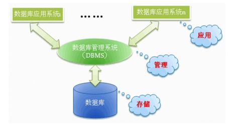

为什么要说这个呢?

- 因为我们要学习的MySQL应该算是一个数据库管理系统.

### 4.MySQL简介与安装


**概念** : 是现在**流行**的**开源**的,**免费**的 **关系型**数据库；
**历史** : 由瑞典MySQL AB 公司开发，目前属于 Oracle 旗下产品。
**特点** :

- 免费 , 开源数据库；
- 小巧 , 功能齐全；
- 使用便捷；
- 可运行于Windows或Linux操作系统；
- 适用于中小型甚至大型网站应用。

> 安装[MySQL](https://www.mysql.com/)
>
> - **建议使用压缩版,安装快,方便.不复杂。**`不建议使用exe文件，不易卸载干净`！！

- **软件下载**，mysql5.7 64位下载地址：https://dev.mysql.com/get/Downloads/MySQL-5.7/mysql-5.7.19-winx64.zip

- 电脑是64位的就下载使用64位版本的！

> 安装步骤

1. 下载后得到zip压缩包。

2. 解压到自己想要安装到的目录，本人解压到的是"F:\java\MySQL"

3. 添加环境变量：
   1. 此电脑->属性->高级->环境变量；
   2. 选择PATH,在其后面添加: 你的mysql 安装文件下面的bin文件夹；
   3. 在F:\java\MySQL目录下新建my.ini文件；
   4. 编辑 my.ini 文件 ,注意替换路径位置；

```mysql
[mysqld]
basedir=F:\java\MySQL
datadir=F:\java\MySQL\data\
port=3306
skip-grant-tables
```

5. 启动管理员模式下的CMD，并将路径切换至mysql下的bin目录，然后输入`mysqld –install` (安装mysql)；
6. 再输入 `mysqld --initialize-insecure --user=mysql` 初始化数据文件；
7. 然后输入命令`net start mysql`再次启动mysql 然后用命令 mysql –u root –p 进入mysql管理界面（密码可为空）；

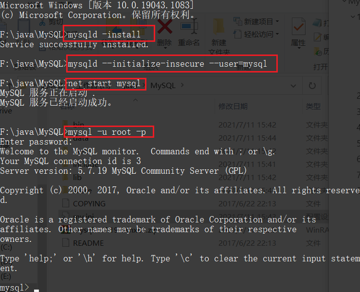

8. 进入界面后更改root密码；

```mysql
update mysql.user set authentication_string=password('root') where user='root' 
and Host = 'localhost';
```

9. 刷新权限；

```mysql
flush privileges;
```

10. 修改 my.ini文件，删除最后一句 `skip-grant-tables`；

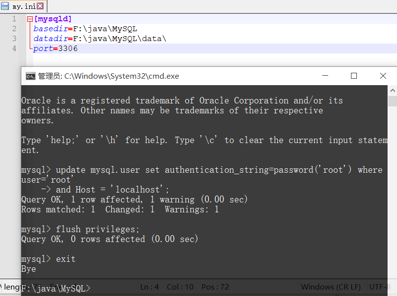

11. 重启mysql即可正常使用（先使用exit，退出mysql）；

```mysql
net stop MySQL
net start MySQL
```

12. 连接上测试，出现以下结果就安装好了。

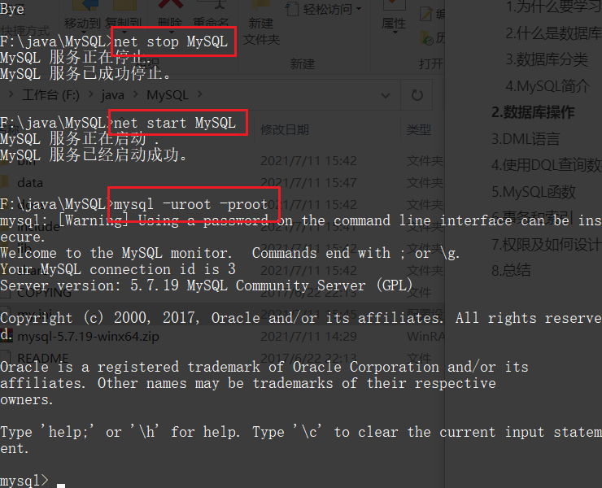

> 注：出现`ERROR 29 (HY000): File './mysql/user.MYD' not found (Errcode: 2 - No such file or directory)`问题。
>
> - ==MySQL文件在C盘未卸载干净。需检查C盘，删除MySQL相关文件夹==。

-----

### 5.SQLyog安装

- 可手动操作,管理MySQL数据库的软件工具。
- 特点 : 简洁 , 易用 , 图形化。

- 下载地址：[地址①](https://sqlyog.en.softonic.com/)；[地址②](https://pan.baidu.com/s/1ddHZ5MmQ_FF2qug6Ks1MUQ)（提取码: 8fqx）；
- 无脑安装，直接下一步；注册软件；连接数据库，运行如下图：

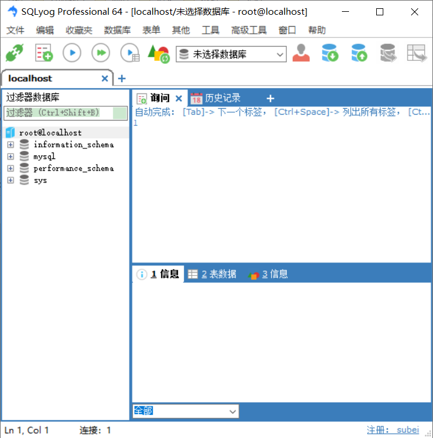

- 创建一个数据库；`现在推荐字符集使用：utf8mb4，排序规则使用utf8mb4_bin`。

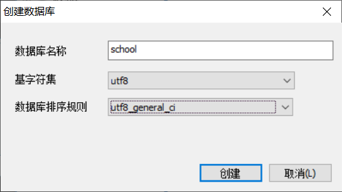

> 每一个 sqlyog的执行操作，本质就是对应了一个sql，可以在软件的历史记录中查看。

- 新建一张表

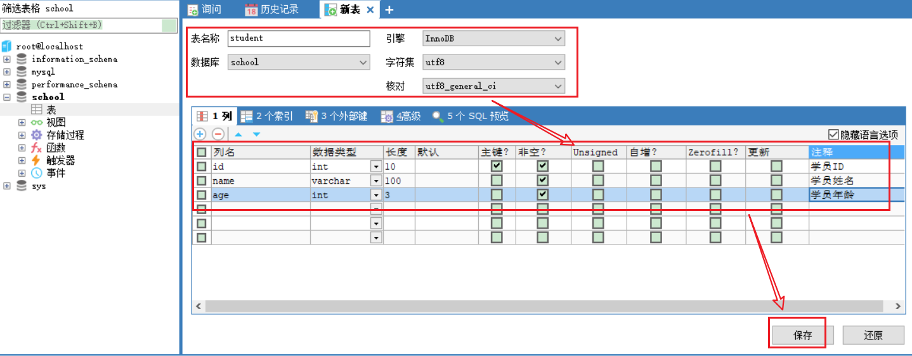

- 查看表

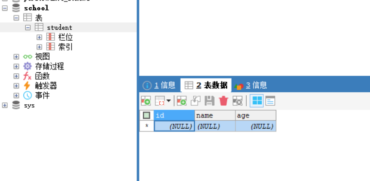

- 插入数据


### 6.连接数据库

打开MySQL命令窗口

- 在DOS命令行窗口进入 **安装目录\mysql\bin**
- 如果之前设置了环境变量，可以在任意目录打开！

**连接数据库语句 :** `mysql -h 服务器主机地址 -u 用户名 -p 用户密码`

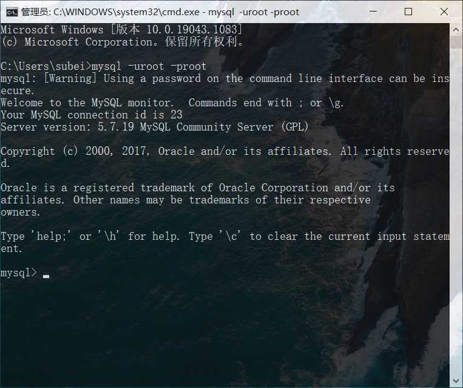

> 注意 : -p后面不能加空格,否则会被当做密码的内容,导致登录失败 !
>
> 注：用键盘上的“向上的箭头”按一下，就可以直接复制上一行的dos命令。

- 基本的数据库操作命令：

```mysql
mysql -uroot -proot -- 连接数据库
update user set password=password('123456')where user='root';  -- 修改密码
flush privileges;  -- 刷新权限
show databases; -- 显示所有数据库
use school; -- 选择school数据库
show tables; -- 显示数据库中所有的表
describe student; -- 显示表mysql数据库中student表的列信息
create database book; -- 创建数据库book
use book; -- 选择book数据库

exit; -- 退出Mysql
? 命令关键词 : 寻求帮助
-- 表示单行注释
/*
SQL的多行注释
*/
```

## 2.数据库操作

> 结构化查询语句分类

|       名称        | 解释                                   | 命令                    |
| :---------------: | -------------------------------------- | ----------------------- |
| 数据定义语言(DDL) | 定义和管理数据对象，如数据库、数据表等 | CRATE、DROP、ALTER      |
| 数据操作语言(DML) | 用于操作数据库对象中所包含的数据       | INSERT、VPDATE、DELETE  |
| 数据查询语言(DQL) | 用于查询数据库数据                     | SELECT                  |
| 数据控制语言(DCL) | 用于管理数据的语言，包括权限及数据更改 | GRANT、COMMIT、ROLLBACK |

### 1.操作数据库

> 命令行操作数据库

- 创建数据库 :  `create database [if not exists] 数据库名;`
- 删除数据库 : `drop database [if exists] 数据库名;`
- 查看数据库 : `show databases;`
- 使用数据库 : `use 数据库名;`

==看到这种语句中有中括号的，都是可写可不写的。==

```mysql
CREATE DATABASE westos;

DROP DATABASE westos;

SHOW DATABASES;
-- tab键上面，如果你的表名或字段名是一个特殊字符，就需要带 ``
USE book;
```

### 2.数据值和列类型

> 参考于：[简书](https://www.jianshu.com/p/dce439b03e7b)

- 列类型： 规定数据库中该列存放的数据类型。

> 数值类型

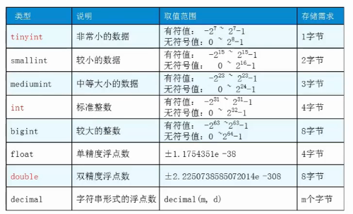

- 最后一个：decimal（13,2）代表这个数字有13位，小数点后面有2位。

> 字符串类型

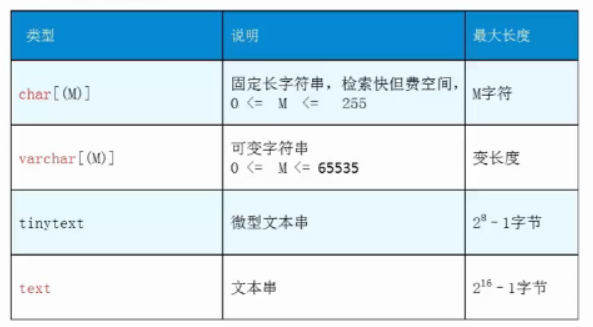

- 前两个的区别在于：一个定长，一个可变长。

> 日期和时间型数值类型


> NULL值

- 理解为 "没有值" 或 "未知值"；
- 不要用NULL进行算术运算 , 结果仍为NULL；

> 如何选择合适的数据类型

1. 整数和浮点：如果你存的这一列没有小数，就选整数类型（货币选decimal）。
2. 日期类型：一般选DATETIME类型；以后可能会用到TIMESTAMP类型。但是后面这个的存储范围是小于前面这个的。
3. char和varchar：char是固定长度的，varchar是可变长度的。如果存储的东西对速度要求很高而对空间要求比较小，就用char；反之则用varchar。

### 3.数据字段属性

> **UnSigned**

- 无符号的。
- 声明该数据列不允许负数。

> **ZEROFILL**

- 0填充的；
- 不足位数的用0来填充 , 如int(3),5则为005；

> **Auto_InCrement**

- 自动增长的 , 每添加一条数据 , 自动在上一个记录数上加 1(默认)；

- 通常用于设置**主键** , 且为整数类型；

- 可定义起始值和步长；

- - 当前表设置步长(AUTO_INCREMENT=100) : 只影响当前表；
  - SET @@auto_increment_increment=5 ; 影响所有使用自增的表(全局)；


> **NULL 和 NOT NULL**

- 默认为NULL , 即没有插入该列的数值；
- 如果设置为NOT NULL , 则该列必须有值；

> **DEFAULT**

- 默认的；
- 用于设置默认值；

> `每一个表 ，都必须存在以下五个字段`：

- id 主键；
- vorsion 乐观锁；
- is_delete 伪删除；
- gmt_create 创建时间；
- gmt_update 修改时间；

### 4.创建数据表

- 属于DDL的一种，语法 :

```mysql
create table [if not exists] `表名`(
   '字段名1' 列类型 [属性][索引][注释],
   '字段名2' 列类型 [属性][索引][注释],
  #...
   '字段名n' 列类型 [属性][索引][注释]
)[表类型][表字符集][注释];
```

- **说明 :** 
  - 反引号用于区别MySQL保留字与普通字符而引入的 (键盘esc下面的键)。
  - 小括号之间创建的各个列之间有逗号，但是最后一个没有逗号。
  - 表明随便取；字段名也是随便取（可中文可英文）。
- 案例代码：

```mysql
CREATE TABLE `user`( 
    `id` INT(10) NOT NULL COMMENT '学员ID', 
    `name` VARCHAR(100) NOT NULL COMMENT '学员姓名', 
    `age` INT(3) NOT NULL COMMENT '学员年龄', 
    PRIMARY KEY (`id`)
) ENGINE=INNODB CHARSET=utf8 COLLATE=utf8_general_ci;
```

- 例如,性别字段,默认为"男" , 否则为 "女" ; 若无指定该列的值 , 则默认值为"男"的值；

```mysql
-- 目标 : 创建一个school数据库
-- 创建学生表(列,字段)
-- 学号int 登录密码varchar(20) 姓名,性别varchar(2),出生日期(datatime),家庭住址,email

-- 创建表之前, 一定要先选择数据库
USE school;

CREATE TABLE IF NOT EXISTS `student` (
    `id` int(4) NOT NULL AUTO_INCREMENT COMMENT '学号',
    `name` varchar(30) NOT NULL DEFAULT '匿名' COMMENT '姓名',
    `pwd` varchar(20) NOT NULL DEFAULT '123456' COMMENT '密码',
    `sex` varchar(2) NOT NULL DEFAULT '男' COMMENT '性别',
    `birthday` datetime DEFAULT NULL COMMENT '出生日期',
    `address` varchar(100) DEFAULT NULL COMMENT '地址',
    `email` varchar(50) DEFAULT NULL COMMENT '邮箱',
    PRIMARY KEY (`id`)
) ENGINE=InnoDB DEFAULT CHARSET=utf8;

-- 查看数据库的定义
SHOW CREATE DATABASE school;

-- 查看数据表的定义
SHOW CREATE TABLE student;

-- 显示表结构
DESC student;  -- 设置严格检查模式(不能容错了)SET sql_mode='STRICT_TRANS_TABLES';
```

### 5.数据表的类型

> 设置数据表的类型

```mysql
CREATE TABLE 表名(
   -- 省略的代码
   -- Mysql注释
   -- 1. # 单行注释
   -- 2. /*...*/ 多行注释
)ENGINE = MyISAM (or InnoDB)

-- 查看mysql所支持的引擎类型 (表类型)
SHOW ENGINES;
```

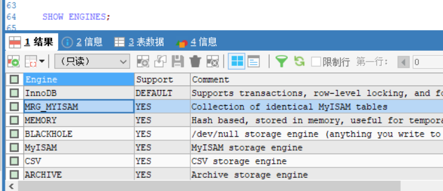

- MySQL的数据表的类型 : **MyISAM** , **InnoDB** , HEAP , BOB , CSV等...

> 常见的 MyISAM 与 InnoDB 类型：

|    名称    | MyISAM |   InnoDB    |
| :--------: | :----: | :---------: |
|  事务处理  | 不支持 |    支持     |
| 数据行锁定 | 不支持 |    支持     |
|  外键约束  | 不支持 |    支持     |
|  全文索引  |  支持  |   不支持    |
| 表空间大小 |  较小  | 较大，约2倍 |

> 适用场合:

- 适用 MyISAM : 节约空间及相应速度；
- 适用 InnoDB : 安全性 , 事务处理，多用户操作数据表；

> 在物理空间存在的位置

- MySQL数据表以文件方式存放在磁盘中；

  - 包括表文件 , 数据文件 , 以及数据库的选项文件；
  - 位置 : Mysql安装目录\data\下存放数据表 . 目录名对应数据库名 , 该目录下文件名对应数据表；

- 注意 :

  - \* . frm -- 表结构定义文件；
  - \* . MYD -- 数据文件 ( data )；
  - \* . MYI -- 索引文件 ( index )；
  - InnoDB类型数据表只有一个 *.frm文件 , 以及上一级目录的ibdata1文件；
  - MyISAM类型数据表对应三个文件：


> 设置数据表字符集

- 我们可为数据库,数据表,数据列设定不同的字符集，设定方法：
  - 创建时通过命令来设置 , 如 : CREATE TABLE 表名() CHARSET = utf8;
  - 如无设定 , 则根据MySQL数据库配置文件 my.ini 中的参数设定。

### 6.修改数据库

> 修改表 ( ALTER TABLE )

- 修改表名 :`ALTER TABLE 旧表名 RENAME AS 新表名；`

- 添加字段 : `ALTER TABLE 表名 ADD 字段名 列属性[属性]；`

- 修改字段 :
  - `ALTER TABLE 表名 MODIFY 字段名 列类型[属性]；`
  - `ALTER TABLE 表名 CHANGE 旧字段名 新字段名 列属性[属性]；`

- 删除字段 :  `ALTER TABLE 表名 DROP 字段名；`

```mysql
USE school;

CREATE TABLE `teacher`( 
    `id` INT(10) NOT NULL COMMENT '教师ID', 
    `name` VARCHAR(100) NOT NULL COMMENT '教师姓名', 
    `age` INT(3) NOT NULL COMMENT '教师年龄', 
    PRIMARY KEY (`id`)
) ENGINE=INNOBASE CHARSET=utf8 COLLATE=utf8_general_ci;

-- 修改表名 :`ALTER TABLE 旧表名 RENAME AS 新表名；`
ALTER TABLE teacher RENAME AS teacher1;

-- 添加字段 : `ALTER TABLE 表名 ADD 字段名 列属性[属性]；`
ALTER TABLE teacher1 ADD age INT(12);

-- 修改字段 : `ALTER TABLE 表名 MODIFY 字段名 列类型[属性]；`
ALTER TABLE teacher1 MODIFY age VARCHAR(12);	-- 修改约束
ALTER TABLE teacher1 CHANGE age age1 INT(12);    -- 字段重命名

-- 删除字段 :  `ALTER TABLE 表名 DROP 字段名；`
ALTER TABLE teacher1 DROP age1;
```

> 删除数据表

- 语法：`DROP TABLE [IF EXISTS] 表名；`
  - IF EXISTS 为可选 , 判断是否存在该数据表；
  - 如删除不存在的数据表会抛出错误；

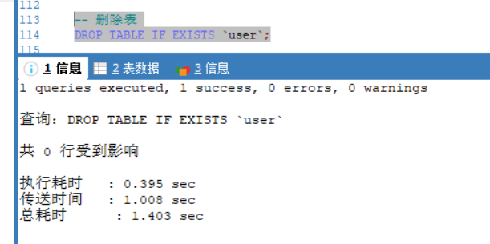

> 注意点：

1. 可用反引号（`）为标识符（库名、表名、字段名、索引、别名）包裹，以避免与关键字重名！中文也可以作为标识符！
2. 每个库目录存在一个保存当前数据库的选项文件db.opt。
3. 注释：
     1. 单行注释： # 注释内容
     2. 多行注释 ：/* 注释内容 */
     3. 单行注释： -- 注释内容       (标准SQL注释风格，要求双破折号后加一空格符（空格、TAB、换行等）)
4. 模式通配符：
     1. _ ：  任意单个字符
     2. % ：  任意多个字符，甚至包括零字符
     3. 单引号需要进行转义 \\'
5. CMD命令行内的语句结束符可以为 ";", "\G", "\g"，仅影响显示结果。其他地方还是用分号结束。delimiter 可修改当前对话的语句结束符。
6. `SQL对大小写不敏感 （关键字）`
7. `清除已有语句：\c`

## 3.MySQL数据管理

###  1.外键

> 外键概念


​		如果公共关键字在一个关系中是主关键字，那么这个公共关键字被称为另一个关系的外键。由此可见，外键表示了两个关系之间的相关联系。以另一个关系的外键作主关键字的表被称为**主表**，具有此外键的表被称为主表的**从表**。

​		在实际操作中，将一个表的值放入第二个表来表示关联，所使用的值是第一个表的主键值(在必要时可包括复合主键值)。此时，第二个表中保存这些值的属性称为外键(**foreign key**)。

- **外键作用**
  - 保持数据**一致性**，**完整性**，主要目的是控制存储在外键表中的数据，**约束**。使两张表形成关联，外键只能引用外表中的列的值或使用空值。

> 创建外键

- 方式一：建表时指定外键约束。

```mysql
-- 创建外键的方式一 : 创建子表同时创建外键

-- 年级表 (id\年级名称)
CREATE TABLE `grade` (
`gradeid` INT(10) NOT NULL AUTO_INCREMENT COMMENT '年级ID',
`gradename` VARCHAR(50) NOT NULL COMMENT '年级名称',
PRIMARY KEY (`gradeid`)
) ENGINE=INNODB DEFAULT CHARSET=utf8;

-- 学生信息表 (学号,姓名,性别,年级,手机,地址,出生日期,邮箱,身份证号)
CREATE TABLE `student2` (
`studentno` INT(4) NOT NULL COMMENT '学号',
`studentname` VARCHAR(20) NOT NULL DEFAULT '匿名' COMMENT '姓名',
`sex` TINYINT(1) DEFAULT '1' COMMENT '性别',
`gradeid` INT(10) DEFAULT NULL COMMENT '年级',
`phoneNum` VARCHAR(50) NOT NULL COMMENT '手机',
`address` VARCHAR(255) DEFAULT NULL COMMENT '地址',
`borndate` DATETIME DEFAULT NULL COMMENT '生日',
`email` VARCHAR(50) DEFAULT NULL COMMENT '邮箱',
`idCard` VARCHAR(18) DEFAULT NULL COMMENT '身份证号',
PRIMARY KEY (`studentno`),
KEY `FK_gradeid` (`gradeid`),
CONSTRAINT `FK_gradeid` FOREIGN KEY (`gradeid`) REFERENCES `grade` (`gradeid`)
) ENGINE=INNODB DEFAULT CHARSET=utf8;
```

- 当创建完子表之后，点开你创建的这个表，如果可以在你创建的这个表的indexes下面看到你创建的外键名，则创建外键就成功了。如下：


- 方式二：建表后修改。

```mysql
-- 创建外键方式二 : 创建子表完毕后,修改子表添加外键
CREATE TABLE `student` (
`id` INT(4) NOT NULL COMMENT '学号',
`name` VARCHAR(20) NOT NULL DEFAULT '匿名' COMMENT '姓名',
`sex` TINYINT(1) DEFAULT '1' COMMENT '性别',
`gradeid` INT(10) DEFAULT NULL COMMENT '年级',
`phoneNum` VARCHAR(50) NOT NULL COMMENT '手机',
`address` VARCHAR(255) DEFAULT NULL COMMENT '地址',
`borndate` DATETIME DEFAULT NULL COMMENT '生日',
`email` VARCHAR(50) DEFAULT NULL COMMENT '邮箱',
`idCard` VARCHAR(18) DEFAULT NULL COMMENT '身份证号',
PRIMARY KEY (`id`)
) ENGINE=INNODB DEFAULT CHARSET=utf8;

ALTER TABLE `student`
ADD CONSTRAINT `FK_gradeid` FOREIGN KEY (`gradeid`) REFERENCES `grade` (`gradeid`);
```

- 错误代码： 1022 Can't write; duplicate key in table '#sql-150c_3'
  - 外键名称重复导致，改为不同名字就可以了。


> 删除外键

- 操作：删除 grade 表，发现报错；


- **注意** : ==删除具有主外键关系的表时 , 要先删子表 , 后删主表==。

```mysql
-- 删除外键
ALTER TABLE student DROP FOREIGN KEY FK_gradeid;
-- 发现执行完上面的,索引还在,所以还要删除索引
-- 注:这个索引是建立外键的时候默认生成的
ALTER TABLE student DROP INDEX FK_gradeid;
```

### 2.DML语言

> **数据库意义** ： 数据存储、数据管理。

**管理数据库数据方法：**

- 通过SQLyog等管理工具管理数据库数据；
- 通过**DML语句**管理数据库数据；

**DML语言**  ：数据操作语言。

- 用于操作数据库对象中所包含的数据；

- 包括 :

- - INSERT (添加数据语句)；
  - UPDATE (更新数据语句)；
  - DELETE (删除数据语句)；

### 3.添加数据

> INSERT命令

- **语法：**`INSERT INTO 表名[(字段1,字段2,字段3,...)] VALUES('值1','值2','值3');`

- **注意 :** 
  - 字段或值之间用英文逗号隔开；
  - ' 字段1,字段2...' 该部分可省略 , 但添加的值务必与表结构,数据列,顺序相对应,且数量一致；
  - 可同时插入多条数据 , values 后用英文逗号隔开；

```mysql
-- 插入语句（添加）
-- 语法 : INSERT INTO 表名[(字段1,字段2,字段3,...)] VALUES('值1','值2','值3')
INSERT INTO grade(gradename) VALUES ('大一');

-- 主键自增,那能否省略呢?
INSERT INTO grade VALUES ('大二');

-- 查询:INSERT INTO grade VALUE ('大二')
-- 错误代码：1136 Column count doesn`t match value count at row 1

-- 一次插入多条数据
INSERT INTO grade(gradename) VALUES ('大三'),('大四');

-- 结论:'字段1,字段2...'该部分可省略 , 但添加的值务必与表结构,数据列,顺序相对应,且数量一致.
```

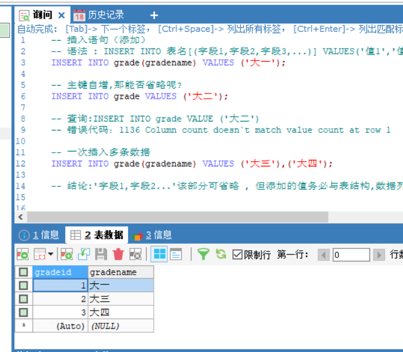

```mysql
CREATE TABLE `student` (
  `id` INT(4) NOT NULL AUTO_INCREMENT COMMENT '学号',
  `name` VARCHAR(20) NOT NULL DEFAULT '匿名' COMMENT '姓名',
  `sex` VARCHAR(10) DEFAULT '1' COMMENT '性别',
  `gradeid` INT(10) DEFAULT NULL COMMENT '年级',
  `phoneNum` VARCHAR(50) DEFAULT NULL COMMENT '手机',
  `address` VARCHAR(255) DEFAULT NULL COMMENT '地址',
  `borndate` DATETIME DEFAULT NULL COMMENT '生日',
  `email` VARCHAR(50) DEFAULT NULL COMMENT '邮箱',
  `idCard` VARCHAR(18) DEFAULT NULL COMMENT '身份证号',
  PRIMARY KEY (`id`),
  KEY `FK_gradeid2` (`gradeid`)
) ENGINE=INNODB AUTO_INCREMENT=3 DEFAULT CHARSET=utf8;

INSERT INTO `student`(`name`) VALUES ('张三');

INSERT INTO `student`(`name`,`address`,`sex`) VALUES ('张三','admin','男');

INSERT INTO `student`(`name`,`address`,`sex`) 
VALUES ('李四','pppppp','女'),('王五','tttttt','男');
```

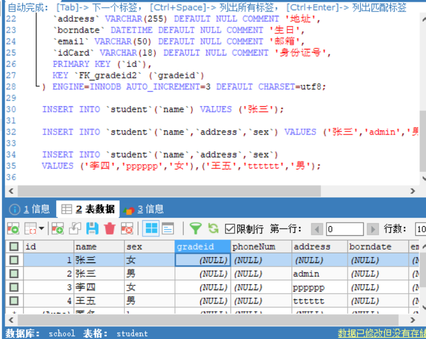

### 4.修改数据

> update命令

- 语法：`UPDATE 表名 SET column_name=value [,column_name2=value2,...] [WHEREcondition];`

- **注意 :** 
  - column_name 为要更改的数据列；
  - value 为修改后的数据 , 可以为变量 , 具体指 , 表达式或者嵌套的SELECT结果；
  - condition 为筛选条件 , 如不指定则修改该表的所有列数据；
  
  ```mysql
  -- 案例
  UPDATE `student` SET `name`='subei',`birthday`=CURRENT_DATE WHERE id = 5;
  ```

- 测试：

```mysql
-- 修改年级名字，带了简介
UPDATE grade SET gradename = '高中' WHERE gradeid = 1;

-- 不指定条件情况下，会改动所有的表
UPDATE `grade` SET `gradename`='果汁';

-- 修改多个属性
UPDATE `student` SET `name`='admin',`email`='2943357596@qq.com' WHERE id = 2;
```

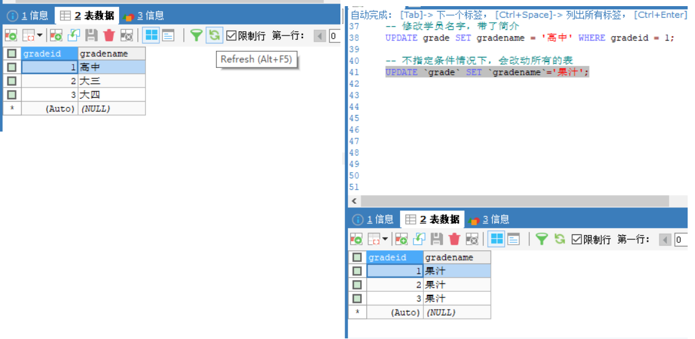

> where条件子句，可以简单理解为 : 有条件地从表中筛选数据。

|  运算符   |      含义      |       范例       | 结果  |
| :-------: | :------------: | :--------------: | :---: |
|     =     |      等于      |       5=6        | false |
| < > 或 != |     不等于     |       5!=6       | true  |
|     >     |      大于      |       5>6        | false |
|     <     |      小于      |       5<6        | true  |
|    >=     |    大于等于    |       5>=6       | false |
|    <=     |    小于等于    |       5<=6       | true  |
|  BETWEEN  | 在某个范围之间 | BETWEEN 5 AND 10 |   -   |
|    AND    |      并且      |   5>1 AND 1>2    | false |
|    OR     |       或       |    5>1 OR 1>2    | true  |

- 测试2：

```mysql
UPDATE `student` SET `name` = '高中' WHERE `id` <= 3;
```


### 5.删除数据

> DELETE命令

- 语法：`DELETE FROM 表名 [WHERE condition];`

- 注意：condition为筛选条件 , 如不指定则删除该表的所有列数据。

```mysql
-- 删除最后一个数据
DELETE FROM grade WHERE gradeid = 5;
```

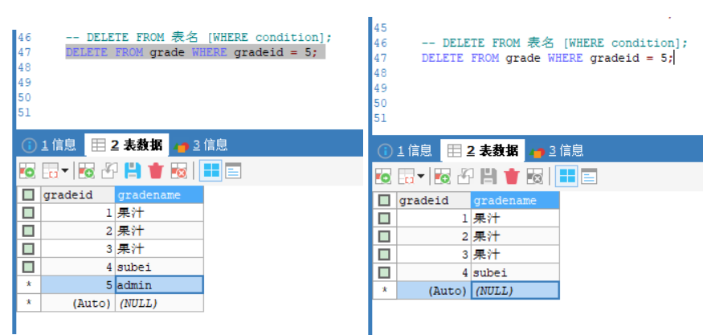

> TRUNCATE命令

- 作用：用于完全清空表数据 , 但表结构 , 索引 , 约束等不变；

- 语法：`TRUNCATE [TABLE] 表名;`

```mysql
-- 清空年级表
TRUNCATE grade;
```

> **注意：区别于DELETE命令**

- 相同：都能删除数据 , 不删除表结构 , 但TRUNCATE速度更快；
- 不同：
  - 使用TRUNCATE TABLE 重新设置AUTO_INCREMENT计数器；
  - 使用TRUNCATE TABLE不会对事务有影响。
- 测试：

```mysql
-- 创建一个测试表
CREATE TABLE `test` (
`id` INT(4) NOT NULL AUTO_INCREMENT,
`coll` VARCHAR(20) NOT NULL,
PRIMARY KEY (`id`)
) ENGINE=INNODB DEFAULT CHARSET=utf8;

-- 插入几个测试数据
INSERT INTO test(coll) VALUES('row1'),('row2'),('row3');

-- 删除表数据(不带where条件的delete)
DELETE FROM test;
-- 结论:如不指定Where则删除该表的所有列数据,自增当前值依然从原来基础上进行,会记录日志.

-- 删除表数据(truncate)
TRUNCATE TABLE test;
-- 结论:truncate删除数据,自增当前值会恢复到初始值重新开始;不会记录日志.

-- 同样使用DELETE清空不同引擎的数据库表数据.重启数据库服务后
-- InnoDB : 自增列从初始值重新开始 (因为是存储在内存中,断电即失)
-- MyISAM : 自增列依然从上一个自增数据基础上开始 (存在文件中,不会丢失)
```

## 4.DQL查询数据

### 1.DQL语言

**DQL( Data Query Language 数据查询语言 )**

- 查询数据库数据 , 如**SELECT**语句；
- 简单的单表查询或多表的复杂查询和嵌套查询；
- ==是数据库语言中最核心,最重要的语句==；
- 使用频率最高的语句；

> SELECT语法

```mysql
SELECT [ALL | DISTINCT]
{* | table.* | [table.field1[as alias1][,table.field2[as alias2]][,...]]}
FROM table_name [as table_alias]
  [left | right | inner join table_name2]  -- 联合查询
  [WHERE ...]  -- 指定结果需满足的条件
  [GROUP BY ...]  -- 指定结果按照哪几个字段来分组
  [HAVING]  -- 过滤分组的记录必须满足的次要条件
  [ORDER BY ...]  -- 指定查询记录按一个或多个条件排序
  [LIMIT {[offset,]row_count | row_countOFFSET offset}];
   -- 指定查询的记录从哪条至哪条
```

- **注意 : [ ] 括号代表可选的 , { }括号代表必选得**。

> SQL准备

```mysql
-- 创建一个school数据库
CREATE DATABASE IF NOT EXISTS `school`;

USE `school`; -- 创建学生表
DROP TABLE IF EXISTS `student`;
CREATE TABLE `student`(
    `studentno` INT(4) NOT NULL COMMENT '学号',
    `loginpwd` VARCHAR(20) DEFAULT NULL,
    `studentname` VARCHAR(20) DEFAULT NULL COMMENT '学生姓名',
    `sex` TINYINT(1) DEFAULT NULL COMMENT '性别，0或1',
    `gradeid` INT(11) DEFAULT NULL COMMENT '年级编号',
    `phone` VARCHAR(50) NOT NULL COMMENT '联系电话，允许为空',
    `address` VARCHAR(255) NOT NULL COMMENT '地址，允许为空',
    `borndate` DATETIME DEFAULT NULL COMMENT '出生时间',
    `email` VARCHAR (50) NOT NULL COMMENT '邮箱账号允许为空',
    `identitycard` VARCHAR(18) DEFAULT NULL COMMENT '身份证号',
    PRIMARY KEY (`studentno`),
    UNIQUE KEY `identitycard`(`identitycard`),
    KEY `email` (`email`)
)ENGINE=MYISAM DEFAULT CHARSET=utf8;

-- 创建年级表
DROP TABLE IF EXISTS `grade`;
CREATE TABLE `grade`(
	`gradeid` INT(11) NOT NULL AUTO_INCREMENT COMMENT '年级编号',
  `gradename` VARCHAR(50) NOT NULL COMMENT '年级名称',
    PRIMARY KEY (`gradeid`)
) ENGINE=INNODB AUTO_INCREMENT = 6 DEFAULT CHARSET = utf8;

-- 创建科目表
DROP TABLE IF EXISTS `subject`;
CREATE TABLE `subject`(
	`subjectno`INT(11) NOT NULL AUTO_INCREMENT COMMENT '课程编号',
    `subjectname` VARCHAR(50) DEFAULT NULL COMMENT '课程名称',
    `classhour` INT(4) DEFAULT NULL COMMENT '学时',
    `gradeid` INT(4) DEFAULT NULL COMMENT '年级编号',
    PRIMARY KEY (`subjectno`)
)ENGINE = INNODB AUTO_INCREMENT = 19 DEFAULT CHARSET = utf8;

-- 创建成绩表
DROP TABLE IF EXISTS `result`;
CREATE TABLE `result`(
	`studentno` INT(4) NOT NULL COMMENT '学号',
    `subjectno` INT(4) NOT NULL COMMENT '课程编号',
    `examdate` DATETIME NOT NULL COMMENT '考试日期',
    `studentresult` INT (4) NOT NULL COMMENT '考试成绩',
    KEY `subjectno` (`subjectno`)
)ENGINE = INNODB DEFAULT CHARSET = utf8;

-- 插入学生数据
insert into `student` (`studentno`,`loginpwd`,`studentname`,`sex`,`gradeid`,`phone`,`address`,`borndate`,`email`,`identitycard`)
values
(1000,'111111','郭靖',1,1,'13500000001','北京海淀区中关村大街1号','1986-12-11 00:00:00','test1@bdqn.cn','450323198612111234'),
(1001,'123456','李文才',1,2,'13500000002','河南洛阳','1981-12-31 00:00:00','test1@bdqn.cn','450323198112311234'),
(1002,'111111','李斯文',1,1,'13500000003','天津市和平区','1986-11-30 00:00:00','test1@bdqn.cn','450323198611301234'),
(1003,'123456','武松',1,3,'13500000004','上海卢湾区','1986-12-31 00:00:00','test1@bdqn.cn','450323198612314234'),
(1004,'123456','张三',1,4,'13500000005','北京市通州','1989-12-31 00:00:00','test1@bdqn.cn','450323198612311244'),
(1005,'123456','张秋丽 ',2,1,'13500000006','广西桂林市灵川','1986-12-31 00:00:00','test1@bdqn.cn','450323198612311214'),
(1006,'123456','肖梅',2,4,'13500000007','地址不详','1986-12-31 00:00:00','test1@bdqn.cn','450323198612311134'),
(1007,'111111','欧阳峻峰',1,1,'13500000008','北京东城区','1986-12-31 00:00:00','test1@bdqn.cn','450323198612311133'),
(1008,'111111','梅超风',1,1,'13500000009','河南洛阳','1986-12-31 00:00:00','test1@bdqn.cn','450323198612311221'),
(1009,'123456','刘毅',1,2,'13500000011','安徽','1986-12-31 00:00:00','test1@bdqn.cn','450323198612311231'),
(1010,'111111','大凡',1,1,'13500000012','河南洛阳','1986-12-31 00:00:00','test1@bdqn.cn','450323198612311044'),
(1011,'111111','奥丹斯',1,1,'13500000013','北京海淀区中关村大街*号','1984-12-31 00:00:00','test1@bdqn.cn','450323198412311234'),
(1012,'123456','多伦',2,3,'13500000014','广西南宁中央大街','1986-12-31 00:00:00','test1@bdqn.cn','450323198612311334'),
(1013,'123456','李梅',2,1,'13500000015','上海卢湾区','1986-12-31 00:00:00','test1@bdqn.cn','450323198612311534'),
(1014,'123456','张得',2,4,'13500000016','北京海淀区中关村大街*号','1986-12-31 00:00:00','test1@bdqn.cn','450323198612311264'),
(1015,'123456','李东方',1,4,'13500000017','广西桂林市灵川','1976-12-31 00:00:00','test1@bdqn.cn','450323197612311234'),
(1016,'111111','刘奋斗',1,1,'13500000018','上海卢湾区','1986-12-31 00:00:00','test1@bdqn.cn','450323198612311251'),
(1017,'123456','可可',2,3,'13500000019','北京长安街1号','1981-09-10 00:00:00','test1@bdqn.cn','450323198109108311'),
(10066,'','Tom',1,1,'13500000000','','0000-00-00 00:00:00','email@22.com','33123123123123123');

-- 插入成绩数据
insert into `result`(`studentno`,`subjectno`,`examdate`,`studentresult`)
values
(1000,1,'2013-11-11 16:00:00',85),
(1000,2,'2012-11-10 10:00:00',75),
(1000,3,'2011-12-19 10:00:00',76),
(1000,4,'2010-11-18 11:00:00',93),
(1000,5,'2013-11-11 14:00:00',97),
(1000,6,'2012-09-13 15:00:00',87),
(1000,7,'2011-10-16 16:00:00',79),
(1000,8,'2010-11-11 16:00:00',74),
(1000,9,'2013-11-21 10:00:00',69),
(1000,10,'2012-11-11 12:00:00',78),
(1000,11,'2011-11-11 14:00:00',66),
(1000,12,'2010-11-11 15:00:00',82),
(1000,13,'2013-11-11 14:00:00',94),
(1000,14,'2012-11-11 15:00:00',98),
(1000,15,'2011-12-11 10:00:00',70),
(1000,16,'2010-09-11 10:00:00',74),
(1001,1,'2013-11-11 16:00:00',76),
(1001,2,'2012-11-10 10:00:00',93),
(1001,3,'2011-12-19 10:00:00',65),
(1001,4,'2010-11-18 11:00:00',71),
(1001,5,'2013-11-11 14:00:00',98),
(1001,6,'2012-09-13 15:00:00',74),
(1001,7,'2011-10-16 16:00:00',85),
(1001,8,'2010-11-11 16:00:00',69),
(1001,9,'2013-11-21 10:00:00',63),
(1001,10,'2012-11-11 12:00:00',70),
(1001,11,'2011-11-11 14:00:00',62),
(1001,12,'2010-11-11 15:00:00',90),
(1001,13,'2013-11-11 14:00:00',97),
(1001,14,'2012-11-11 15:00:00',89),
(1001,15,'2011-12-11 10:00:00',72),
(1001,16,'2010-09-11 10:00:00',90),
(1002,1,'2013-11-11 16:00:00',61),
(1002,2,'2012-11-10 10:00:00',80),
(1002,3,'2011-12-19 10:00:00',89),
(1002,4,'2010-11-18 11:00:00',88),
(1002,5,'2013-11-11 14:00:00',82),
(1002,6,'2012-09-13 15:00:00',91),
(1002,7,'2011-10-16 16:00:00',63),
(1002,8,'2010-11-11 16:00:00',84),
(1002,9,'2013-11-21 10:00:00',60),
(1002,10,'2012-11-11 12:00:00',71),
(1002,11,'2011-11-11 14:00:00',93),
(1002,12,'2010-11-11 15:00:00',96),
(1002,13,'2013-11-11 14:00:00',83),
(1002,14,'2012-11-11 15:00:00',69),
(1002,15,'2011-12-11 10:00:00',89),
(1002,16,'2010-09-11 10:00:00',83),
(1003,1,'2013-11-11 16:00:00',91),
(1003,2,'2012-11-10 10:00:00',75),
(1003,3,'2011-12-19 10:00:00',65),
(1003,4,'2010-11-18 11:00:00',63),
(1003,5,'2013-11-11 14:00:00',90),
(1003,6,'2012-09-13 15:00:00',96),
(1003,7,'2011-10-16 16:00:00',97),
(1003,8,'2010-11-11 16:00:00',77),
(1003,9,'2013-11-21 10:00:00',62),
(1003,10,'2012-11-11 12:00:00',81),
(1003,11,'2011-11-11 14:00:00',76),
(1003,12,'2010-11-11 15:00:00',61),
(1003,13,'2013-11-11 14:00:00',93),
(1003,14,'2012-11-11 15:00:00',79),
(1003,15,'2011-12-11 10:00:00',78),
(1003,16,'2010-09-11 10:00:00',96),
(1004,1,'2013-11-11 16:00:00',84),
(1004,2,'2012-11-10 10:00:00',79),
(1004,3,'2011-12-19 10:00:00',76),
(1004,4,'2010-11-18 11:00:00',78),
(1004,5,'2013-11-11 14:00:00',81),
(1004,6,'2012-09-13 15:00:00',90),
(1004,7,'2011-10-16 16:00:00',63),
(1004,8,'2010-11-11 16:00:00',89),
(1004,9,'2013-11-21 10:00:00',67),
(1004,10,'2012-11-11 12:00:00',100),
(1004,11,'2011-11-11 14:00:00',94),
(1004,12,'2010-11-11 15:00:00',65),
(1004,13,'2013-11-11 14:00:00',86),
(1004,14,'2012-11-11 15:00:00',77),
(1004,15,'2011-12-11 10:00:00',82),
(1004,16,'2010-09-11 10:00:00',87),
(1005,1,'2013-11-11 16:00:00',82),
(1005,2,'2012-11-10 10:00:00',92),
(1005,3,'2011-12-19 10:00:00',80),
(1005,4,'2010-11-18 11:00:00',92),
(1005,5,'2013-11-11 14:00:00',97),
(1005,6,'2012-09-13 15:00:00',72),
(1005,7,'2011-10-16 16:00:00',84),
(1005,8,'2010-11-11 16:00:00',79),
(1005,9,'2013-11-21 10:00:00',76),
(1005,10,'2012-11-11 12:00:00',87),
(1005,11,'2011-11-11 14:00:00',65),
(1005,12,'2010-11-11 15:00:00',67),
(1005,13,'2013-11-11 14:00:00',63),
(1005,14,'2012-11-11 15:00:00',64),
(1005,15,'2011-12-11 10:00:00',99),
(1005,16,'2010-09-11 10:00:00',97),
(1006,1,'2013-11-11 16:00:00',82),
(1006,2,'2012-11-10 10:00:00',73),
(1006,3,'2011-12-19 10:00:00',79),
(1006,4,'2010-11-18 11:00:00',63),
(1006,5,'2013-11-11 14:00:00',97),
(1006,6,'2012-09-13 15:00:00',83),
(1006,7,'2011-10-16 16:00:00',78),
(1006,8,'2010-11-11 16:00:00',88),
(1006,9,'2013-11-21 10:00:00',89),
(1006,10,'2012-11-11 12:00:00',82),
(1006,11,'2011-11-11 14:00:00',70),
(1006,12,'2010-11-11 15:00:00',69),
(1006,13,'2013-11-11 14:00:00',64),
(1006,14,'2012-11-11 15:00:00',80),
(1006,15,'2011-12-11 10:00:00',90),
(1006,16,'2010-09-11 10:00:00',85),
(1007,1,'2013-11-11 16:00:00',87),
(1007,2,'2012-11-10 10:00:00',63),
(1007,3,'2011-12-19 10:00:00',70),
(1007,4,'2010-11-18 11:00:00',74),
(1007,5,'2013-11-11 14:00:00',79),
(1007,6,'2012-09-13 15:00:00',83),
(1007,7,'2011-10-16 16:00:00',86),
(1007,8,'2010-11-11 16:00:00',76),
(1007,9,'2013-11-21 10:00:00',65),
(1007,10,'2012-11-11 12:00:00',87),
(1007,11,'2011-11-11 14:00:00',69),
(1007,12,'2010-11-11 15:00:00',69),
(1007,13,'2013-11-11 14:00:00',90),
(1007,14,'2012-11-11 15:00:00',84),
(1007,15,'2011-12-11 10:00:00',95),
(1007,16,'2010-09-11 10:00:00',92),
(1008,1,'2013-11-11 16:00:00',96),
(1008,2,'2012-11-10 10:00:00',62),
(1008,3,'2011-12-19 10:00:00',97),
(1008,4,'2010-11-18 11:00:00',84),
(1008,5,'2013-11-11 14:00:00',86),
(1008,6,'2012-09-13 15:00:00',72),
(1008,7,'2011-10-16 16:00:00',67),
(1008,8,'2010-11-11 16:00:00',83),
(1008,9,'2013-11-21 10:00:00',86),
(1008,10,'2012-11-11 12:00:00',60),
(1008,11,'2011-11-11 14:00:00',61),
(1008,12,'2010-11-11 15:00:00',68),
(1008,13,'2013-11-11 14:00:00',99),
(1008,14,'2012-11-11 15:00:00',77),
(1008,15,'2011-12-11 10:00:00',73),
(1008,16,'2010-09-11 10:00:00',78),
(1009,1,'2013-11-11 16:00:00',67),
(1009,2,'2012-11-10 10:00:00',70),
(1009,3,'2011-12-19 10:00:00',75),
(1009,4,'2010-11-18 11:00:00',92),
(1009,5,'2013-11-11 14:00:00',76),
(1009,6,'2012-09-13 15:00:00',90),
(1009,7,'2011-10-16 16:00:00',62),
(1009,8,'2010-11-11 16:00:00',68),
(1009,9,'2013-11-21 10:00:00',70),
(1009,10,'2012-11-11 12:00:00',83),
(1009,11,'2011-11-11 14:00:00',88),
(1009,12,'2010-11-11 15:00:00',65),
(1009,13,'2013-11-11 14:00:00',91),
(1009,14,'2012-11-11 15:00:00',99),
(1009,15,'2011-12-11 10:00:00',65),
(1009,16,'2010-09-11 10:00:00',83),
(1010,1,'2013-11-11 16:00:00',83),
(1010,2,'2012-11-10 10:00:00',87),
(1010,3,'2011-12-19 10:00:00',89),
(1010,4,'2010-11-18 11:00:00',99),
(1010,5,'2013-11-11 14:00:00',91),
(1010,6,'2012-09-13 15:00:00',96),
(1010,7,'2011-10-16 16:00:00',72),
(1010,8,'2010-11-11 16:00:00',72),
(1010,9,'2013-11-21 10:00:00',98),
(1010,10,'2012-11-11 12:00:00',73),
(1010,11,'2011-11-11 14:00:00',68),
(1010,12,'2010-11-11 15:00:00',62),
(1010,13,'2013-11-11 14:00:00',67),
(1010,14,'2012-11-11 15:00:00',69),
(1010,15,'2011-12-11 10:00:00',71),
(1010,16,'2010-09-11 10:00:00',66),
(1011,1,'2013-11-11 16:00:00',62),
(1011,2,'2012-11-10 10:00:00',72),
(1011,3,'2011-12-19 10:00:00',96),
(1011,4,'2010-11-18 11:00:00',64),
(1011,5,'2013-11-11 14:00:00',89),
(1011,6,'2012-09-13 15:00:00',91),
(1011,7,'2011-10-16 16:00:00',95),
(1011,8,'2010-11-11 16:00:00',96),
(1011,9,'2013-11-21 10:00:00',89),
(1011,10,'2012-11-11 12:00:00',73),
(1011,11,'2011-11-11 14:00:00',82),
(1011,12,'2010-11-11 15:00:00',98),
(1011,13,'2013-11-11 14:00:00',66),
(1011,14,'2012-11-11 15:00:00',69),
(1011,15,'2011-12-11 10:00:00',91),
(1011,16,'2010-09-11 10:00:00',69),
(1012,1,'2013-11-11 16:00:00',86),
(1012,2,'2012-11-10 10:00:00',66),
(1012,3,'2011-12-19 10:00:00',97),
(1012,4,'2010-11-18 11:00:00',69),
(1012,5,'2013-11-11 14:00:00',70),
(1012,6,'2012-09-13 15:00:00',74),
(1012,7,'2011-10-16 16:00:00',91),
(1012,8,'2010-11-11 16:00:00',97),
(1012,9,'2013-11-21 10:00:00',84),
(1012,10,'2012-11-11 12:00:00',82),
(1012,11,'2011-11-11 14:00:00',90),
(1012,12,'2010-11-11 15:00:00',91),
(1012,13,'2013-11-11 14:00:00',91),
(1012,14,'2012-11-11 15:00:00',97),
(1012,15,'2011-12-11 10:00:00',85),
(1012,16,'2010-09-11 10:00:00',90),
(1013,1,'2013-11-11 16:00:00',73),
(1013,2,'2012-11-10 10:00:00',69),
(1013,3,'2011-12-19 10:00:00',91),
(1013,4,'2010-11-18 11:00:00',72),
(1013,5,'2013-11-11 14:00:00',76),
(1013,6,'2012-09-13 15:00:00',87),
(1013,7,'2011-10-16 16:00:00',61),
(1013,8,'2010-11-11 16:00:00',77),
(1013,9,'2013-11-21 10:00:00',83),
(1013,10,'2012-11-11 12:00:00',99),
(1013,11,'2011-11-11 14:00:00',91),
(1013,12,'2010-11-11 15:00:00',84),
(1013,13,'2013-11-11 14:00:00',98),
(1013,14,'2012-11-11 15:00:00',74),
(1013,15,'2011-12-11 10:00:00',92),
(1013,16,'2010-09-11 10:00:00',90),
(1014,1,'2013-11-11 16:00:00',64),
(1014,2,'2012-11-10 10:00:00',81),
(1014,3,'2011-12-19 10:00:00',79),
(1014,4,'2010-11-18 11:00:00',74),
(1014,5,'2013-11-11 14:00:00',65),
(1014,6,'2012-09-13 15:00:00',88),
(1014,7,'2011-10-16 16:00:00',86),
(1014,8,'2010-11-11 16:00:00',77),
(1014,9,'2013-11-21 10:00:00',86),
(1014,10,'2012-11-11 12:00:00',85),
(1014,11,'2011-11-11 14:00:00',86),
(1014,12,'2010-11-11 15:00:00',75),
(1014,13,'2013-11-11 14:00:00',89),
(1014,14,'2012-11-11 15:00:00',79),
(1014,15,'2011-12-11 10:00:00',73),
(1014,16,'2010-09-11 10:00:00',68),
(1015,1,'2013-11-11 16:00:00',99),
(1015,2,'2012-11-10 10:00:00',60),
(1015,3,'2011-12-19 10:00:00',60),
(1015,4,'2010-11-18 11:00:00',75),
(1015,5,'2013-11-11 14:00:00',78),
(1015,6,'2012-09-13 15:00:00',78),
(1015,7,'2011-10-16 16:00:00',84),
(1015,8,'2010-11-11 16:00:00',95),
(1015,9,'2013-11-21 10:00:00',93),
(1015,10,'2012-11-11 12:00:00',79),
(1015,11,'2011-11-11 14:00:00',74),
(1015,12,'2010-11-11 15:00:00',65),
(1015,13,'2013-11-11 14:00:00',63),
(1015,14,'2012-11-11 15:00:00',74),
(1015,15,'2011-12-11 10:00:00',67),
(1015,16,'2010-09-11 10:00:00',65),
(1016,1,'2013-11-11 16:00:00',97),
(1016,2,'2012-11-10 10:00:00',90),
(1016,3,'2011-12-19 10:00:00',77),
(1016,4,'2010-11-18 11:00:00',75),
(1016,5,'2013-11-11 14:00:00',75),
(1016,6,'2012-09-13 15:00:00',97),
(1016,7,'2011-10-16 16:00:00',96),
(1016,8,'2010-11-11 16:00:00',92),
(1016,9,'2013-11-21 10:00:00',62),
(1016,10,'2012-11-11 12:00:00',83),
(1016,11,'2011-11-11 14:00:00',98),
(1016,12,'2010-11-11 15:00:00',94),
(1016,13,'2013-11-11 14:00:00',62),
(1016,14,'2012-11-11 15:00:00',97),
(1016,15,'2011-12-11 10:00:00',76),
(1016,16,'2010-09-11 10:00:00',82),
(1017,1,'2013-11-11 16:00:00',100),
(1017,2,'2012-11-10 10:00:00',88),
(1017,3,'2011-12-19 10:00:00',86),
(1017,4,'2010-11-18 11:00:00',73),
(1017,5,'2013-11-11 14:00:00',96),
(1017,6,'2012-09-13 15:00:00',64),
(1017,7,'2011-10-16 16:00:00',81),
(1017,8,'2010-11-11 16:00:00',66),
(1017,9,'2013-11-21 10:00:00',76),
(1017,10,'2012-11-11 12:00:00',95),
(1017,11,'2011-11-11 14:00:00',73),
(1017,12,'2010-11-11 15:00:00',82),
(1017,13,'2013-11-11 14:00:00',85),
(1017,14,'2012-11-11 15:00:00',68),
(1017,15,'2011-12-11 10:00:00',99),
(1017,16,'2010-09-11 10:00:00',76);

-- 插入年级数据
insert into `grade` (`gradeid`,`gradename`) 
values(1,'大一'),(2,'大二'),(3,'大三'),
(4,'大四'),(5,'预科班');

-- 插入科目数据
insert into `subject`(`subjectno`,`subjectname`,`classhour`,`gradeid`)values
(1,'高等数学-1',110,1),
(2,'高等数学-2',110,2),
(3,'高等数学-3',100,3),
(4,'高等数学-4',130,4),
(5,'C语言-1',110,1),
(6,'C语言-2',110,2),
(7,'C语言-3',100,3),
(8,'C语言-4',130,4),
(9,'JAVA第一学年',110,1),
(10,'JAVA第二学年',110,2),
(11,'JAVA第三学年',100,3),
(12,'JAVA第四学年',130,4),
(13,'数据库结构-1',110,1),
(14,'数据库结构-2',110,2),
(15,'数据库结构-3',100,3),
(16,'数据库结构-4',130,4),
(17,'C#基础',130,1);
```


### 2.指定查询字段

```mysql
-- 查询表中所有的数据列结果 , 采用 **" \* "** 符号; 但是效率低，不推荐 .

-- 查询所有学生信息
SELECT * FROM student;

-- 查询指定列(学号 , 姓名)
SELECT studentno,studentname FROM student;
```

> AS 子句作为别名

作用：

- 可给数据列取一个新别名；
- 可给表取一个新别名；
- 可把经计算或总结的结果用另一个新名称来代替；

```mysql
-- 这里是为列取别名(当然as关键词可以省略)
SELECT studentno AS 学号,studentname AS 姓名 FROM student;

-- 使用as也可以为表取别名
SELECT studentno AS 学号,studentname AS 姓名 FROM student AS s;

-- 使用as,为查询结果取一个新名字
-- CONCAT()函数拼接字符串
SELECT CONCAT('姓名:',studentname) AS 新姓名 FROM student;
```

> DISTINCT关键字的使用

- 作用 : 去掉SELECT查询返回的记录结果中重复的数据 ( 返回所有列的值都相同 ) , 只返回一条。

```mysql
-- 查看哪些同学参加了考试(学号) 去除重复项
SELECT * FROM result; -- 查看考试成绩
SELECT studentno FROM result; -- 查看哪些同学参加了考试
SELECT DISTINCT studentno FROM result; -- 了解:DISTINCT 去除重复项 , (默认是ALL)
```

> 数据库的列——(表达式)

- 数据库中的表达式 : 一般由文本值 , 列值 , NULL , 函数和操作符等组成。

应用场景 :

- SELECT语句返回结果列中使用；

- SELECT语句中的ORDER BY , HAVING等子句中使用；

- DML语句中的 where 条件语句中使用表达式。

  ```mysql
  -- selcet查询中可以使用表达式
  SELECT VERSION(); -- 查询版本号
  SELECT 100*3-1 AS 计算结果; -- 表达式
  SELECT @@auto_increment_increment; -- 查询自增步长
  
  -- 学员考试成绩集体提分一分查看
  SELECT studentno,StudentResult+1 AS '提分后' FROM result;
  ```

- 避免SQL返回结果中包含 ' . ' , ' * ' 和括号等干扰开发语言程序。

### 3.where条件语句

- 作用：用于检索数据表中 `符合条件` 的记录。

- 搜索条件可由一个或多个逻辑表达式组成 , 结果一般为真或假。

> 逻辑运算符：`尽量使用英文符号`。

| 操作符名称 | 语法               | 描述                             |
| ---------- | ------------------ | -------------------------------- |
| AND 或 &&  | a AND b 或 a && b  | 逻辑与，同时为真结果才为真       |
| OR 或 \|\| | a OR b 或 a \|\| b | 逻辑或，只要一个为真，则结果为真 |
| NOT 或 !   | NOT a 或 !a        | 逻辑非，若操作数为假，则结果为真 |

- 测试

```mysql
-- =============where===============
SELECT studentno,studentResult FROM result;

-- 查询考试成绩在95-100之间的
SELECT studentno,studentresult
FROM result
WHERE studentresult>=95 AND studentresult<=100;

-- AND也可以写成 &&
SELECT studentno,studentresult
FROM result 
WHERE studentresult>=95 AND studentresult<=100;

-- 模糊查询(对应的词:精确查询)
SELECT studentno,studentresult
FROM result WHERE studentresult BETWEEN 95 AND 100;

-- 除了1000号同学,要其他同学的成绩
SELECT studentno,studentresult
FROM result WHERE studentno!=1000;

-- 使用NOT
SELECT studentno,studentresult
FROM result WHERE NOT studentno=1000;
```

> 模糊查询 ：比较运算符

| 操作符名称  | 语法              | 描述                                 |
| ----------- | ----------------- | ------------------------------------ |
| IS NULL     | a IS NULL         | 若操作符为NULL，则结果为真           |
| IS NOT NULL | a IS NOT NULL     | 若操作符不为NULL，则结果为真         |
| BETWEEN     | a BETWEEN b AND c | 若a范围在b与c之间，则结果为真        |
| LIKE        | a LIKE b          | SQL模式匹配，若a匹配b，则结果为真    |
| IN          | a IN              | 若a等于a1，a2…中的某一个，则结果为真 |

- 注意：
  - 数值数据类型的记录之间才能进行算术运算 ;
  - 相同数据类型的数据之间才能进行比较 ;

- 测试：

```mysql
-- ===================LIKE==========================
-- 查询姓刘的同学的学号及姓名
-- like结合使用的通配符 : % (代表0到任意个字符) _ (一个字符)
SELECT studentno,studentname FROM student
WHERE studentname LIKE '刘%';

-- 查询姓刘的同学,后面只有一个字的
SELECT studentno,studentname FROM student
WHERE studentname LIKE '刘_';

-- 查询姓刘的同学,后面只有两个字的
SELECT studentno,studentname FROM student
WHERE studentname LIKE '刘__';

-- 查询姓名中含有 梅 字的
SELECT studentno,studentname FROM student
WHERE studentname LIKE '%梅%';

-- 查询姓名中含有特殊字符的需要使用转义符号 '\'
-- 自定义转义符关键字: ESCAPE ':'

-- =====================IN========================
-- 查询学号为1000,1001,1002的学生姓名
SELECT studentno,studentname FROM student
WHERE studentno IN (1000,1001,1002);

-- 查询地址在北京,南京,河南洛阳的学生
SELECT studentno,studentname,address FROM student
WHERE address IN ('北京','南京','河南洛阳');

-- ====================NULL 空=========================
-- 查询出生日期没有填写的同学
-- 不能直接写=NULL , 这是代表错误的 , 用 is null
SELECT studentname FROM student
WHERE BornDate IS NULL;

-- 查询出生日期填写的同学
SELECT studentname FROM student
WHERE BornDate IS NOT NULL;

-- 查询没有写家庭住址的同学(空字符串不等于null)
SELECT studentname FROM student
WHERE Address='' OR Address IS NULL;
```

### 4.联表查询

> JOIN 对比

| 操作符名称 | 描述                                       |
| ---------- | ------------------------------------------ |
| INNER JOIN | 如果表中有至少一个匹配，则返回行           |
| LEFT JOIN  | 即使右表中没有匹配，也从左表中返回所有的行 |
| RIGHT JOIN | 即使左表中没有匹配，也从右表中返回所有的行 |

- 七种Join：


- 连接查询
  - 如需要多张数据表的数据进行查询,则可通过连接运算符实现多个查询。
- 内连接 inner join
  - 查询两个表中的结果集中的交集。
- 外连接 outer join
  - 左外连接 left join——(以左表作为基准,右边表来一一匹配,匹配不上的,返回左表的记录,右表以NULL填充)。
  - 右外连接 right join——(以右表作为基准,左边表来一一匹配,匹配不上的,返回右表的记录,左表以NULL填充)。
- 等值连接和非等值连接。
- 自连接

```sql
-- 查询参加了考试的同学信息(学号,学生姓名,科目编号,分数)
SELECT * FROM student;
SELECT * FROM result;

/*思路:
(1):分析需求,确定查询的列来源于两个类,student result,连接查询
(2):确定使用哪种连接查询?(内连接)
*/
SELECT s.studentno,studentname,subjectno,StudentResult
FROM student s
INNER JOIN result r
ON r.studentno = s.studentno;

-- 右连接(也可实现)
SELECT s.studentno,studentname,subjectno,StudentResult
FROM student s
RIGHT JOIN result r
ON r.studentno = s.studentno;

-- 等值连接
SELECT s.studentno,studentname,subjectno,StudentResult
FROM student s , result r
WHERE r.studentno = s.studentno;

-- 左连接 (查询了所有同学,不考试的也会查出来)
SELECT s.studentno,studentname,subjectno,StudentResult
FROM student s
LEFT JOIN result r
ON r.studentno = s.studentno;

-- 查询缺考的同学(左连接应用场景)
SELECT s.studentno,studentname,subjectno,StudentResult
FROM student s
LEFT JOIN result r
ON r.studentno = s.studentno
WHERE StudentResult IS NULL;

-- 思考题:查询参加了考试的同学信息(学号,学生姓名,科目名,分数)
SELECT s.studentno,studentname,subjectname,StudentResult
FROM student s
INNER JOIN result r
ON r.studentno = s.studentno
INNER JOIN `subject` sub
ON sub.subjectno = r.subjectno;
```

> 自连接(了解！！)

- 自己的表与自己的表连接，核心：`一张表拆成两张一样的表`。

```mysql
/*
需求:从一个包含栏目ID , 栏目名称和父栏目ID的表中
    查询父栏目名称和其他子栏目名称
*/

-- 创建一个表
CREATE TABLE `category` (
`categoryid` INT(10) UNSIGNED NOT NULL AUTO_INCREMENT COMMENT '主题id',
`pid` INT(10) NOT NULL COMMENT '父id',
`categoryName` VARCHAR(50) NOT NULL COMMENT '主题名字',
PRIMARY KEY (`categoryid`)
) ENGINE=INNODB AUTO_INCREMENT=9 DEFAULT CHARSET=utf8;

-- 插入数据
INSERT INTO `category` (`categoryid`, `pid`, `categoryName`)
VALUES('2','1','信息技术'),
('3','1','软件开发'),
('4','3','数据库'),
('5','1','美术设计'),
('6','3','web开发'),
('7','5','ps技术'),
('8','2','办公信息');

-- 编写SQL语句,将栏目的父子关系呈现出来 (父栏目名称,子栏目名称)
-- 核心思想:把一张表看成两张一模一样的表,然后将这两张表连接查询(自连接)
SELECT a.`categoryName` AS '父栏目',b.`categoryName` AS '子栏目'
FROM `category` AS a,`category` AS b
WHERE a.`categoryid` = b.`pid`;

-- 思考题:查询参加了考试的同学信息(学号,学生姓名,科目名,分数)
SELECT s.studentno,studentname,subjectname,StudentResult
FROM student s
INNER JOIN result r
ON r.studentno = s.studentno
INNER JOIN `subject` sub
ON sub.subjectno = r.subjectno;

-- 查询学员及所属的年级(学号,学生姓名,年级名)
SELECT studentno AS 学号,studentname AS 学生姓名,gradename AS 年级名称
FROM student s
INNER JOIN grade g
ON s.`GradeId` = g.`GradeID`;

-- 查询科目及所属的年级(科目名称,年级名称)
SELECT subjectname AS 科目名称,gradename AS 年级名称
FROM SUBJECT sub
INNER JOIN grade g
ON sub.gradeid = g.gradeid;

-- 查询 数据库结构-1 的所有考试结果(学号 学生姓名 科目名称 成绩)
SELECT s.studentno,studentname,subjectname,StudentResult
FROM student s
INNER JOIN result r
ON r.studentno = s.studentno
INNER JOIN `subject` sub
ON r.subjectno = sub.subjectno
WHERE subjectname='数据库结构-1';
```

### 5.分页和排序

> 排序——order by

- 语法 : `ORDER BY`
  - ORDER BY 语句用于根据指定的列对结果集进行排序。
  - ORDER BY 语句==默认按照ASC升序对记录进行排序==。
  - 如果希望按照==降序==对记录进行排序，可以使用 `DESC` 关键字。

```mysql
-- 查询 数据库结构-1 的所有考试结果(学号 学生姓名 科目名称 成绩)
-- 按成绩降序排序
SELECT s.studentno,studentname,subjectname,StudentResult
FROM student s
INNER JOIN result r
ON r.studentno = s.studentno
INNER JOIN `subject` sub
ON r.subjectno = sub.subjectno
WHERE subjectname='数据库结构-1'
ORDER BY StudentResult DESC;

-- 如果成绩一样，按其他规则排列，比如学号的升序与降序。
SELECT s.studentno,studentname,subjectname,StudentResult
FROM student s
INNER JOIN result r
ON r.studentno = s.studentno
INNER JOIN `subject` sub
ON r.subjectno = sub.subjectno
WHERE subjectname='数据库结构-1'
ORDER BY StudentResult DESC, studentno DESC;
```

**注意**：

```mysql
ORDER BY StudentResult, studentno DESC;
```

- 此处的正确理解是：成绩升序排列、学号降序排列。因为DESC是修饰studentno的，而StudentResult 是默认的。

> 分页——limit

- 语法 : `SELECT * FROM table LIMIT [offset,] rows | rows OFFSET offset`;

- 好处 : (用户体验,网络传输,查询压力)。

  ```mysql
  /*
  推导:
     第一页 : limit 0,5  (1-1)*5
     第二页 : limit 5,5  (2-1)*5
     第三页 : limit 10,5  (3-1)*5
     ......
     第N页 : limit (n-1)*pageSzie,pageSzie
     [n:当前页码,pageSize:单页面显示条数]
  */
  ```

```mysql
-- 需求：查询 数据库结构-1 的所有考试结果（学号 学生 科目名称 成绩),成绩
-- 每页显示5条数据
SELECT s.studentno,studentname,subjectname,StudentResult
FROM student s
INNER JOIN result r
ON r.studentno = s.studentno
INNER JOIN `subject` sub
ON r.subjectno = sub.subjectno
WHERE subjectname='数据库结构-1'
ORDER BY StudentResult DESC , studentno
LIMIT 0,5;

-- 查询 JAVA第一学年 课程成绩前10名并且分数大于80的学生信息(学号,姓名,课程名,分数)
SELECT s.studentno,studentname,subjectname,StudentResult
FROM student s
INNER JOIN result r
ON r.studentno = s.studentno
INNER JOIN `subject` sub
ON r.subjectno = sub.subjectno
WHERE studentresult>80 AND subjectname='JAVA第一学年'
ORDER BY StudentResult DESC
LIMIT 0,10;
```

### 6.子查询

> 什么是子查询?
>
> - 在查询语句中的WHERE条件子句中,又嵌套了另一个查询语句;
> - 嵌套查询可由多个子查询组成,求解的方式是由里及外;
> - 子查询返回的结果一般都是集合,故而建议使用IN关键字;

```mysql
-- 查询 数据库结构-1 的所有考试结果(学号,科目编号,成绩),并且成绩降序排列
-- 方法一:使用连接查询
SELECT studentno,r.subjectno,StudentResult
FROM result r
INNER JOIN `subject` sub
ON r.`SubjectNo`=sub.`SubjectNo`
WHERE subjectname = '数据库结构-1'
ORDER BY studentresult DESC;

-- 方法二:使用子查询(执行顺序:由里及外)
SELECT studentno,subjectno,StudentResult
FROM result
WHERE subjectno=(
   SELECT subjectno FROM `subject`
   WHERE subjectname = '数据库结构-1'
)
ORDER BY studentresult DESC;

-- 查询课程为 高等数学-2 且分数不小于80分的学生的学号和姓名
-- 方法一:使用连接查询
SELECT s.studentno,studentname
FROM student s
INNER JOIN result r
ON s.`StudentNo` = r.`StudentNo`
INNER JOIN `subject` sub
ON sub.`SubjectNo` = r.`SubjectNo`
WHERE subjectname = '高等数学-2' AND StudentResult>=80;

-- 方法二:使用连接查询+子查询
-- 分数不小于80分的学生的学号和姓名
SELECT r.studentno,studentname FROM student s
INNER JOIN result r ON s.`StudentNo`=r.`StudentNo`
WHERE StudentResult>=80;

-- 在上面SQL基础上,添加需求:课程为 高等数学-2
SELECT r.studentno,studentname FROM student s
INNER JOIN result r ON s.`StudentNo`=r.`StudentNo`
WHERE StudentResult>=80 AND subjectno=(
   SELECT subjectno FROM `subject`
   WHERE subjectname = '高等数学-2'
);

-- 方法三:使用子查询
-- 分步写简单sql语句,然后将其嵌套起来
SELECT studentno,studentname FROM student WHERE studentno IN(
   SELECT studentno FROM result WHERE StudentResult>=80 AND subjectno=(
       SELECT subjectno FROM `subject` WHERE subjectname = '高等数学-2'
  )
);
```

- 练习

```mysql
/*
题目:
   查 C语言-1 的前5名学生的成绩信息(学号,姓名,分数)
   使用子查询,查询郭靖同学所在的年级名称
*/

-- 需求：查询C语言-1的前5名学生的成绩信息：学号、姓名、分数
-- 方式一：连接查询
SELECT s.studentno,studentname,studentresult
FROM student AS s
INNER JOIN result AS r
ON s.StudentNo=r.StudentNo
INNER JOIN `subject` AS su
ON r.SubjectNo=su.subjectno
WHERE subjectname='C语言-1'
ORDER BY studentresult DESC
LIMIT 0,5;

-- 方式二：连接查询和子查询并用
SELECT s.studentno,studentname,studentresult
FROM student AS s
INNER JOIN result AS r
ON s.StudentNo=r.StudentNo
WHERE subjectno=
(SELECT subjectno FROM `subject` WHERE subjectname='C语言-1')
ORDER BY studentresult DESC
LIMIT 0,5;

-- 使用子查询：查询郭靖同学所在的年级名称
SELECT gradename FROM grade 
WHERE gradeid=
(SELECT gradeid FROM student WHERE studentname='郭靖');
```

### 7.分组和过滤

```mysql
 -- 查询不同课程的平均分,最高分,最低分
 -- 前提:根据不同的课程进行分组
 
 SELECT subjectname,AVG(studentresult) AS 平均分,MAX(StudentResult) AS 最高分,MIN(StudentResult) AS 最低分
 FROM result AS r
 INNER JOIN `subject` AS s
 ON r.subjectno = s.subjectno
 GROUP BY r.subjectno
 HAVING 平均分>80;
 
 /*
 where写在group by前面.
 要是放在分组后面的筛选
 要使用HAVING..
 因为having是从前面筛选的字段再筛选，而where是从数据表中的>字段直接进行的筛选的
 */
```

## 5.MySQL函数

> 官网：[链接](https://dev.mysql.com/doc/refman/5.7/en/built-in-function-reference.html)

### 1.常用函数

- 数据函数

```mysql
SELECT ABS(-8);	-- 绝对值函数
SELECT CEILING(9.4); -- 向上取整/
SELECT FLOOR(9.4);   -- 向下取整
SELECT RAND();  -- 随机数,返回一个0-1之间的随机数
SELECT SIGN(0); -- 符号函数: 负数返回-1,正数返回1,0返回0
```

- 字符串函数

```mysql
SELECT CHAR_LENGTH('Java坚持就能成功'); -- 返回字符串包含的字符数
SELECT CONCAT('我','改','程序');  -- 合并字符串,参数可以有多个
SELECT INSERT('我在编程hello world',1,2,'为了咸鱼');  -- 替换字符串,从某个位置开始替换某个长度
SELECT LOWER('subeiLY'); -- 小写
SELECT UPPER('unremittingly'); -- 大写
SELECT LEFT('hello,world',5);   -- 从左边截取
SELECT RIGHT('hello,world',5);  -- 从右边截取
SELECT REPLACE('Java坚持就能成功','咸鱼','努力');  -- 替换字符串
SELECT SUBSTR('Java坚持就能成功',4,6); -- 截取字符串,开始和长度
SELECT REVERSE('Java坚持就能成功'); -- 反转
 
-- 查询姓郭的同学,改成邹
SELECT REPLACE(studentname,'郭','邹') AS 新名字
FROM student WHERE studentname LIKE '郭%';
```

- 日期和时间函数

```mysql
 SELECT CURRENT_DATE();   -- 获取当前日期
 SELECT CURDATE();   -- 获取当前日期
 SELECT NOW();   -- 获取当前日期和时间
 SELECT LOCALTIME();   -- 获取当前日期和时间
 SELECT SYSDATE();   -- 获取当前日期和时间
 
 -- 获取年月日,时分秒
 SELECT YEAR(NOW());
 SELECT MONTH(NOW());
 SELECT DAY(NOW());
 SELECT HOUR(NOW());
 SELECT MINUTE(NOW());
 SELECT SECOND(NOW());
```

- 系统信息函数

```mysql
 SELECT VERSION();  -- 版本
 SELECT USER();     -- 用户 
```

### 2.聚合函数

| 函数名称 | 描述                                                         |
| -------- | ------------------------------------------------------------ |
| COUNT()  | 返回满足Select条件的记录总和数，如 select count(*) 【不建议使用 *，效率低】 |
| SUM()    | 返回数字字段或表达式列作统计，返回一列的总和。               |
| AVG()    | 通常为数值字段或表达列作统计，返回一列的平均值               |
| MAX()    | 可以为数值字段，字符字段或表达式列作统计，返回最大的值。     |
| MIN()    | 可以为数值字段，字符字段或表达式列作统计，返回最小的值。     |

- 从含义上讲，count(1) 与 count(*) 都表示对全部数据行的查询。

  - count(字段) 会统计该字段在表中出现的次数，忽略字段为null 的情况。即不统计字段为null 的记录。
  - count(*) 包括了所有的列，相当于行数，在统计结果的时候，包含字段为null 的记录；
  - count(1) 用1代表代码行，在统计结果的时候，包含字段为null 的记录 。

> 很多人认为count(1)执行的效率会比count(* )高，原因是count( * )会存在全表扫描，而count(1)可以针对一个字段进行查询。其实不然，count(1)和count(*)都会对全表进行扫描，统计所有记录的条数，包括那些为null的记录，因此，它们的效率可以说是相差无几。而count(字段)则与前两者不同，它会统计该字段不为null的记录条数。

- 两者之间的对比：
  - 1）在表没有主键时，count(1)比count(*)快；
  - 2）有主键时，主键作为计算条件，count(主键)效率最高；
  - 3）若表格只有一个字段，则count(*)效率较高。


```mysql
 -- 聚合函数
 -- COUNT:非空的
 SELECT COUNT(studentname) FROM student; -- count(指定列
 SELECT COUNT(*) FROM student;  -- count(*)
 SELECT COUNT(1) FROM student;  -- count(1) 推荐
 
 SELECT SUM(StudentResult) AS 总和 FROM result;
 SELECT AVG(StudentResult) AS 平均分 FROM result;
 SELECT MAX(StudentResult) AS 最高分 FROM result;
 SELECT MIN(StudentResult) AS 最低分 FROM result;
```

### 3.数据库级别的MD5 加密

> **一、什么是[MD5](https://baike.baidu.com/item/MD5/212708)？**

- 主要增强算法复杂度和不可逆性。
- MD5不可逆，具体的值的md5是一样的；
- MD5破解网站的原理，背后有一个字典，MD5加密后的值，加密的前值。

> **二、实现数据加密**

- 新建一个表 testmd5：

```mysql
CREATE TABLE `testmd5` (
`id` INT(4) NOT NULL,
`name` VARCHAR(20) NOT NULL,
`pwd` VARCHAR(50) NOT NULL,
PRIMARY KEY (`id`)
) ENGINE=INNODB DEFAULT CHARSET=utf8;
```

- 插入一些数据：

```mysql
INSERT INTO testmd5 VALUES(1,'subei','123456'),(2,'wahaha','456789');
```

- 如果我们要对pwd这一列数据进行加密，语法是：

```mysql
update testmd5 set pwd = md5(pwd);
```

- 如果单独对某个用户(如wahaha)的密码加密：

```mysql
INSERT INTO testmd5 VALUES(3,'admin','123456');

UPDATE testmd5 SET pwd = MD5(pwd) WHERE NAME='admin';
```

- 插入新的数据自动加密

```mysql
INSERT INTO testmd5 VALUES(4,'party',md5('123456'));
```

- 查询登录用户信息（md5对比使用，查看用户输入加密后的密码进行比对）

```mysql
SELECT * FROM testmd5 WHERE `name`='subei' AND pwd=MD5('123456');
```

## 6.事务

### 1.什么是事务?

- 要么都成功，要么都失败。

- 事务就是将一组SQL语句放在同一批次内去执行；
- 如果一个SQL语句出错,则该批次内的所有SQL都将被取消执行；
- MySQL事务处理只支持InnoDB和BDB数据表类型；

> 事务原则：ACID原则、原子性、一致性、隔离性、持久性。
>
> 参考博客链接：https://blog.csdn.net/dengjili/article/details/82468576

**原子性(Atomic)**

- 整个事务中的所有操作，要么全部完成，要么全部不完成，不可能停滞在中间某个环节。事务在执行过程中发生错误，会被回滚（ROLLBACK）到事务开始前的状态，就像这个事务从来没有执行过一样。

**一致性(Consist)**

- 一个事务可以封装状态改变（除非它是一个只读的）。==事务必须始终保持系统处于一致的状态，不管在任何给定的时间并发事务有多少==。
- 也就是说：如果事务是并发多个，系统也必须如同串行事务一样操作。其主要特征是保护性和不变性(Preserving an Invariant)，以转账案例为例，假设有五个账户，每个账户余额是100元，那么五个账户总额是500元，如果在这个5个账户之间同时发生多个转账，无论并发多少个，比如在A与B账户之间转账5元，在C与D账户之间转账10元，在B与E之间转账15元，五个账户总额也应该还是500元，这就是保护性和不变性。

**持久性(Durable)**

- 在事务完成以后，该事务对数据库所作的更改便持久的保存在数据库之中，并不会被回滚。

**隔离性(Isolated)**

- 隔离状态执行事务，使它们好像是系统在给定时间内执行的唯一操作。如果有两个事务，运行在相同的时间内，执行相同的功能，事务的隔离性将确保每一事务在系统中认为只有该事务在使用系统。这种属性有时称为`串行化`，为了防止事务操作间的混淆，必须串行化或序列化请求，使得在同一时间仅有一个请求用于同一数据。

> 隔离所导致的一些问题：
>
> - 脏读：指一个事务读取了另外一个事务未提交的数据。
> - 不可重复读：在一个事务内读取表中的某一行数据，多次读取结果不同。（这个不一定是错误，只是某些场合不对）。
> - 虚读(幻读)：是指在一个事务内读取到了别的事务插入的数据，导致前后读取数量总量不一致。

### 2.执行事务

- 注意:
  1. MySQL中默认是自动提交；
  2. `使用事务时应先关闭自动提交`。

```mysql
-- ==========事务==========

-- MySQL默认开启事务的
SET autocommit = 0;   -- 关闭
SET autocommit = 1;   -- 开启(默认的)

-- 手动处理事务

-- 事务开启
START TRANSACTION;  -- 开始一个事务,标记事务的起始点

INSERT XX
INSERT XX

-- 提交:持久化
COMMIT;

-- 回滚:数据回到本次事务的初始状态
ROLLBACK;

-- 事务结束
SET autocommit =1;  -- 开始自动提交

-- 保存点
SAVEPOINT 保存点名称; -- 设置一个事务保存点
ROLLBACK TO SAVEPOINT 保存点名称; -- 回滚到保存点
RELEASE SAVEPOINT 保存点名称; -- 删除保存点
```

> 测试

```mysql
/*
题目：
	A在线买一款价格为500元商品,网上银行转账.
	A的银行卡余额为2000,然后给商家B支付500.
	商家B一开始的银行卡余额为10000
	
	创建数据库shop和创建表account并插入2条数据
*/

CREATE DATABASE `shop`CHARACTER SET utf8 COLLATE utf8_general_ci;
USE `shop`;

CREATE TABLE `account` (
`id` INT(11) NOT NULL AUTO_INCREMENT,
`name` VARCHAR(32) NOT NULL,
`money` DECIMAL(9,2) NOT NULL,
PRIMARY KEY (`id`)
) ENGINE=INNODB DEFAULT CHARSET=utf8;

INSERT INTO account (`name`,`money`)
VALUES('A',2000.00),('B',10000.00);

-- 模拟转账
SET autocommit = 0; -- 关闭自动提交
START TRANSACTION;  -- 开始一个事务

UPDATE account SET money=money-500 WHERE `name`='A';
UPDATE account SET money=money+500 WHERE `name`='B';

COMMIT; -- 提交事务，持久化了！！！
# rollback; -- 回滚
SET autocommit = 1; -- 恢复自动提交
```

## 7.索引

### 1.概述

> MySQL官方对索引的定义为：**索引（index）是帮助 MysQL高效获取数据的数据结构**。
>
> 提取句子主千，就可以得到索引的本质：索引是数据结构。

> 索引的作用：

- 提高查询速度；
- 确保数据的唯一性；
- 可以加速表和表之间的连接 , 实现表与表之间的参照完整性；
- 使用分组和排序子句进行数据检索时 , 可以显著减少分组和排序的时间；
- 全文检索字段进行搜索优化。

### 2.索引的分类

- 主键索引 (Primary Key)

  - 唯一的标识，主键不可重复，只能有一个列作为主键。

- 唯一索引 (Unique)

  - 避免重复的列出现，唯一索引可以重复，多个列都可以标识唯一索引。

- 常规索引 (Index)

  - 默认的，key关键字来设置。

- 全文索引 (FullText)

  - 在特定引擎下才可以实现，MyISAM。
    - MySQL 5.6 以前的版本，只有 MyISAM 存储引擎支持全文索引；
    - MySQL 5.6 及以后的版本，MyISAM 和 InnoDB 存储引擎均支持全文索引;
    - 只有字段的数据类型为 char、varchar、text 及其系列才可以建全文索引。
    - 测试或使用全文索引时，要先看一下自己的 MySQL 版本、存储引擎和数据类型是否支持全文索引。
  - 快速定位数据。

- 语法：

  ```mysql
  #方法一：创建表时
    　　CREATE TABLE 表名 (
                 字段名1 数据类型 [完整性约束条件…],
                 字段名2 数据类型 [完整性约束条件…],
                 [UNIQUE | FULLTEXT | SPATIAL ]   INDEX | KEY
                 [索引名] (字段名[(长度)] [ASC |DESC])
                 );
  
  #方法二：CREATE在已存在的表上创建索引
         CREATE [UNIQUE | FULLTEXT | SPATIAL ] INDEX 索引名
                      ON 表名 (字段名[(长度)] [ASC |DESC]) ;
  
  #方法三：ALTER TABLE在已存在的表上创建索引
         ALTER TABLE 表名 ADD [UNIQUE | FULLTEXT | SPATIAL ] INDEX
                              索引名 (字段名[(长度)] [ASC |DESC]) ;
                             
                             
  #删除索引：DROP INDEX 索引名 ON 表名字;
  #删除主键索引: ALTER TABLE 表名 DROP PRIMARY KEY;
  ```

```mysql
-- 索引的使用
-- 1.在创建表时给字段增加索引
-- 2.创建完毕后，增加索引

-- 显示所有的索引信息
SHOW INDEX FROM student;

-- 增加全文索引
ALTER TABLE `school`.`student` ADD FULLTEXT INDEX `studentname` (`studentname`);

-- EXPLAIN : 分析SQL语句执行性能
EXPLAIN SELECT * FROM student;  -- 非全文索引

EXPLAIN SELECT * FROM student WHERE MATCH(`studentname`) AGAINST('张');
```

> 报错：#1292 – Incorrect datetime value: ‘0000-00-00 00:00:00’ 原因与解决方法：

- 原因：
  - 当前的MySQL模式不支持datetime为0的情况。

- 解决方法：只需要直接修改“sql_mode”即可！以Mysql5.7版本为例子，具体解决方法如下：

  1. 在MySQL配置文件my.ini 的 [mysqld] 下添加：

     ```ini
     sql_mode=ONLY_FULL_GROUP_BY,STRICT_TRANS_TABLES,ERROR_FOR_DIVISION_BY_ZERO,NO_AUTO_CREATE_USER,NO_ENGINE_SUBSTITUTION
     ```

  2. 重启MySQL。


### 3.测试索引

- 建表app_user：

```mysql
CREATE TABLE `app_user` (
`id` BIGINT(20) UNSIGNED NOT NULL AUTO_INCREMENT,
`name` VARCHAR(50) DEFAULT'' COMMENT'用户昵称',
`email` VARCHAR(50) NOT NULL COMMENT'用户邮箱',
`phone` VARCHAR(20) DEFAULT'' COMMENT'手机号',
`gender` TINYINT(4) UNSIGNED DEFAULT '0'COMMENT '性别（0：男;1:女）',
`password` VARCHAR(100) NOT NULL COMMENT '密码',
`age` TINYINT(4) DEFAULT'0'  COMMENT '年龄',
`create_time` DATETIME DEFAULT CURRENT_TIMESTAMP,
`update_time` TIMESTAMP NOT NULL DEFAULT CURRENT_TIMESTAMP ON UPDATE CURRENT_TIMESTAMP,
PRIMARY KEY (`id`)
) ENGINE=INNODB DEFAULT CHARSET=utf8 COMMENT = 'app用户表';
```

- 批量插入数据：100w

```mysql
-- 插入百万条数据
DROP FUNCTION IF EXISTS mock_data;

DELIMITER $$ -- 写函数之前必须写，标志

CREATE FUNCTION mock_data()
RETURNS INT
BEGIN
    DECLARE num INT DEFAULT 1000000;
    DECLARE i INT DEFAULT 0;
    WHILE i < num DO
	-- 插入语句
	INSERT INTO app_user(`name`, `email`, `phone`, `gender`, `password`, `age`)
	VALUES(CONCAT('用户', i), '24736743@qq.com', CONCAT('18', FLOOR(RAND()*(999999999-100000000)+100000000)),FLOOR(RAND()*2),UUID(), FLOOR(RAND()*100));
	SET i = i + 1;
    END WHILE;
    RETURN i;
END;

SELECT mock_data();
```

**索引效率测试**

- 无索引

```mysql
SELECT * FROM app_user WHERE NAME = '用户9999'; -- 查看耗时
SELECT * FROM app_user WHERE NAME = '用户9999';
SELECT * FROM app_user WHERE NAME = '用户9999';

EXPLAIN SELECT * FROM app_user WHERE NAME = '用户9999';
```

- 创建索引

```mysql
-- CREATE INDEX 索引名 ON 表(字段)
CREATE INDEX id_app_user_name ON app_user(`name`);
```

- 测试普通索引

```mysql
SELECT * FROM app_user WHERE NAME = '用户9999';
```

### 4.索引原则

- 索引不是越多越好；
- 不要对经常变动的数据加索引；
- 小数据量的表建议不要加索引；
- 索引一般应加在查找条件的字段。

> 索引的数据结构，[参考博文](http://blog.codinglabs.org/articles/theory-of-mysql-index.html)

- 在创建上述索引的时候，为其指定索引类型，分两类：
  - hash类型的索引：查询单条快，范围查询慢；
  - btree类型的索引：b+树，层数越多，数据量指数级增长（我们就用它，因为innodb默认支持它）。
- 不同的存储引擎支持的索引类型也不一样：
  - InnoDB 支持事务，支持行级别锁定，支持 B-tree、Full-text 等索引，不支持 Hash 索引；
  - MyISAM 不支持事务，支持表级别锁定，支持 B-tree、Full-text 等索引，不支持 Hash 索引；
  - Memory 不支持事务，支持表级别锁定，支持 B-tree、Hash 等索引，不支持 Full-text 索引；
  - NDB 支持事务，支持行级别锁定，支持 Hash 索引，不支持 B-tree、Full-text 等索引；
  - Archive 不支持事务，支持表级别锁定，不支持 B-tree、Hash、Full-text 等索引；

## 8.权限管理及备份

### 1.用户管理

> 使用SQLyog 创建用户，并授予权限。

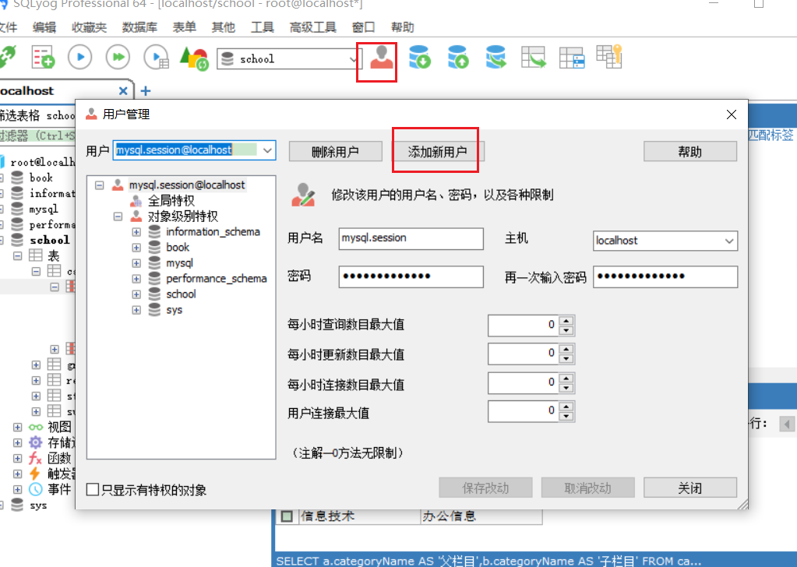

> SQL命令操作

- 用户表：mysql.user
- 本质：对这张表进行增删改查。

```mysql
-- 刷新权限
FLUSH PRIVILEGES;

-- 增加用户 
CREATE USER subei IDENTIFIED BY '123456';

CREATE USER 用户名 IDENTIFIED BY [PASSWORD] 密码(字符串)
  - 必须拥有mysql数据库的全局CREATE USER权限，或拥有INSERT权限。
  - 只能创建用户，不能赋予权限。
  - 用户名，注意引号：如 'user_name'@'192.168.1.1'
  - 密码也需引号，纯数字密码也要加引号
  - 要在纯文本中指定密码，需忽略PASSWORD关键词。要把密码指定为由PASSWORD()函数返回的混编值，需包含关键字PASSWORD

-- 重命名用户 
RENAME USER subei TO subei2;
RENAME USER old_user TO new_user;

-- 设置密码
SET PASSWORD = PASSWORD('admin');
SET PASSWORD = PASSWORD('密码');    -- 为当前用户设置密码
SET PASSWORD FOR 用户名 = PASSWORD('密码');    -- 为指定用户设置密码

-- 删除用户 
DROP USER subei2;
DROP USER 用户名;

-- 分配权限/添加用户
GRANT all privileges ON *.* TO subei2;
GRANT 权限列表 ON 表名 TO 用户名 [IDENTIFIED BY [PASSWORD] 'password']
  - all privileges 表示所有权限
  - *.* 表示所有库的所有表
  - 库名.表名 表示某库下面的某表  

-- 查看权限   
SHOW GRANTS FOR root@localhost;
SHOW GRANTS FOR 用户名
   -- 查看当前用户权限
  SHOW GRANTS; 或 SHOW GRANTS FOR CURRENT_USER; 或 SHOW GRANTS FOR CURRENT_USER();

-- 撤消权限
REVOKE 权限列表 ON 表名 FROM 用户名
REVOKE ALL PRIVILEGES, GRANT OPTION FROM 用户名    -- 撤销所有权限
```

> 权限解释

```mysql
-- 权限列表
ALL [PRIVILEGES]    -- 设置除GRANT OPTION之外的所有简单权限
ALTER    -- 允许使用ALTER TABLE
ALTER ROUTINE    -- 更改或取消已存储的子程序
CREATE    -- 允许使用CREATE TABLE
CREATE ROUTINE    -- 创建已存储的子程序
CREATE TEMPORARY TABLES        -- 允许使用CREATE TEMPORARY TABLE
CREATE USER        -- 允许使用CREATE USER, DROP USER, RENAME USER和REVOKE ALL PRIVILEGES。
CREATE VIEW        -- 允许使用CREATE VIEW
DELETE    -- 允许使用DELETE
DROP    -- 允许使用DROP TABLE
EXECUTE        -- 允许用户运行已存储的子程序
FILE    -- 允许使用SELECT...INTO OUTFILE和LOAD DATA INFILE
INDEX     -- 允许使用CREATE INDEX和DROP INDEX
INSERT    -- 允许使用INSERT
LOCK TABLES        -- 允许对您拥有SELECT权限的表使用LOCK TABLES
PROCESS     -- 允许使用SHOW FULL PROCESSLIST
REFERENCES    -- 未被实施
RELOAD    -- 允许使用FLUSH
REPLICATION CLIENT    -- 允许用户询问从属服务器或主服务器的地址
REPLICATION SLAVE    -- 用于复制型从属服务器（从主服务器中读取二进制日志事件）
SELECT    -- 允许使用SELECT
SHOW DATABASES    -- 显示所有数据库
SHOW VIEW    -- 允许使用SHOW CREATE VIEW
SHUTDOWN    -- 允许使用mysqladmin shutdown
SUPER    -- 允许使用CHANGE MASTER, KILL, PURGE MASTER LOGS和SET GLOBAL语句，mysqladmin debug命令；允许您连接（一次），即使已达到max_connections。
UPDATE    -- 允许使用UPDATE
USAGE    -- “无权限”的同义词
GRANT OPTION    -- 允许授予权限


-- 表维护

-- 分析和存储表的关键字分布
ANALYZE [LOCAL | NO_WRITE_TO_BINLOG] TABLE 表名 ...
-- 检查一个或多个表是否有错误
CHECK TABLE tbl_name [, tbl_name] ... [option] ...
option = {QUICK | FAST | MEDIUM | EXTENDED | CHANGED}
-- 整理数据文件的碎片
OPTIMIZE [LOCAL | NO_WRITE_TO_BINLOG] TABLE tbl_name [, tbl_name] ...
```

### 2.MySQL备份

数据库备份必要性：

- 保证重要数据不丢失；
- 数据转移；

MySQL数据库备份方法：

- mysqldump备份工具；
- 数据库管理工具，如SQLyog；


- 直接拷贝数据库文件和相关配置文件；

**mysqldump客户端**

作用 :

- 转储数据库；
- 搜集数据库进行备份；
- 将数据转移到另一个SQL服务器,不一定是MySQL服务器。

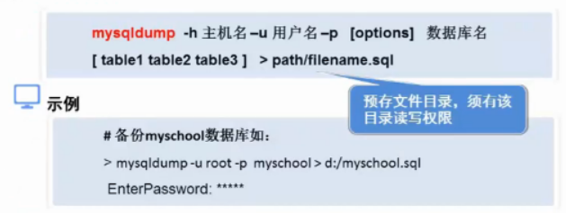

```mysql
-- 导出
1. 导出一张表 
-- mysqldump -uroot -proot school student >D:/a.sql
　　mysqldump -h 主机 -u用户名 -p密码 库名 表名 > 文件名(D:/a.sql)
2. 导出多张表 
-- mysqldump -uroot -proot school student result >D:/b.sql
　　mysqldump -h 主机 -u用户名 -p密码 库名 表1 表2 表3 > 文件名(D:/b.sql)
3. 导出所有表 
-- mysqldump -uroot -proot school >D:/c.sql
　　mysqldump -h 主机 -u用户名 -p密码 库名 > 文件名(D:/c.sql)
4. 导出一个库 
-- mysqldump -uroot -proot -B school >D:/d.sql
　　mysqldump -h 主机 -u用户名 -p密码 -B 库名 > 文件名(D:/d.sql)

可以-w携带备份条件

-- 导入
1. 在登录mysql的情况下：
-- source D:/a.sql
　　source 备份文件
2. 在不登录的情况下:
　　mysql -u用户名 -p密码 库名 < 备份文件
```


## 9.规范化数据库设计

### 1.为什么需要数据库设计

**当数据库比较复杂时我们需要设计数据库**。

**糟糕的数据库设计 :** 

- 数据冗余,存储空间浪费；
- 数据更新和插入的异常【屏蔽使用物理外键】；
- 程序性能差；

**良好的数据库设计 :** 

- 节省数据的存储空间；
- 能够保证数据的完整性；
- 方便进行数据库应用系统的开发；

 **软件项目开发周期中数据库设计 :**

- 需求分析阶段: 分析客户的业务和数据处理需求；
- 概要设计阶段:设计数据库的E-R模型图 , 确认需求信息的正确和完整。

**设计数据库步骤**：

- 分析需求：分析业务和需要处理的数据库的需求；
- 概要设计：设计关系E-R图；

---

- 收集信息
- 与该系统有关人员进行交流 , 座谈 , 充分了解用户需求 , 理解数据库需要完成的任务.
- 标识实体[Entity]
  - 标识数据库要管理的关键对象或实体,实体一般是名词；
  - 标识每个实体需要存储的详细信息[Attribute]；
  - 标识实体之间的关系[Relationship]。

### 2.三大范式

**问题 : 为什么需要数据规范化?**

不合规范的表设计会导致的问题：

- 信息重复

- 更新异常

- 插入异常

  - 无法正确表示信息

- 删除异常

  - 丢失有效信息

> 三大范式

**第一范式 (1NF)**

- 第一范式的目标是确保每列的原子性，如果每列都是不可再分的最小数据单元，则满足第一范式。

**第二范式(2NF)**

- 第二范式（2NF）是在第一范式（1NF）的基础上建立起来的，即满足第二范式（2NF）必须先满足第一范式（1NF）。

- 第二范式要求每个表只描述一件事情。

**第三范式(3NF)**

- 如果一个关系满足第二范式,并且除了主键以外的其他列都不传递依赖于主键列,则满足第三范式。

- 第三范式需要确保数据表中的每一列数据都和主键直接相关，而不能间接相关。

**规范化和性能的关系**

- 为满足某种商业目标 , 数据库性能比规范化数据库更重要；
- 在数据规范化的同时 , 要综合考虑数据库的性能；
- 通过在给定的表中添加额外的字段,以大量减少需要从中搜索信息所需的时间；
- 通过在给定的表中插入计算列,以方便查询。

## 10.JDBC

### 1.数据库驱动

> 这里的驱动的概念和平时听到的那种驱动的概念是一样的，比如平时购买的声卡，网卡直接插到计算机上面是不能用的，必须要安装相应的驱动程序之后才能够使用声卡和网卡，同样道理，我们安装好数据库之后，我们的应用程序也是不能直接使用数据库的，必须要通过相应的数据库驱动程序，通过驱动程 序去和数据库打交道，如下所示：


### 2.JDBC介绍 

> SUN公司为了简化、统一对数据库的操作，定义了一套Java操作数据库的规范（接口），称之为JDBC。 这套接口由数据库厂商去实现，这样，开发人员只需要学习jdbc接口，并通过jdbc加载具体的驱动，就 可以操作数据库。 

- 如下图所示：


- JDBC全称为：Java Data Base Connectivity（java数据库连接），它主要由接口组成。 
- 组成JDBC的２个包：java.sql、javax.sql 
- 开发JDBC应用需要以上2个包的支持外，还需要导入相应JDBC的数据库实现(即数据库驱动包—mysql-connector-java-5.1.47.jar)。 

### 3.第一个JDBC程序

> 搭建实验环境

```mysql
CREATE DATABASE jdbcStudy CHARACTER SET utf8 COLLATE utf8_general_ci;
USE jdbcStudy;
CREATE TABLE users(
id INT PRIMARY KEY,
NAME VARCHAR(40),
PASSWORD VARCHAR(40),
email VARCHAR(60),
birthday DATE
);
INSERT INTO users(id,NAME,PASSWORD,email,birthday)
VALUES(1,'zhansan','123456','zs@sina.com','1980-12-04'),
(2,'lisi','123456','lisi@sina.com','1981-12-04'),
(3,'wangwu','123456','wangwu@sina.com','1979-12-04');
```

> 新建一个Java工程，并导入数据驱动。
>
> jar包下载地址：[maven仓库](https://mvnrepository.com/artifact/mysql/mysql-connector-java/5.1.47)。

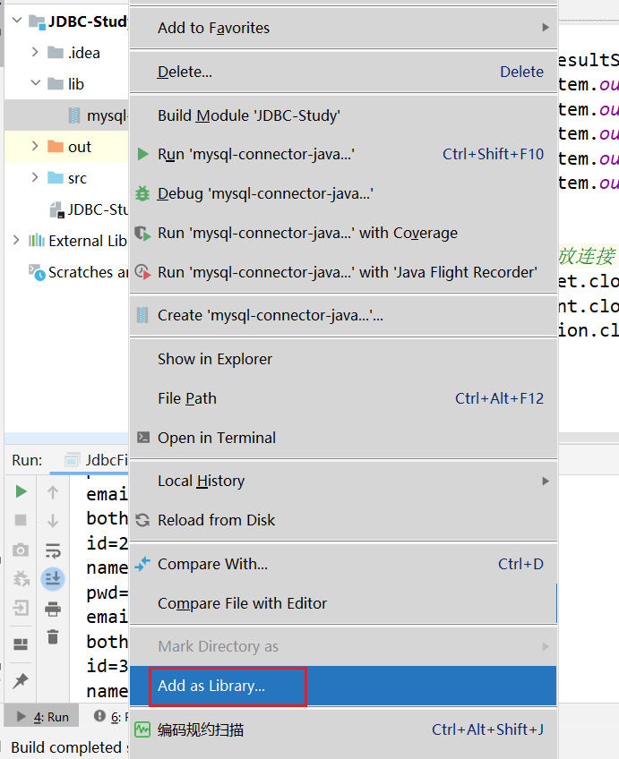

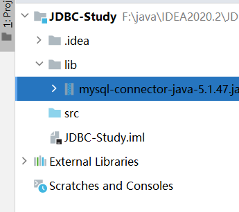

> 编写程序从user表中读取数据，并打印在命令行窗口中。

```java
package com.github.lesson01;

import java.sql.Connection;
import java.sql.DriverManager;
import java.sql.ResultSet;
import java.sql.Statement;

/**
 * 第一个JDBC程序
 */
public class JdbcFirstDemo {
    public static void main(String[] args) throws Exception{
        // 1.加载驱动
        Class.forName("com.mysql.jdbc.Driver"); // 固定写法，加载驱动

        // 2.用户信息和url
        // uesUnicode=true 支持中文编码
        // characterEncoding=utf8 设定字符集
        // useSSL=true 使用安全的连接
        String url = "jdbc:mysql://localhost:3306/jdbcStudy?uesUnicode=true&characterEncoding=utf8&useSSL=true";
        String username = "root";
        String password = "root";

        // 3.连接成功，数据库对象 connection 代表数据库
        Connection connection = DriverManager.getConnection(url, username, password);

        // 4.执行SQL对象
        Statement statement = connection.createStatement();

        // 5.执行SQL对象，执行SQL
        String sql = "SELECT * FROM users";

        ResultSet resultSet = statement.executeQuery(sql);  // 返回结果集,结果集中封装了我们全部查询出来的对象

        while(resultSet.next()){
            System.out.println("id=" + resultSet.getObject("id"));
            System.out.println("name=" + resultSet.getObject("NAME"));
            System.out.println("pwd=" + resultSet.getObject("PASSWORD"));
            System.out.println("email=" + resultSet.getObject("email"));
            System.out.println("both=" + resultSet.getObject("birthday"));
        }

        // 6.释放连接
        resultSet.close();
        statement.close();
        connection.close();

    }
}
```

步骤总结：

1. 加载驱动；
2. 连接数据库 DriverManager；
3. 获得执行SQL的对象 Statement；
4. 获得返回的结果集；
5. 释放连接。

### 4.对象说明

> DriverManager

- JDBC程序中的DriverManager用于加载驱动，并创建与数据库的链接，这个API的常用方法：

```java
// DriverManager.registerDriver(new Driver())
// DriverManager.getConnection(url, user, password)

Class.forName("com.mysql.jdbc.Driver"); // 固定写法，加载驱动 
Connection connection = DriverManager.getConnection(url, username, password);

// connection 代表数据库
connection.createStatement();// 创建向数据库发送sql的statement对象
connection.prepareStatement(sql);// 创建向数据库发送预编译sql的PrepareSatement对象
connection.rollback();  // 事务回滚
connection.commit(); // 事务提交
connection.setAutoCommit(); // 设置数据库自动提交
```

注意：==在实际开发中并不推荐采用registerDriver方法注册驱动==。原因如下： 

1. 查看Driver的源代码可以看到，如果采用此种方式，会导致驱动程序注册两次，也就是在内存中会 有两个Driver对象。
2. 程序依赖mysql的api，脱离mysql的jar包，程序将无法编译，将来程序切换底层数据库将会非常麻 烦。 

推荐方式：`Class.forName("com.mysql.jdbc.Driver");` 

采用此种方式不会导致驱动对象在内存中重复出现，并且采用此种方式，程序仅仅只需要一个字符串， 不需要依赖具体的驱动，使程序的灵活性更高。

> URL说明

- URL用于标识数据库的位置，通过URL地址告诉JDBC程序连接哪个数据库，URL地址的写法为：

```java
String url = "jdbc:mysql://localhost:3306/jdbcStudy?uesUnicode=true&characterEncoding=utf8&useSSL=true";

// mysql 端口号 3306
// jdbc:mysql://localhost:3306/数据库名?参数1&参数2&参数3

// oracle 端口号 1521
// jdbc:oracle:thin:@localhost:1521:sid
```

- 常用数据库URL地址的写法： 
  - Oracle写法：jdbc:oracle:thin:@localhost:1521:sid 
  - SqlServer写法：jdbc:microsoft:sqlserver://localhost:1433; DatabaseName=sid 
  - MySql写法：jdbc:mysql://localhost:3306/sid
- 如果连接的是本地的Mysql数据库，并且连接使用的端口是3306，那么的url地址可以简写为
  - `jdbc:mysql:///数据库`

> Statement执行SQL的对象

```java
String sql = "SELECT * FROM users";
ResultSet resultSet = statement.executeQuery(sql);  // 返回结果集,结果集中封装了我们全部查询出来的对象

// Statement对象常用方法
statement.executeQuery(sql); // 查询操作，返回结果集
statement.execute(sql); // 执行任何SQL
statement.executeUpdate(sql); // 更新、插入、删除，均为这个。唯一受影响的是行数
statement.addBatch(sql); // 把多条sql语句放到一个批处理中
statement.executeBatch(sql); // 向数据库发送一批sql语句执行
```

> ResultSet 查询的结果集：封装了所有的查询结果。

- 获取指定的数据类型

```java
resultSet.getString(); // 不知道数据类型时使用
// 如果知道列的类型就用指定的类型
resultSet.getString();
resultSet.getInt();
resultSet.getFloat();
resultSet.getDouble();
resultSet.getDate();
resultSet.getObject();
....
```

- ResultSet还提供了对结果集进行滚动的方法：

```java
resultSet.next(); // 移动到下一行
resultSet.previous(); // 移动到前一行
resultSet.absolute(int row); // 移动到指定行
resultSet.beforeFirst(); // 移动resultSet的最前面。
resultSet.afterLast(); // 移动到resultSet的最后面。
```

> 释放资源

```java
// 6.释放连接
resultSet.close();
statement.close();
connection.close(); // 用完即关掉
```

### 5.statement对象

==JDBC中的statement对象用于向数据库发送SQL语句，想完成对数据库的增删改查，只需要通过这个对象 向数据库发送增删改查语句即可==。

Statement对象的executeUpdate方法，用于向数据库发送增、删、改的sql语句，executeUpdate执行 完后，将会返回一个整数（即增删改语句导致了数据库几行数据发生了变化）。 

Statement.executeQuery方法用于向数据库发送查询语句，executeQuery方法返回代表查询结果的 ResultSet对象。

> CRUD操作-create

- 使用executeUpdate(String sql)方法完成数据添加操作，示例操作：

```java
Statement st = conn.createStatement();
String sql = "insert into user(….) values(…..) ";
int num = st.executeUpdate(sql);
if(num>0){
    System.out.println("插入成功！！！");
}
```

> CRUD操作-delete

- 使用executeUpdate(String sql)方法完成数据删除操作，示例操作：

```java
Statement st = conn.createStatement();
String sql = "delete from user where id=1";
int num = st.executeUpdate(sql);
if(num>0){
	System.out.println(“删除成功！！！");
}
```

> CRUD操作-update

- 使用executeUpdate(String sql)方法完成数据修改操作，示例操作：

```java
Statement st = conn.createStatement();
String sql = "update user set name='' where name=''";
int num = st.executeUpdate(sql);
if(num>0){
	System.out.println(“修改成功！！！");
}
```

> CRUD操作-read 

- 使用executeQuery(String sql)方法完成数据查询操作，示例操作：

```java
Statement st = conn.createStatement();
String sql = "select * from user where id=1";
ResultSet rs = st.executeUpdate(sql);
while(rs.next()){
	//根据获取列的数据类型，分别调用rs的相应方法映射到java对象中
}
```

> 案例：使用jdbc对数据库增删改查

1. 新建一个 lesson02 的包；
2. 在src目录下创建一个db.properties文件，写入如下内容：

```mysql
driver=com.mysql.jdbc.Driver
url=jdbc:mysql://localhost:3306/jdbcStudy?useUnicode=true&characterEncoding=utf8&useSSL=true
username=root
password=root
```

3. 在lesson02 下新建一个 utils 包，新建一个类 `Utils`：

```java
package com.github.lesson02.utils;

import java.io.InputStream;
import java.sql.*;
import java.util.Properties;

public class Utils {

    private static String driver = null;
    private static String url = null;
    private static String username = null;
    private static String password = null;

    static{
        try{
            // 读取db.properties文件中的数据库连接信息
            InputStream in = Utils.class.getClassLoader().getResourceAsStream("db.properties");
            Properties properties = new Properties();
            properties.load(in);

            // 获取数据库连接驱动
            driver = properties.getProperty("driver");
            // 获取数据库连接URL地址
            url = properties.getProperty("url");
            // 获取数据库连接用户名
            username = properties.getProperty("username");
            // 获取数据库连接密码
            password = properties.getProperty("password");

            // 加载数据库驱动，只需加载一次！
            Class.forName(driver);

        } catch (Exception e) {
            e.printStackTrace();
        }
    }

    // 获取连接对象
    public static Connection getConnection() throws SQLException{
        return DriverManager.getConnection(url,username,password);
    }

    // 释放资源
    public static void release(Connection conn, Statement st, ResultSet rs){
        if(conn!=null){
            try {
                conn.close();
            } catch (SQLException throwables) {
                throwables.printStackTrace();
            }
        }
        if(st!=null){
            try {
                st.close();
            } catch (SQLException throwables) {
                throwables.printStackTrace();
            }
        }
        if(rs!=null){
            try {
                rs.close();
            } catch (SQLException throwables) {
                throwables.printStackTrace();
            }
        }
    }
}
```

4. 执行增删改查数据

```java
package com.github.lesson02;

import com.github.lesson02.utils.Utils;

import java.sql.Connection;
import java.sql.ResultSet;
import java.sql.Statement;

/**
 * 插入数据
 */
public class TestInsert {
    public static void main(String[] args) {
        Connection conn = null;
        Statement st = null;
        ResultSet rs = null;
        try{
            // 获取一个数据库连接
            conn = Utils.getConnection();

            // 通过conn对象获取负责执行SQL命令的Statement对象
            st = conn.createStatement();

            // 要执行的SQL
            String sql = "";

            // 执行操作
            int num = st.executeUpdate(sql);
            if(num>0){
                System.out.println("插入数据成功！！！");
            }

        } catch (Exception e) {
            e.printStackTrace();
        } finally {
            // 关闭资源
            Utils.release(conn,st,rs);
        }
    }
}
```

```java
package com.github.lesson02;

import com.github.lesson02.utils.Utils;

import java.sql.Connection;
import java.sql.ResultSet;
import java.sql.Statement;

/**
 * 删除数据
 */
public class TestDelete {
    public static void main(String[] args) {
        Connection conn = null;
        Statement st = null;
        ResultSet rs = null;
        try{
            conn = Utils.getConnection();
            st = conn.createStatement();
            String sql = "delete from users where id=4";
            int num = st.executeUpdate(sql);
            if(num>0){
                System.out.println("删除数据成功！！！");
            }
        } catch (Exception e) {
            e.printStackTrace();
        } finally {
            Utils.release(conn,st,rs);
        }
    }
}
```

```java
package com.github.lesson02;

import com.github.lesson02.utils.Utils;

import java.sql.Connection;
import java.sql.ResultSet;
import java.sql.Statement;

/**
 * 修改数据
 */
public class TestUpdate {
    public static void main(String[] args) {
        Connection conn = null;
        Statement st = null;
        ResultSet rs = null;
        try{
            conn = Utils.getConnection();
            st = conn.createStatement();
            String sql = "update users set name='王伟',email='wangwei@163.com' where id=3";
            int num = st.executeUpdate(sql);
            if(num>0){
                System.out.println("更新数据成功！！！");
            }
        } catch (Exception e) {
            e.printStackTrace();
        } finally {
            Utils.release(conn,st,rs);
        }
    }
}
```

```java
package com.github.lesson02;

import com.github.lesson02.utils.Utils;

import java.sql.Connection;
import java.sql.ResultSet;
import java.sql.Statement;

/**
 * 查询数据
 */
public class TestSelect {
    public static void main(String[] args) {
        Connection conn = null;
        Statement st = null;
        ResultSet rs = null;
        try{
            conn = Utils.getConnection();
            st = conn.createStatement();
//            String sql = "select * from users";
            String sql = "select * from users where id=2";
            rs = st.executeQuery(sql);
            while(rs.next()){
                System.out.println("查询数据成功！！！");
//                System.out.println(rs.getString("name"));
            }
        } catch (Exception e) {
            e.printStackTrace();
        } finally {
            Utils.release(conn,st,rs);
        }
    }
}
```

> SQL注入
>
> - ==通过巧妙的技巧来拼接字符串，造成SQL短路，从而获取数据库数据==

- SQL存在漏洞，会被攻击。

```java
package com.github.lesson03;

import com.github.lesson02.utils.Utils;

import java.sql.Connection;
import java.sql.ResultSet;
import java.sql.Statement;

public class SQL注入 {
    public static void main(String[] args) {
        login("lisi","123456");    // 正常登录 ==结果==>结果输出
//        login("'or '1=1","123456");  // SQL注入 ==结果==>输出数据库内容
    }

    // 登陆业务
    public static void login(String username,String password){
        Connection conn = null;
        Statement st = null;
        ResultSet rs = null;
        try{
            conn = Utils.getConnection();
            st = conn.createStatement();
            // select * from users where name=''or '1-1' and password='123456'
            String sql = "select * from users where name='"+username
                    +"' and password='"+password+"'";
            rs = st.executeQuery(sql);
            while(rs.next()){
                System.out.println("查询数据成功！！！");
                System.out.println(rs.getString("name"));
                System.out.println(rs.getString("password"));
                System.out.println("==========");
            }
        } catch (Exception e) {
            e.printStackTrace();
        } finally {
            Utils.release(conn,st,rs);
        }
    }
}
```

### 6.PreparedStatement对象

PreperedStatement是Statement的子类，它的实例对象可以通过调用 Connection.preparedStatement()方法获得，相对于Statement对象而言：==PreperedStatement可以避 免SQL注入的问题==。 

==Statement会使数据库频繁编译SQL，可能造成数据库缓冲区溢出==。 

PreparedStatement可对SQL进行预编译，从而提高数据库的执行效率。并且PreperedStatement对于 sql中的参数，允许使用占位符的形式进行替换，简化sql语句的编写。

> 使用PreparedStatement对象完成对数据库的CRUD操作

- 插入数据

```java
package com.github.lesson03;

import com.github.lesson02.utils.Utils;

import java.sql.Connection;
import java.sql.PreparedStatement;
import java.sql.ResultSet;

public class TestInsert {
    public static void main(String[] args) {
        Connection conn = null;
        PreparedStatement st = null;
        ResultSet rs = null;
        try {
            conn = Utils.getConnection();
            String sql = "insert into users(id,name,password,email,birthday) values (?,?,?,?,?)";
            st = conn.prepareStatement(sql);
            // 为SQL参数赋值，索引是从1开始的
            st.setInt(1,5); // id是int类型
            st.setString(2,"subei"); // name是字符串类型
            st.setString(3,"123456"); // password是字符串类型
            st.setString(4,"24635862@qq.com"); // email是字符串类型
            st.setDate(5,new java.sql.Date(System.currentTimeMillis())); // birthday是date类型

            /*
            * 这里有个小问题:
            *   在使用  new Date().getTime() 时，会报错：请使用System.currentTimeMillis()代替new Date().getTime()
            * 对于这个问题，百度一下：
            *   new Date()所做的事情其实就是调用了System.currentTimeMillis()。
            *   如果仅仅是需要或者毫秒数，那么完全可以使用System.currentTimeMillis()去代替new Date()，
            *   效率上会高一点。况且很多人喜欢在同一个方法里面多次使用new Date()，
            *   通常性能就是这样一点一点地消耗掉，这里其实可以声明一个引用。
             * */

            // 执行插入数据操作
            int num = st.executeUpdate();
            if(num>0){
                System.out.println("插入数据成功！！！");
            }

        } catch (Exception e) {
            e.printStackTrace();
        } finally {
            // SQL释放资源
            Utils.release(conn,st,rs);
        }

    }
}
```

- 删除数据

```java
package com.github.lesson03;

import com.github.lesson02.utils.Utils;

import java.sql.Connection;
import java.sql.PreparedStatement;
import java.sql.ResultSet;

/**
 * 删除数据
 */
public class TestDelete {
    public static void main(String[] args) {
        Connection conn = null;
        PreparedStatement st = null;
        ResultSet rs = null;
        try{
            conn = Utils.getConnection();
            String sql = "delete * from users where id=?";
            st = conn.prepareStatement(sql);
            st.setInt(1,4);
            int num = st.executeUpdate(sql);
            if(num>0){
                System.out.println("删除数据成功！！！");
            }
        } catch (Exception e) {
            e.printStackTrace();
        } finally {
            Utils.release(conn,st,rs);
        }
    }
}
```

- 更新数据

```java
package com.github.lesson03;

import com.github.lesson02.utils.Utils;

import java.sql.Connection;
import java.sql.PreparedStatement;
import java.sql.ResultSet;

/**
 * 修改数据
 */
public class TestUpdate {
    public static void main(String[] args) {
        Connection conn = null;
        PreparedStatement st = null;
        ResultSet rs = null;
        try{
            conn = Utils.getConnection();
            String sql = "update users set name=?,email=? where id=?";
            st = conn.prepareStatement(sql);
            st.setString(1,"叶凡");
            st.setString(2,"632579682@163.com");
            st.setInt(3,1);
            int num = st.executeUpdate();
            if(num>0){
                System.out.println("更新数据成功！！！");
            }
        } catch (Exception e) {
            e.printStackTrace();
        } finally {
            Utils.release(conn,st,rs);
        }
    }
}
```

- 查询数据

```java
package com.github.lesson03;

import com.github.lesson02.utils.Utils;

import java.sql.Connection;
import java.sql.PreparedStatement;
import java.sql.ResultSet;

/**
 * 查询数据
 */
public class TestSelect {
    public static void main(String[] args) {
        Connection conn = null;
        PreparedStatement st = null;
        ResultSet rs = null;
        try{
            conn = Utils.getConnection();
            String sql = "select * from users where id=?";
            st = conn.prepareStatement(sql);
            st.setInt(1,1);
            rs = st.executeQuery();
            if(rs.next()){
                System.out.println(rs.getString("name"));
                System.out.println("查询数据成功！！！");
            }
        } catch (Exception e) {
            e.printStackTrace();
        } finally {
            Utils.release(conn,st,rs);
        }
    }
}
```

> 避免SQL注入

```java
package com.github.lesson03;

import com.github.lesson02.utils.Utils;

import java.sql.Connection;
import java.sql.PreparedStatement;
import java.sql.ResultSet;

public class SQL注入 {
    public static void main(String[] args) {
//        login("lisi","123456");    // 正常登录  ==结果==>结果输出
        login("'or '1=1","123456");  // SQL注入  ==结果==>无结果输出
    }

    // 登陆业务
    public static void login(String username,String password){
        Connection conn = null;
        PreparedStatement st = null;
        ResultSet rs = null;
        try{
            conn = Utils.getConnection();
            String sql = "select * from users where name=? and password=?";
            st = conn.prepareStatement(sql);
            st.setString(1,username);
            st.setString(2,password);
            rs = st.executeQuery();
            while(rs.next()){
                System.out.println("查询数据成功！！！");
                System.out.println(rs.getString("name"));
                System.out.println(rs.getString("password"));
                System.out.println("==========");
            }
        } catch (Exception e) {
            e.printStackTrace();
        } finally {
            Utils.release(conn,st,rs);
        }
    }
}
```

- 原理：执行的时候参数会用引号包起来，并把参数中的引号作为转义字符，从而避免了参数也作为条件 的一部分。

### 7.使用IDEA连接数据库

- 打开IDEA2020.2的如下图：


- 打开如下界面，开始进行相关设置：


- 连接成功后，进入下图操作：

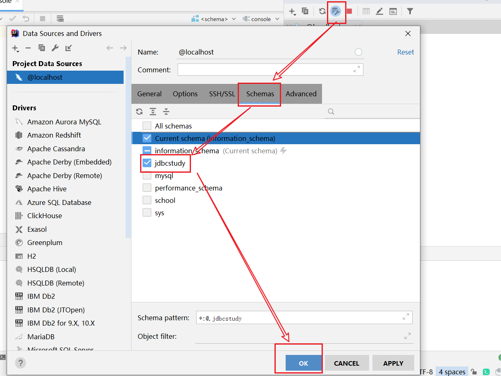

- 然后打开如下图：

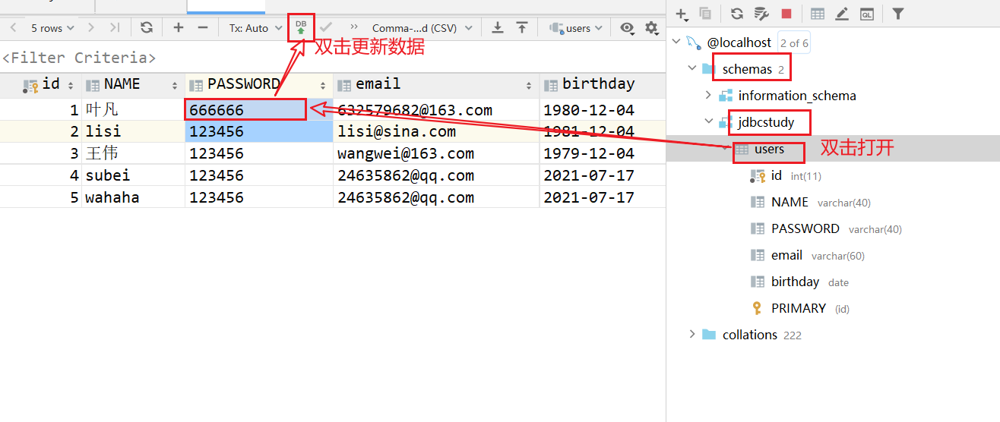

- 一定要点击那个绿色的箭头，否则更新失败，数据未保存！更新成功如下图：

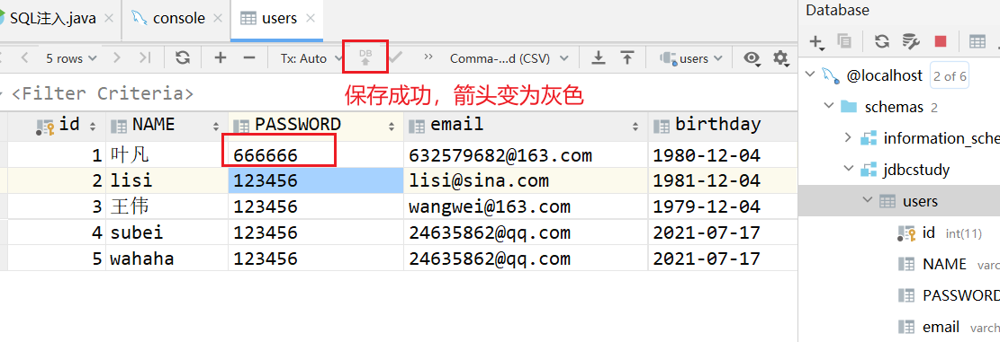

- 编写数据库，编写后点击下图左上角绿色执行，具体如下图：


```mysql
-- 案例
-- 创建账户表
CREATE TABLE account(
    id INT PRIMARY KEY AUTO_INCREMENT,
    NAME VARCHAR(40),
    money FLOAT
);
-- 插入测试数据
insert into account(name,money) values('A',1000);
insert into account(name,money) values('B',1000);
insert into account(name,money) values('C',1000);
```

- `如果IDEA2020.2 连接失败MySQL数据库`，参考下图修改：

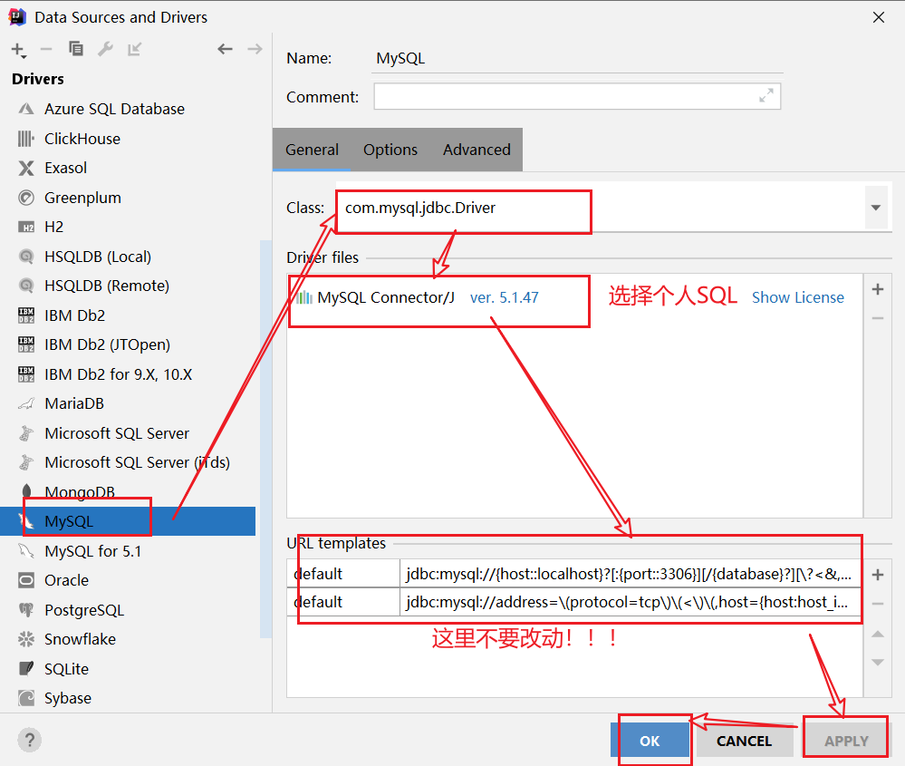

### 8.JDBC操作事务

- 事务：逻辑上的一组操作，组成这组操作的各个单元，==要不全部成功，要不全部不成功==。
- ACID原则：
  - 原子性(Atomic)：要么全部完成，要么都不完成。
  - 一致性(Consist)：总数不变。
  - **隔离性(Isolated)：多个进程互不干扰**。
  - 持久性(Durable)：一旦提交不可逆，持久化到数据库了。
- 隔离导致的一些问题：

  - 脏读：一个事务读取了另外一个事务未提交的数据。
  - 不可重复读：在一个事务内读取表中的某一行数据，多次读取结果不同。（这个不一定是错误，只是某些场合不对）。
  - 虚读(幻读)：是指在一个事务内读取到了别的事务插入的数据，导致前后读取数量总量不一致。

- 当Jdbc程序向数据库获得一个Connection对象时，默认情况下这个Connection对象会自动向数据库提交 在它上面发送的SQL语句。若想关闭这种默认提交方式，让多条SQL在一个事务中执行，可使用下列的 JDBC控制事务语句。

```java
Connection.setAutoCommit(false);//开启事务(start transaction)
Connection.rollback();//回滚事务(rollback)
Connection.commit();//提交事务(commit)
```

- 模拟转账成功时的业务

```java
package com.github.lesson04;

import com.github.lesson02.utils.Utils;

import java.sql.Connection;
import java.sql.PreparedStatement;
import java.sql.ResultSet;
import java.sql.SQLException;

/**
 * 模拟转账成功时的业务场景
 */
public class TestTransaction {
    public static void main(String[] args) {
        Connection conn = null;
        PreparedStatement st = null;
        ResultSet rs = null;

        try {
            // 关闭数据库的自动提交，自动开启事务
            conn = Utils.getConnection();
            // 开启事务
            conn.setAutoCommit(false);

            String sql1 = "update account set money=money-100 where name='A'";
            st = conn.prepareStatement(sql1);
            st.executeUpdate();

            String sql2 = "update account set money=money+100 where name='B'";
            st = conn.prepareStatement(sql2);
            st.executeUpdate();

            // 业务完毕，提交事务
            conn.commit();
            System.out.println("转账成功！！！");
        } catch (Exception e) {
            try {
                conn.rollback(); // 失败，则事务回滚
            } catch (SQLException throwables) {
                throwables.printStackTrace();
            }
            e.printStackTrace();
        } finally {
            Utils.release(conn,st,rs);
        }

    }
}
```

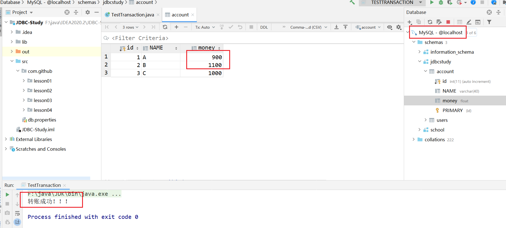

- 模拟转账过程中出现异常，导致部分SQL执行失败后，让数据库`自动`回滚事务

```java
package com.github.lesson04;

import com.github.lesson02.utils.Utils;

import java.sql.Connection;
import java.sql.PreparedStatement;
import java.sql.ResultSet;
import java.sql.SQLException;

/**
 * 模拟转账失败时的业务场景
 */
public class TestTransaction {
    public static void main(String[] args) {
        Connection conn = null;
        PreparedStatement st = null;
        ResultSet rs = null;

        try {
            // 关闭数据库的自动提交，自动开启事务
            conn = Utils.getConnection();
            // 开启事务
            conn.setAutoCommit(false);

            String sql1 = "update account set money=money-100 where name='A'";
            st = conn.prepareStatement(sql1);
            st.executeUpdate();

            int x=1/0;  // 报错

            String sql2 = "update account set money=money+100 where name='B'";
            st = conn.prepareStatement(sql2);
            st.executeUpdate();

            // 业务完毕，提交事务
            conn.commit();
            System.out.println("转账成功！！！");
        } catch (Exception e) {
            e.printStackTrace();
        } finally {
            Utils.release(conn,st,rs);
        }

    }
}
```

- 模拟转账过程中出现异常，导致部分SQL执行失败时，`手动`通知数据库回滚事务

```java
package com.github.lesson04;

import com.github.lesson02.utils.Utils;

import java.sql.Connection;
import java.sql.PreparedStatement;
import java.sql.ResultSet;
import java.sql.SQLException;

/**
 * 模拟转账失败时的业务场景
 */
public class TestTransaction {
    public static void main(String[] args) {
        Connection conn = null;
        PreparedStatement st = null;
        ResultSet rs = null;

        try {
            // 关闭数据库的自动提交，自动开启事务
            conn = Utils.getConnection();
            // 开启事务
            conn.setAutoCommit(false);

            String sql1 = "update account set money=money-100 where name='A'";
            st = conn.prepareStatement(sql1);
            st.executeUpdate();

            int x=1/0;  // 报错

            String sql2 = "update account set money=money+100 where name='B'";
            st = conn.prepareStatement(sql2);
            st.executeUpdate();

            // 业务完毕，提交事务
            conn.commit();
            System.out.println("转账成功！！！");
        } catch (Exception e) {
            try {
                conn.rollback(); // 失败，则事务回滚
            } catch (SQLException throwables) {
                throwables.printStackTrace();
            }
            e.printStackTrace();
        } finally {
            Utils.release(conn,st,rs);
        }

    }
}
```

### 8.数据库连接池

用户每次请求都需要向数据库获得链接，而数据库创建连接通常需要消耗相对较大的资源，创建时间也 较长。假设网站一天10万访问量，数据库服务器就需要创建10万次连接，极大的浪费数据库的资源，并且极易造成数据库服务器内存溢出、拓机。

> 数据库连接池的基本概念

数据库连接是一种关键的有限的昂贵的资源，这一点在多用户的网页应用程序中体现的尤为突出。对数据库连接的管理能显著影响到整个应用程序的伸缩性和健壮性，影响到程序的性能指标。数据库连接池正式针对这个问题提出来的。**数据库连接池负责分配,管理和释放数据库连接,它允许应用程序重复使用一个现有的 数据库连接,而不是重新建立一个**。 

数据库连接池在初始化时将创建一定数量的数据库连接放到连接池中，这些数据库连接的数量是由最小数据库连接数来设定的。无论这些数据库连接是否被使用，连接池都将一直保证至少拥有这么多的连接数量。连接池的最大数据库连接数量限定了这个连接池能占有的最大连接数，当应用程序向连接池请求的连接数 超过最大连接数量时，这些请求将被加入到等待队列中。

数据库连接池的最小连接数和最大连接数的设置要考虑到以下几个因素: 

1. 最小连接数：是连接池一直保持的数据库连接，所以如果应用程序对数据库连接的使用量不大，将会有大量的数据库连接资源被浪费。
2. 最大连接数：是连接池能申请的最大连接数，如果数据库连接请求超过次数，后面的数据库连接请求将被加入到等待队列中，这会影响以后的数据库操作。 
3. 如果最小连接数与最大连接数相差很大：那么最先连接请求将会获利，之后超过最小连接数量的连接请求等价于建立一个新的数据库连接。不过，这些大于最小连接数的数据库连接在使用完不会马上被释放，他将被放到连接池中等待重复使用或是空间超时后被释放。

==编写连接池，需实现java.sql.DataSource接口==。

> 开源数据源实现

现在很多WEB服务器(Weblogic, WebSphere, Tomcat)都提供了DataSoruce的实现，即连接池的实现。 **通常我们把DataSource的实现，按其英文含义称之为数据源，数据源中都包含了数据库连接池的实 现**。 

也有一些开源组织提供了数据源的独立实现： 

- DBCP 数据库连接池 
- C3P0 数据库连接池 
- Druid 数据库连接池 —— 阿里巴巴

在使用了数据库连接池之后，在项目的实际开发中就不需要编写连接数据库的代码了，直接从数据源获得数据库的连接。

> DBCP

- 要使用DBCP数据源，需要导入如下两个 jar 文件：

  - [Commons-dbcp-1.4.jar](https://mvnrepository.com/artifact/commons-dbcp/commons-dbcp/1.4)
  - [Commons-pool-1.6.jar](https://mvnrepository.com/artifact/commons-pool/commons-pool/1.6)

  

- 在src目录下加入dbcp的配置文件：dbcpconfig.properties

```java
#连接设置
driverClassName=com.mysql.jdbc.Driver
url=jdbc:mysql://localhost:3306/jdbcStudy?useUnicode=true&characterEncoding=utf8&useSSL=true
username=root
password=root

#<!-- 初始化连接 -->
initialSize=10

#最大连接数量
maxActive=50

#<!-- 最大空闲连接 -->
maxIdle=20

#<!-- 最小空闲连接 -->
minIdle=5

#<!-- 超时等待时间以毫秒为单位 6000毫秒/1000等于60秒 -->
maxWait=60000

#JDBC驱动建立连接时附带的连接属性属性的格式必须为这样：[属性名=property;]
#注意："user" 与 "password" 两个属性会被明确地传递，因此这里不需要包含他们。
connectionProperties=useUnicode=true;characterEncoding=UTF8

#指定由连接池所创建的连接的自动提交（auto-commit）状态。
defaultAutoCommit=true

#driver default 指定由连接池所创建的连接的只读（read-only）状态。
#如果没有设置该值，则“setReadOnly”方法将不被调用。（某些驱动并不支持只读模式，如：Informix）
defaultReadOnly=

#driver default 指定由连接池所创建的连接的事务级别（TransactionIsolation）。
#可用值为下列之一：（详情可见javadoc。）NONE,READ_UNCOMMITTED, READ_COMMITTED,REPEATABLE_READ, SERIALIZABLE
defaultTransactionIsolation=READ_UNCOMMITTED
```

- 编写工具类 Utils_DBCP

```java
package com.github.lesson05.utils;

import org.apache.commons.dbcp.BasicDataSourceFactory;

import javax.sql.DataSource;
import java.io.InputStream;
import java.sql.Connection;
import java.sql.ResultSet;
import java.sql.SQLException;
import java.sql.Statement;
import java.util.Properties;

/**
 * 数据库连接工具类
 */
public class Utils_DBCP {
    private static DataSource ds = null;

    static{
        try {
            InputStream in = Utils_DBCP.class.getClassLoader().getResourceAsStream("dbcpconfig.properties");
            Properties prpo = new Properties();
            prpo.load(in);
            // 创建数据源
            ds = BasicDataSourceFactory.createDataSource(prpo);
        } catch (Exception e) {
            throw new ExceptionInInitializerError(e);
        }
    }

    /**
     * 获取数据库连接
     * @return
     * @throws SQLException
     */
    public static Connection getConnection() throws SQLException {
        return ds.getConnection();
    }

    /**
     * 释放资源
     * @param conn
     * @param st
     * @param rs
     */
    public static void release(Connection conn, Statement st, ResultSet rs){
        if(rs!=null){
            try {
                rs.close();
            } catch (Exception e) {
                e.printStackTrace();
            }
        }
        if(st!=null) {
            try {
                st.close();
            } catch (Exception e) {
                e.printStackTrace();
            }
        }
        if(conn!=null) {
            try {
                conn.close();
            } catch (Exception e) {
                e.printStackTrace();
            }
        }
    }
}
```

- 测试

```java
package com.github.lesson05;

import com.github.lesson05.utils.Utils_DBCP;
import java.sql.*;

/**
 * 数据库连接工具类测试
 */
public class TestDbcp {
    public static void main(String[] args) {
        Connection conn = null;
        PreparedStatement st = null;
        ResultSet rs = null;
        try {
            conn = Utils_DBCP.getConnection();
            String sql = "insert into users(id,name,password,email,birthday) values (?,?,?,?,?)";
            st = conn.prepareStatement(sql);
            st.setInt(1,6);
            st.setString(2,"apple");
            st.setString(3,"232323");
            st.setString(4,"327338203@qq.com");
            st.setDate(5,new java.sql.Date(System.currentTimeMillis()));
            // 执行插入数据操作
            int num = st.executeUpdate();
            if(num>0){
                System.out.println("插入数据成功！！！");
            }

        } catch (Exception e) {
            e.printStackTrace();
        } finally {
            // SQL释放资源
            Utils_DBCP.release(conn,st,rs);
        }
    }
}
```

> C3P0

- C3P0是一个开源的JDBC连接池，它实现了数据源和JNDI绑定，支持JDBC3规范和JDBC2的标准扩展。目前使用它的开源项目有Hibernate，Spring等。

- c3p0与dbcp区别： 
  - dbcp没有自动回收空闲连接的功能；
  - c3p0有自动回收空闲连接功能。
- 要使用C3P0数据源，需要导入如下两个 jar 文件：
  - [c3p0-0.9.5.5.jar](https://mvnrepository.com/artifact/com.mchange/c3p0/0.9.5.5)
  - [mchange-commons-java-0.2.19.jar](https://mvnrepository.com/artifact/com.mchange/mchange-commons-java/0.2.19)
- 在src目录下加入C3P0的配置文件：c3p0-config.xml

```xml
<?xml version="1.0" encoding="UTF-8"?>
<c3p0-config>
    <!--
    C3P0的缺省(默认)配置，
    如果在代码中“ComboPooledDataSource ds = new ComboPooledDataSource();”这样写
    就表示使用的是C3P0的缺省(默认)配置信息来创建数据源
    -->
    <default-config>
        <property name="driverClass">com.mysql.jdbc.Driver</property>
        <property name="jdbcUrl">jdbc:mysql://localhost:3306/jdbcStudy? useUnicode=true&amp;characterEncoding=utf8&amp;useSSL=true</property>
        <property name="user">root</property>
        <property name="password">root</property>
        <property name="acquireIncrement">5</property>
        <property name="initialPoolSize">10</property>
        <property name="minPoolSize">5</property>
        <property name="maxPoolSize">20</property>
    </default-config>
    <!--
    C3P0的命名配置，
    如果在代码中“ComboPooledDataSource ds = new
    ComboPooledDataSource("MySQL");”这样写就表示使用的是name是MySQL的配置
    信息来创建数据源
    -->
    <named-config name="MySQL">
        <property name="driverClass">com.mysql.jdbc.Driver</property>
        <property name="jdbcUrl">jdbc:mysql://localhost:3306/jdbcStudy?useUnicode=true&amp;characterEncoding=utf8&amp;useSSL=true</property>
        <property name="user">root</property>
        <property name="password">root</property>
        <property name="acquireIncrement">5</property>
        <property name="initialPoolSize">10</property>
        <property name="minPoolSize">5</property>
        <property name="maxPoolSize">20</property>
    </named-config>
</c3p0-config>
```

- 编写工具类 Utils_C3P0.java

```java
package com.github.lesson05.utils;

import com.mchange.v2.c3p0.ComboPooledDataSource;

import java.sql.Connection;
import java.sql.ResultSet;
import java.sql.SQLException;
import java.sql.Statement;

/**
 * C3P0工具类
 */
public class Utils_C3P0 {
    private static ComboPooledDataSource ds = null;

    static{
        try {
            // 使用C3P0的默认配置来创建数据源
            ds = new ComboPooledDataSource();
            // 使用C3P0的命名配置来创建数据源
//            ds = new ComboPooledDataSource("MySQL");
        } catch (Exception e) {
            throw new ExceptionInInitializerError(e);
        }
    }

    /**
     * 获取数据库连接
     * @return
     * @throws SQLException
     */
    public static Connection getConnection() throws SQLException {
        return ds.getConnection();
    }

    /**
     * 释放资源
     * @param conn
     * @param st
     * @param rs
     */
    public static void release(Connection conn, Statement st, ResultSet rs) {
        if(rs != null){
            try {
                rs.close();
            } catch (Exception e) {
                e.printStackTrace();
            }
        }
        if(st!=null) {
            try {
                st.close();
            } catch (Exception e) {
                e.printStackTrace();
            }
        }
        if(conn!=null) {
            try {
                conn.close();
            } catch (Exception e) {
                e.printStackTrace();
            }
        }
    }
}
```

- 测试类

```java
package com.github.lesson05;

import com.github.lesson05.utils.Utils_C3P0;

import java.sql.Connection;
import java.sql.PreparedStatement;
import java.sql.ResultSet;

/**
 * C3P0测试类
 */
public class TestC3P0 {
    public static void main(String[] args) {
        Connection conn = null;
        PreparedStatement st = null;
        ResultSet rs = null;
        try {
            conn = Utils_C3P0.getConnection();
            String sql = "insert into users(id,name,password,email,birthday) values (?,?,?,?,?)";
            st = conn.prepareStatement(sql);
            st.setInt(1,7);
            st.setString(2,"pink");
            st.setString(3,"263223");
            st.setString(4,"3276128203@qq.com");
            st.setDate(5,new java.sql.Date(System.currentTimeMillis()));
            // 执行插入数据操作
            int num = st.executeUpdate();
            if(num>0){
                System.out.println("插入数据成功！！！");
            }

        } catch (Exception e) {
            e.printStackTrace();
        } finally {
            // SQL释放资源
            Utils_C3P0.release(conn,st,rs);
        }
    }
}
```

## MySQL快速入门完结🎉🎉🎉🎉

