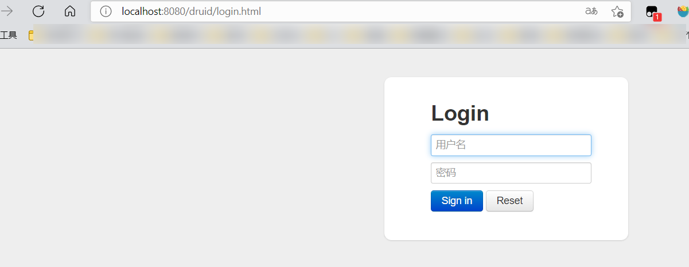
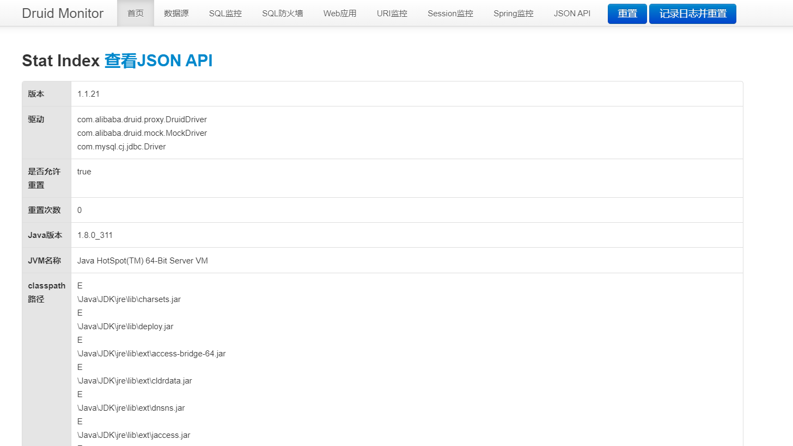

# SpringBoot操作数据库

## 1.整合JDBC

> SpringData简介

- 对于数据访问层，无论是 SQL(关系型数据库) 还是 NOSQL(非关系型数据库)，Spring Boot 底层都是采用 Spring Data 的方式进行统一处理。

- Spring Boot 底层都是采用 Spring Data 的方式进行统一处理各种数据库，Spring Data 也是 Spring 中与 Spring Boot、Spring Cloud 等齐名的知名项目。

- Sping Data 官网：https://spring.io/projects/spring-data

- 数据库相关的启动器 ：[弹簧启动参考文档 (spring.io)](https://docs.spring.io/spring-boot/docs/2.6.3/reference/htmlsingle/#using.build-systems.starters)


> 整合JDBC

1. 导入测试数据库

```mysql
CREATE DATABASE /*!32312 IF NOT EXISTS*/`springboot` /*!40100 DEFAULT
CHARACTER SET utf8 */;

USE `springboot`;

/*Table structure for table `department` */
DROP TABLE IF EXISTS `department`;

CREATE TABLE `department` (
`id` int(3) NOT NULL AUTO_INCREMENT COMMENT '部门id',
`department_name` varchar(20) NOT NULL COMMENT '部门名字',
PRIMARY KEY (`id`)
) ENGINE=InnoDB AUTO_INCREMENT=106 DEFAULT CHARSET=utf8;
/*Data for the table `department` */

insert into `department`(`id`,`department_name`) values (101,'技术部'),
(102,'销售部'),(103,'售后部'),(104,'后勤部'),(105,'运营部');

/*Table structure for table `employee` */
DROP TABLE IF EXISTS `employee`;

CREATE TABLE `employee` (
`id` int(5) NOT NULL AUTO_INCREMENT COMMENT '雇员id',
`last_name` varchar(100) NOT NULL COMMENT '名字',
`email` varchar(100) NOT NULL COMMENT '邮箱',
`gender` int(2) NOT NULL COMMENT '性别1 男, 0 女',
`department` int(3) NOT NULL COMMENT '部门id',
`birth` datetime NOT NULL COMMENT '生日',
PRIMARY KEY (`id`)
) ENGINE=InnoDB AUTO_INCREMENT=1006 DEFAULT CHARSET=utf8;
/*Data for the table `employee` */

insert into
`employee`(`id`,`last_name`,`email`,`gender`,`department`,`birth`) values
(1001,'张三','243357594@qq.com',1,101,'2021-03-06 15:04:33'),(1002,'李
四','243357594@qq.com',1,102,'2021-03-06 15:04:36'),(1003,'王
五','243357594@qq.com',0,103,'2021-03-06 15:04:37'),(1004,'赵
六','243357594@qq.com',1,104,'2021-03-06 15:04:39'),(1005,'孙
七','243357594@qq.com',0,105,'2021-03-06 15:04:45');
```

2. 新建一个项目测试：springboot-data-jdbc; 引入相应的模块！基础模块


3. 项目建好之后，发现自动帮我们导入了如下的启动器：

```xml
<dependency>
    <groupId>org.springframework.boot</groupId>
    <artifactId>spring-boot-starter-jdbc</artifactId>
</dependency>
<dependency>
    <groupId>mysql</groupId>
    <artifactId>mysql-connector-java</artifactId>
    <scope>runtime</scope>
</dependency>
```

4. 编写yaml配置文件连接数据库；

```yaml
spring: 
  datasource:
    username: root
    password: root
    # ?serverTimezone=UTC解决时区的报错
    url: jdbc:mysql://localhost:3306/springboot?serverTimezone=UTC&useUnicode=true&characterEncoding=utf-8
    driver-class-name: com.mysql.cj.jdbc.Driver
```

5. 配置完这一些东西后，就可以直接去使用了！因为SpringBoot已经默认帮我们进行了自动配置；去测试类测试一下：

```java
@SpringBootTest
class Springboot05JdbcApplicationTests {
    // DI注入数据源
    @Autowired
    DataSource dataSource;
    
    @Test
    void contextLoads() throws SQLException {
        // 查看默认数据源
        System.out.println(dataSource.getClass());
        // 获得连接
        Connection connection = dataSource.getConnection();
        System.out.println(connection);
        // 关闭连接
        connection.close();
    }

}
```

- 结果：可以看到他默认给我们配置的数据源为: class com.zaxxer.hikari.HikariDataSource，我们并没有手动配置。


- 来全局搜索一下，找到数据源的所有自动配置都在：DataSourceAutoConfiguration文件：

```java
@Import({Hikari.class, Tomcat.class, Dbcp2.class, OracleUcp.class, Generic.class, DataSourceJmxConfiguration.class})
protected static class PooledDataSourceConfiguration {
    protected PooledDataSourceConfiguration() {
    }
}
```

- 这里导入的类都在 DataSourceConfiguration 配置类下，可以看出 Spring Boot 2.6.3默认使用 HikariDataSource 数据源，而以前版本，如 Spring Boot 1.5默认使用 org.apache.tomcat.jdbc.pool.DataSource 作为数据源； 
- ==HikariDataSource 号称 Java WEB 当前速度最快的数据源，相比于传统的 C3P0 、DBCP、Tomcat jdbc 等连接池更加优秀==；
- **可以使用 spring.datasource.type 指定自定义的数据源类型，值为要使用的连接池实现的完全限定名**。
- 关于数据源不做过多介绍，有了数据库连接，显然就可以CRUD操作数据库了。但是仍需要先了解一个对象——`JdbcTemplate`。

> JdbcTemplate

1. 有了数据源(com.zaxxer.hikari.HikariDataSource)，然后可以拿到数据库连接 (java.sql.Connection)，有了连接，就可以使用原生的 JDBC 语句来操作数据库； 
2. 即使不使用第三方第数据库操作框架，如 MyBatis等，Spring 本身也对原生的JDBC 做了轻量级的封装，即`JdbcTemplate`。 
3. 数据库操作的所有 CRUD 方法都在 JdbcTemplate 中。 
4. Spring Boot不仅提供了默认的数据源，同时默认已经配置好了 JdbcTemplate 放在了容器中，程序员只需自己注入即可使用。
5. JdbcTemplate 的自动配置是依赖 org.springframework.boot.autoconfigure.jdbc 包下的JdbcTemplateConfiguration类。

**JdbcTemplate主要提供以下几类方法**： 

- execute方法：可以用于执行任何SQL语句，一般用于执行DDL语句； 
- update方法及batchUpdate方法：update方法用于执行新增、修改、删除等语句；batchUpdate 方法用于执行批处理相关语句； 
- query方法及queryForXXX方法：用于执行查询相关语句； 
- call方法：用于执行存储过程、函数相关语句。

> 测试案例

- 编写一个Controller，注入jdbcTemplate，编写测试方法进行访问测试；

```java
package com.github.controller;

import org.springframework.beans.factory.annotation.Autowired;
import org.springframework.jdbc.core.JdbcTemplate;
import org.springframework.web.bind.annotation.GetMapping;
import org.springframework.web.bind.annotation.PathVariable;
import org.springframework.web.bind.annotation.RequestMapping;
import org.springframework.web.bind.annotation.RestController;

import java.util.Date;
import java.util.List;
import java.util.Map;

/**
 * @author subeiLY
 * @create 2022-01-26 14:35
 */
@RestController
//@RequestMapping("/jdbc")
public class JdbcController {
    /**
     *  Spring Boot 默认提供了数据源，默认提供了 org.springframework.jdbc.core.JdbcTemplate
     *  JdbcTemplate 中会自己注入数据源，用于简化 JDBC操作
     *  还能避免一些常见的错误,使用起来也不用再自己来关闭数据库连接
     */
    @Autowired
    JdbcTemplate jdbcTemplate;

    /**
     *     查询employee表中所有数据
     *     List 中的1个 Map 对应数据库的 1行数据
     *     Map 中的 key 对应数据库的字段名，value 对应数据库的字段值
     */
    @GetMapping("/list")
    public List<Map<String, Object>> userList(){
        String sql = "select * from employee";
        List<Map<String, Object>> maps = jdbcTemplate.queryForList(sql);
        return maps;
    }

    /**
     * 新增一个用户
     */
    @GetMapping("/add")
    public String addUser(){
        // 插入语句，注意时间问题
        String sql = "insert into employee(last_name, email,gender,department,birth)" +
                " values ('夸克','243357594@qq.com',1,101,'"+ new Date().toLocaleString() +"')";
        jdbcTemplate.update(sql);
        // 查询
        return "addOk";
    }

    /**
     * 修改用户信息
     */
    @GetMapping("/update/{id}")
    public String updateUser(@PathVariable("id") int id){
        // 插入语句
        String sql = "update employee set last_name=?,email=? where id="+id;
        // 数据
        Object[] objects = new Object[2];
        objects[0] = "subei";
        objects[1] = "243357594@163.com";
        jdbcTemplate.update(sql,objects);
        // 查询
        return "updateOk";
    }

    /**
     * 删除用户
     */
    @GetMapping("/delete/{id}")
    public String delUser(@PathVariable("id") int id){
        // 删除语句
        String sql = "delete from employee where id=?";
        jdbcTemplate.update(sql,id);
        // 查询
        return "deleteOk";
    }
}
```


> 至此，CURD的基本操作，使用 JDBC 就搞定了。

## 2.整合Druid

> Druid 简介

- Java程序很大一部分要操作数据库，为了提高性能操作数据库的时候，又不得不使用数据库连接池。 
- Druid是阿里巴巴开源平台上一个数据库连接池实现，结合了 C3P0、DBCP 等DB池的优点，同时加入了日志监控。 
- Druid可以很好的监控 DB 池连接和 SQL 的执行情况，天生就是针对监控而生的DB连接池。 
- Spring Boot 2.0 以上默认使用Hikari数据源，可以说Hikari与Driud都是当前Java Web上最优秀的数据源，我们来重点介绍Spring Boot如何集成Druid数据源，如何实现数据库监控。 
- Github地址：https://github.com/alibaba/druid

> com.alibaba.druid.pool.DruidDataSource 基本配置参数如下：

| 配置                          | 缺省值             | 说明                                                         |
| ----------------------------- | ------------------ | ------------------------------------------------------------ |
| name                          |                    | 配置这个属性的意义在于，如果存在多个数据源，监控的时候可以通过名字来区分开来。如果没有配置，将会生成一个名字，格式是："DataSource-" + System.identityHashCode(this). |
| url                           |                    | 连接数据库的url，不同数据库不一样。例如： mysql: jdbc:mysql://10.20.153.104:3306/druid2 oracle: jdbc:oracle:thin:@10.20.149.85:1521:ocnauto |
| username                      |                    | 连接数据库的用户名                                           |
| password                      |                    | 连接数据库的密码。如果你不希望密码直接写在配置文件中，可以使用ConfigFilter。 |
| driverClassName               | 根据url自动识别    | 这一项可配可不配，如果不配置druid会根据url自动识别dbType，然后选择相应的driverClassName |
| initalSize                    | 0                  | 初始化时建立物理连接的个数。初始化发生在显示调用init方法，或者第一次getConnection时 |
| maxActive                     | 8                  | 最大连接池数量                                               |
| maxIdle                       | 8                  | ==已经不再使用，配置了也没效果==                             |
| minIdle                       |                    | 最小连接池数量                                               |
| maxWait                       |                    | 获取连接时最大等待时间，单位毫秒。配置了maxWait之后，缺省启用公平锁，并发效率会有所下降，如果需要可以通过配置useUnfairLock属性为true使用非公平锁。 |
| poolPreparedStatements        | false              | 是否缓存preparedStatement，也就是PSCache。PSCache对支持游标的数据库性能提升巨大，比如说oracle。在mysql下建议关闭。 |
| maxOpenPreparedStatements     | -1                 | 要启用PSCache，必须配置大于0，当大于0时，poolPreparedStatements自动触发修改为true。在Druid中，不会存在Oracle下PSCache占用内存过多的问题，可以把这个数值配置大一些，比如说100 |
| validationQuery               |                    | 用来检测连接是否有效的sql，要求是一个查询语句。如果validationQuery为null，testOnBorrow、testOnReturn、testWhileIdle都不会其作用。 |
| validationQueryTimeout        |                    | 单位：秒，检测连接是否有效的超时时间。底层调用jdbc Statement对象的void setQueryTimeout(int seconds)方法。 |
| testOnBorrow                  | true               | 申请连接时执行validationQuery检测连接是否有效，做了这个配置会降低性能。 |
| testOnReturn                  | false              | 归还连接时执行validationQuery检测连接是否有效，做了这个配置会降低性能 |
| testWhileIdle                 | false              | 建议配置为true，不影响性能，并且保证安全性。申请连接的时候检测，如果空闲时间大于timeBetweenEvictionRunsMillis，执行validationQuery检测连接是否有效。 |
| timeBetweenEvictionRunsMillis | 1分钟 （1.0.14）   | 有两个含义： 1) Destroy线程会检测连接的间隔时间，如果连接空闲时间大于等于minEvictableIdleTimeMillis则关闭物理连接 2) testWhileIdle的判断依据，详细看testWhileIdle属性的说明。 |
| numTestsPerEvictionRun        |                    | 不再使用，一个DruidDataSource只支持一个EvictionRun           |
| numTestsPerEvictionRun        | 30分钟 （1.0.14）  | 连接保持空闲而不被驱逐的最长时间                             |
| connectionInitSqls            |                    | 物理连接初始化的时候执行的sql                                |
| exceptionSorter               | 根据dbType自动识别 | 当数据库抛出一些不可恢复的异常时，抛弃连接                   |
| filters                       |                    | 属性类型是字符串，通过别名的方式配置扩展插件，常用 的插件有：监控统计用的filter:stat 日志用的filter:log4j 防御sql注入的filter:wall |
| proxyFilters                  |                    | 类型是List，如果同时配置了filters和proxyFilters，是组合关系，并非替换关系 |

> 配置数据源

1. 添加上Druid数据源依赖。

```xml
<!-- https://mvnrepository.com/artifact/com.alibaba/druid -->
<dependency>
    <groupId>com.alibaba</groupId>
    <artifactId>druid</artifactId>
    <version>1.1.21</version>
</dependency>
```

2. 切换数据源；之前已经说过 Spring Boot 2.0 以上默认使用com.zaxxer.hikari.HikariDataSource数据源，但可以通过spring.datasource.type指定数据源。

```yaml
spring:
  datasource:
    username: root
    password: root
    # ?serverTimezone=UTC解决时区的报错
    url: jdbc:mysql://localhost:3306/springboot?serverTimezone=UTC&useUnicode=true&characterEncoding=utf-8
    driver-class-name: com.mysql.cj.jdbc.Driver
    type: com.alibaba.druid.pool.DruidDataSource # 自定义数据源
```

3. 数据源切换之后，在测试类中注入DataSource，然后获取到它，输出一看便知是否成功切换；


4. 切换成功！既然切换成功，就可以设置数据源连接初始化大小、最大连接数、等待时间、最小连接数 等设置项；可以查看源码。

```yaml
spring:
  datasource:
    username: root
    password: root
    # ?serverTimezone=UTC解决时区的报错
    url: jdbc:mysql://localhost:3306/springboot?serverTimezone=UTC&useUnicode=true&characterEncoding=utf-8
    driver-class-name: com.mysql.cj.jdbc.Driver
    type: com.alibaba.druid.pool.DruidDataSource # 自定义数据源

    #Spring Boot 默认是不注入这些属性值的，需要自己绑定
    #druid 数据源专有配置
    initialSize: 5
    minIdle: 5
    maxActive: 20
    maxWait: 60000
    timeBetweenEvictionRunsMillis: 60000
    minEvictableIdleTimeMillis: 300000
    validationQuery: SELECT 1 FROM DUAL
    testWhileIdle: true
    testOnBorrow: false
    testOnReturn: false
    poolPreparedStatements: true
    #配置监控统计拦截的filters，stat:监控统计、log4j：日志记录、wall：防御sql注入
    #如果允许时报错 java.lang.ClassNotFoundException: org.apache.log4j.Priority
      #则导入 log4j 依赖即可，Maven 地址：https://mvnrepository.com/artifact/log4j/log4j
    filters: stat,wall,log4j
    maxPoolPreparedStatementPerConnectionSize: 20
    useGlobalDataSourceStat: true
    connectionProperties: druid.stat.mergeSql=true;druid.stat.slowSqlMillis=500
```

5. 导入Log4j的依赖

```xml
<!-- https://mvnrepository.com/artifact/log4j/log4j -->
<dependency>
    <groupId>log4j</groupId>
    <artifactId>log4j</artifactId>
    <version>1.2.17</version>
</dependency>
```

6. 为DruidDataSource 绑定全局配置文件中的参数，再添加到容器中，而不再使用Spring Boot的自动生成了；需要自己添加DruidDataSource组件到容器中，并绑定属性；

```java
package com.github.controller;

import com.alibaba.druid.pool.DruidDataSource;
import org.springframework.boot.context.properties.ConfigurationProperties;
import org.springframework.context.annotation.Bean;
import org.springframework.context.annotation.Configuration;

import javax.sql.DataSource;

@Configuration
public class DruidConfig {

    /**
     *   将自定义的 Druid数据源添加到容器中，不再让 Spring Boot 自动创建
     *   绑定全局配置文件中的 druid 数据源属性到 com.alibaba.druid.pool.DruidDataSource从而让它们生效
     *   @ConfigurationProperties(prefix = "spring.datasource")：作用就是将 全局配置文件中
     *   前缀为 spring.datasource的属性值注入到 com.alibaba.druid.pool.DruidDataSource 的同名参数中
     */
    @ConfigurationProperties(prefix = "spring.datasource")
    @Bean
    public DataSource druidDataSource() {
        return new DruidDataSource();
    }

}
```

7. 去测试类中测试一下；看是否成功！

```java
@SpringBootTest
class SpringbootDataJdbcApplicationTests {
    // DI注入数据源
    @Autowired
    DataSource dataSource;

    @Test
    public void contextLoads() throws SQLException {
        // 查看默认数据源
        System.out.println(dataSource.getClass());
        // 获得连接
        Connection connection =   dataSource.getConnection();
        System.out.println(connection);

        DruidDataSource druidDataSource = (DruidDataSource) dataSource;
        System.out.println("druidDataSource 数据源最大连接数：" + druidDataSource.getMaxActive());
        System.out.println("druidDataSource 数据源初始化连接数：" + druidDataSource.getInitialSize());

        // 关闭连接
        connection.close();
    }
}
```

- 输出结果：可见配置参数已经生效！


> 配置 Druid 数据源监控

- Druid 数据源具有监控的功能，并提供了一个web界面方便用户查看，类似安装路由器时，人家也提 供了一个默认的web页面。
- 所以第一步需要设置 Druid 的后台管理页面，比如登录账号、密码等；配置后台管理；

```java
    // 配置 Druid 监控管理后台的Servlet；
    // 内置 Servlet 容器时没有web.xml文件，所以使用 Spring Boot 的注册 Servlet 方式
    @Bean
    public ServletRegistrationBean statViewServlet() {
        ServletRegistrationBean bean = new ServletRegistrationBean(new StatViewServlet(), "/druid/*");

        // 这些参数可以在 com.alibaba.druid.support.http.StatViewServlet
        // 的父类 com.alibaba.druid.support.http.ResourceServlet 中找到
        Map<String, String> initParams = new HashMap<>();
        initParams.put("loginUsername", "admin"); //后台管理界面的登录账号
        initParams.put("loginPassword", "123456"); //后台管理界面的登录密码

        // 后台允许谁可以访问
        // initParams.put("allow", "localhost")：表示只有本机可以访问
        // initParams.put("allow", "")：为空或者为null时，表示允许所有访问
        initParams.put("allow", "");
        // deny：Druid 后台拒绝谁访问
        // initParams.put("kuangshen", "192.168.1.20");表示禁止此ip访问

        // 设置初始化参数
        bean.setInitParameters(initParams);
        return bean;
    }
```

- 配置完毕后，访问： http://localhost:8080/druid/login.html



- 进入之后



- 配置Druid web监控filter过滤器

```java
// 配置 Druid 监控 之  web 监控的 filter
// WebStatFilter：用于配置Web和Druid数据源之间的管理关联监控统计
@Bean
public FilterRegistrationBean webStatFilter() {
    FilterRegistrationBean bean = new FilterRegistrationBean();
    bean.setFilter(new WebStatFilter());

    // exclusions：设置哪些请求进行过滤排除掉，从而不进行统计
    Map<String, String> initParams = new HashMap<>();
    initParams.put("exclusions", "*.js,*.css,/druid/*,/jdbc/*");
    bean.setInitParameters(initParams);

    // "/*" 表示过滤所有请求
    bean.setUrlPatterns(Arrays.asList("/*"));
    return bean;
}
```

> 平时在工作中，按需求进行配置即可，主要用作监控！

## 3.整合MyBatis

- 官方文档：http://mybatis.org/spring-boot-starter/mybatis-spring-boot-autoconfigure/ 
- Maven仓库地址：[Maven Repository: org.mybatis.spring.boot » mybatis-spring-boot-starter » 2.2.1 (mvnrepository.com)](https://mvnrepository.com/artifact/org.mybatis.spring.boot/mybatis-spring-boot-starter/2.2.1)

> 整合测试

1. 导入MyBatis所需要的依赖

```xml
<dependency>
    <groupId>org.mybatis.spring.boot</groupId>
    <artifactId>mybatis-spring-boot-starter</artifactId>
    <version>2.2.1</version>
</dependency>
```

2. 配置数据库连接信息

```yaml
spring:
  datasource:
    username: root
    password: root
    # ?serverTimezone=UTC解决时区的报错
    url: jdbc:mysql://localhost:3306/springboot?serverTimezone=UTC&useUnicode=true&characterEncoding=utf-8
    driver-class-name: com.mysql.cj.jdbc.Driver
    type: com.alibaba.druid.pool.DruidDataSource # 自定义数据源

    #Spring Boot 默认是不注入这些属性值的，需要自己绑定
    #druid 数据源专有配置
    initialSize: 5
    minIdle: 5
    maxActive: 20
    maxWait: 60000
    timeBetweenEvictionRunsMillis: 60000
    minEvictableIdleTimeMillis: 300000
    validationQuery: SELECT 1 FROM DUAL
    testWhileIdle: true
    testOnBorrow: false
    testOnReturn: false
    poolPreparedStatements: true
    #配置监控统计拦截的filters，stat:监控统计、log4j：日志记录、wall：防御sql注入
    #如果允许时报错 java.lang.ClassNotFoundException: org.apache.log4j.Priority
      #则导入 log4j 依赖即可，Maven 地址：https://mvnrepository.com/artifact/log4j/log4j
    filters: stat,wall,log4j
    maxPoolPreparedStatementPerConnectionSize: 20
    useGlobalDataSourceStat: true
    connectionProperties: druid.stat.mergeSql=true;druid.stat.slowSqlMillis=500
```

3. 测试数据库是否连接成功！

```java
@SpringBootTest
class Springboot05MybatisApplicationTests {
    // DI注入数据源
    @Autowired
    DataSource dataSource;

    @Test
    void contextLoads() throws SQLException {
        // 查看默认数据源
        System.out.println(dataSource.getClass());
        System.out.println(dataSource.getConnection());
    }

}
```

4. 创建实体类，导入`Lombok`！

```java
@Data
@NoArgsConstructor
@AllArgsConstructor
public class Department {
    private Integer id;
    private String departmentName;
}
```

5. 创建mapper目录以及对应的Mapper接口——`DepartmentMapper.java`！

```java
// @Mapper: 表示本类是一个 MyBatis 的 Mapper
@Mapper
@Repository
public interface DepartmentMapper {

    // 获取所有部门信息
    List<Department> getDepartments();

    // 通过id获得部门
    Department getDepartment(Integer id);

}
```

6. 对应的Mapper映射文件——`DepartmentMapper.xml`

```xml
<?xml version="1.0" encoding="UTF-8" ?>
<!DOCTYPE mapper
        PUBLIC "-//mybatis.org//DTD Mapper 3.0//EN"
        "http://mybatis.org/dtd/mybatis-3-mapper.dtd">

<mapper namespace="com.github.mapper.DepartmentMapper">

    <select id="getDepartments" resultType="Department">
        select * from department;
    </select>

    <select id="getDepartment" resultType="Department" parameterType="int">
        select * from department where id = #{id};
    </select>

</mapper>
```

7. maven配置资源过滤问题

```xml
<resources>
    <resource>
        <directory>src/main/java</directory>
        <includes>
            <include>**/*.xml</include>
        </includes>
        <filtering>true</filtering>
    </resource>
</resources>
```

> 既然已经提供了MyBatis 的映射配置文件，自然要告诉spring boot这些文件的位置。

```yaml
# 指定myBatis的核心配置文件与Mapper映射文件
mybatis.mapper-locations=classpath:mybatis/mapper/*.xml
# 注意：对应实体类的路径
mybatis.type-aliases-package=com.github.pojo
```

8. 编写部门的DepartmentController进行测试！

```java
@RestController
public class DepartmentController {

    @Autowired
    DepartmentMapper departmentMapper;

    // 查询全部部门
    @GetMapping("/getDepartments")
    public List<Department> getDepartments(){
        return departmentMapper.getDepartments();
    }

    // 查询全部部门
    @GetMapping("/getDepartment/{id}")
    public Department getDepartment(@PathVariable("id") Integer id){
        return departmentMapper.getDepartment(id);
    }

}
```

- 启动项目访问进行测试！


> 增加一个员工类再测试下，为之后做准备。

1. 新建一个pojo类Employee；

```java
@Data
@AllArgsConstructor
@NoArgsConstructor
public class Employee {

    private Integer id;
    private String lastName;
    private String email;
    //1 male, 0 female
    private Integer gender;
    private Integer department;
    private Date birth;

    private Department eDepartment; // 冗余设计

}
```

2. 新建一个EmployeeMapper接口

```java
// @Mapper: 表示本类是一个 MyBatis 的 Mapper
@Mapper
@Repository
public interface EmployeeMapper {

    // 获取所有员工信息
    List<Employee> getEmployees();

    // 新增一个员工
    int save(Employee employee);

    // 通过id获得员工信息
    Employee get(Integer id);

    // 通过id删除员工
    int delete(Integer id);

}
```

3. 编写EmployeeMapper.xml配置文件

```xml
<?xml version="1.0" encoding="UTF-8" ?>
<!DOCTYPE mapper
        PUBLIC "-//mybatis.org//DTD Mapper 3.0//EN"
        "http://mybatis.org/dtd/mybatis-3-mapper.dtd">

<mapper namespace="com.github.mapper.EmployeeMapper">

    <resultMap id="EmployeeMap" type="Employee">
        <id property="id" column="eid"/>
        <result property="lastName" column="last_name"/>
        <result property="email" column="email"/>
        <result property="gender" column="gender"/>
        <result property="birth" column="birth"/>
        <association property="eDepartment"  javaType="Department">
            <id property="id" column="did"/>
            <result property="departmentName" column="dname"/>
        </association>
    </resultMap>

    <select id="getEmployees" resultMap="EmployeeMap">
        select e.id as eid,last_name,email,gender,birth,d.id as did,d.department_name as dname
        from department d,employee e
        where d.id = e.department
    </select>

    <insert id="save" parameterType="Employee">
        insert into employee (last_name,email,gender,department,birth)
        values (#{lastName},#{email},#{gender},#{department},#{birth});
    </insert>

    <select id="get" resultType="Employee">
        select * from employee where id = #{id}
    </select>

    <delete id="delete" parameterType="int">
        delete from employee where id = #{id}
    </delete>

</mapper>
```

4. 编写EmployeeController类进行测试。

```java
@RestController
public class EmployeeController {

    @Autowired
    EmployeeMapper employeeMapper;

    // 获取所有员工信息
    @GetMapping("/getEmployees")
    public List<Employee> getEmployees(){
        return employeeMapper.getEmployees();
    }

    @GetMapping("/save")
    public int save(){
        Employee employee = new Employee();
        employee.setLastName("kuangshen");
        employee.setEmail("qinjiang@qq.com");
        employee.setGender(1);
        employee.setDepartment(101);
        employee.setBirth(new Date());
        return employeeMapper.save(employee);
    }

    // 通过id获得员工信息
    @GetMapping("/get/{id}")
    public Employee get(@PathVariable("id") Integer id){
        return employeeMapper.get(id);
    }

    // 通过id删除员工
    @GetMapping("/delete/{id}")
    public int delete(@PathVariable("id") Integer id){
        return employeeMapper.delete(id);
    }

}
```


> 测试结果完成！！！

## 4.集成Swagger

> 官网：[API Documentation & Design Tools for Teams | Swagger](https://swagger.io/)


### 1.Swagger简介

**前后端分离**

- 前端 -> 前端控制层、视图层；
- 后端 -> 后端控制层、服务层、数据访问层；
- 前后端通过API进行交互；
- 前后端相对独立且松耦合。

**产生的问题**

- 前后端集成，前端或者后端无法做到“及时协商，尽早解决”，最终导致问题集中爆发。

**解决方案**

- 首先定义schema[计划的提纲]，并实时跟踪最新的API，降低集成风险。

**Swagger**

- 号称世界上最流行的API框架；
- Restful API文档在线自动生成器 => **API 文档 与API 定义同步更新**。
- 直接运行，在线测试API；
- 支持多种语言（如：Java，PHP等）；
- 官网：https://swagger.io/

### 2.SpringBoot集成

**SpringBoot集成Swagger** => **springfox**，两个jar包

- **Springfox-swagger2**；
- swagger -> springmvc。

**使用Swagger**

- 要求：JDK1.8 + 否则swagger2无法运行。

步骤：

1. 新建一个SpringBoot-web项目

   

2. 添加Maven依赖

```xml
<!-- https://mvnrepository.com/artifact/io.springfox/springfox-swagger2 -->
<dependency>
   <groupId>io.springfox</groupId>
   <artifactId>springfox-swagger2</artifactId>
   <version>2.9.2</version>
</dependency>
<!-- https://mvnrepository.com/artifact/io.springfox/springfox-swagger-ui -->
<dependency>
   <groupId>io.springfox</groupId>
   <artifactId>springfox-swagger-ui</artifactId>
   <version>2.9.2</version>
</dependency>
```

3. 编写HelloController，测试确保运行成功！

```java

```

4. 要使用Swagger，我们需要编写一个配置类-SwaggerConfig来配置 Swagger

```java
```

5. 访问测试：http://localhost:8080/swagger-ui.html，可以看到swagger的界面。


### 3.配置Swagger

1. Swagger实例Bean是Docket，所以通过配置Docket实例来配置Swaggger。

```java
```

2. 可以通过apiInfo()属性配置文档信息；

```java
```

3. Docket 实例关联上apiInfo()

```java
```

4. 重启项目，访问测试 http://localhost:8080/swagger-ui.html 看下效果；


### 4.配置扫描端口


### 5.


## 5.整合Dubbo+Zookeeper


## 6.SpringSecurity权限控制


## 7.Shiro


