# 手把手教你如何分析开源项目

## 1.如何分析开源项目

> 学习的方式：

1. 不知道这个代码怎么来的；
2. 这个代码跑不起来；
3. 这个项目对我们有什么帮助，不会模块化分析；

**任何一个开源项目，都可以让自己等到提升**。

- 代码自动生成：我们平时会写很多业务代码，用Mybatis Plus去生成的，第三方的工具包去生成。
- 开源项目：eladmin

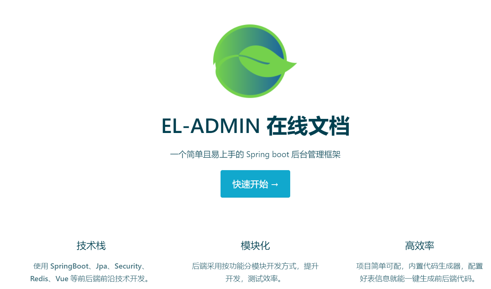

> **项目简介**

- 一个基于Spring Boot 2.1.0、Spring Boot Jpa、JWT、Spring Security、Redis、Vue的前后端分离的后台管理系统。

- **开发文档：** [https://el-admin.vip](https://el-admin.vip)

- **体验地址：** [https://el-admin.xin](https://el-admin.xin)

- **账号密码：** admin / 123456

> **项目源码**

|        | **后端源码**                                 | **前端源码**                                         |
| ------ | -------------------------------------------- | ---------------------------------------------------- |
| github | [eladmin](https://github.com/elunez/eladmin) | [eladmin-web](https://github.com/elunez/eladmin-web) |
| 码云   | [eladmin](https://gitee.com/elunez/eladmin)  | [eladmin-web](https://gitee.com/elunez/eladmin-web)  |

> 观察开源项目

- 后端：

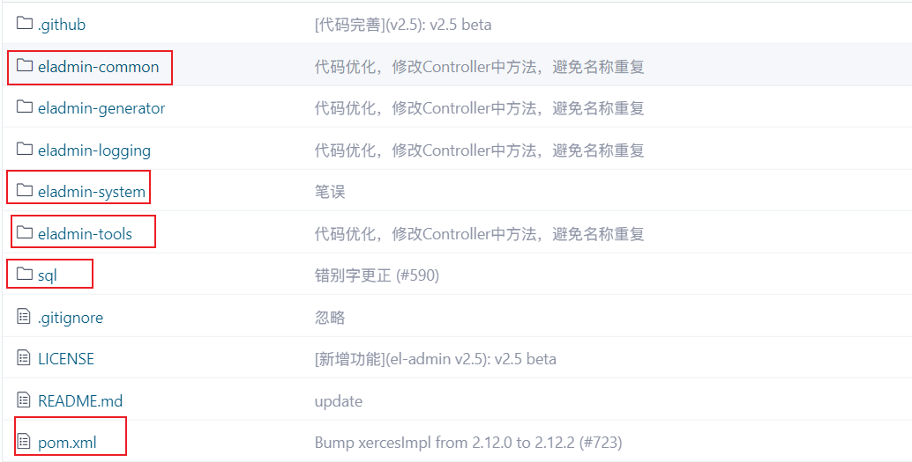

- 前端：

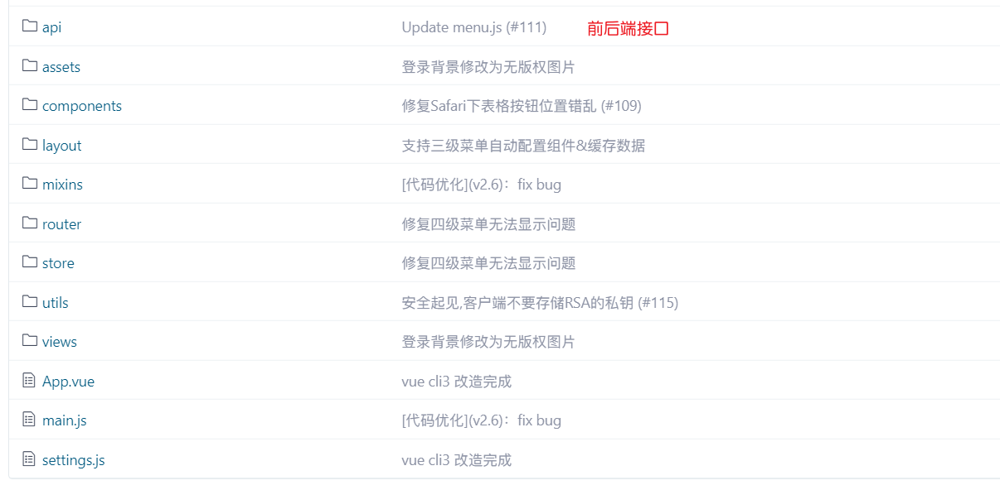

## 2.开源项目下载

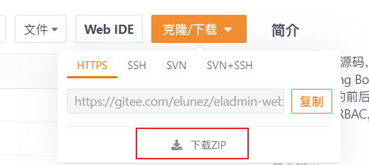

- 在码云下载，因为GitHub下载太慢了，下载完毕进行解压。
  - 后端：https://gitee.com/elunez/eladmin
  - 前端：https://gitee.com/elunez/eladmin-web

- 解压完不要着急运行，先去观察项目：
  1. 用了哪些技术（Springboot、Vue、Redis、MQ…）
  2. 是否有数据库
  3. 你的环境是否匹配(Maven、(npm、node.js)、redis…)

> 当需要的环境匹配了，再想办法运行。这里列出项目所需的环境与相关安装教程，方便刚入门的同学：

```html
1、JDK：1.8+ 
安装教程：https://www.runoob.com/java/java-environment-setup.html
2、Redis 3.0+
安装教程：https://www.runoob.com/redis/redis-install.html
3、Maven 3.0+
安装教程：https://www.runoob.com/maven/maven-setup.html
4、MYSQL 5.5.0+
安装教程：https://www.runoob.com/mysql/mysql-install.html
5、Node v10+ (最好使用 12，高版本可能会有问题)
安装教程：https://www.runoob.com/nodejs/nodejs-install-setup.html
```

>注意：
>
>- 前端安装完 node 后，最好设置下淘宝的镜像源，不建议使用 cnpm（可能会出现奇怪的问题）。

```nginx
npm config set registry https://registry.npm.taobao.org
配置后可通过下面方式来验证是否成功
npm config get registry

在 ~/.npmrc 加入下面内容，可以避免安装 node-sass 失败
sass_binary_site=https://npm.taobao.org/mirrors/node-sass/

.npmrc 文件位于
win：C:\Users\[你的账户名称]\.npmrc
linux：直接使用 vi ~/.npmrc
```

----

> 开发准备

**提示**：在使用该系统前，还需要做如下准备。

1. 给 [idea (opens new window)](https://blog.csdn.net/wochunyang/article/details/81736354)或者 [eclipse (opens new window)](https://blog.csdn.net/magi1201/article/details/85995987)安装 lombok 插件，我们用它可以省略get，set 方法，可以使代码更简洁。
2. 了解MapStruct，项目用到了他映射实体，如果你不熟悉可以查看：[熟悉MapStruct(opens new window)](https://www.jianshu.com/p/3f20ca1a93b0)
3. 你需要有 Spring boot 的基础。
4. 你还需要有 [Vue (opens new window)](https://cn.vuejs.org/v2/guide/)的基础。

==注意：因为本项目是前后端分离的，所以需要前后端都启动好，才能进行访问==。

## 3.如何跑起来

1. 安装数据库，执行SQL（先创建数据库，编码默认utf8）


2. 前端跑起来（在文件上全选文件名然后cmd）

```nginx
# 安装依赖
npm install

# 启动服务 localhost:8013
npm run dev

# 构建生产环境
npm run build:prod
```


3. 后端项目导入（打开idea——import）


4. 后端项目结构（一般前后端分离项目，前端依赖于后端）

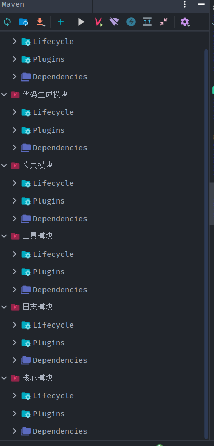

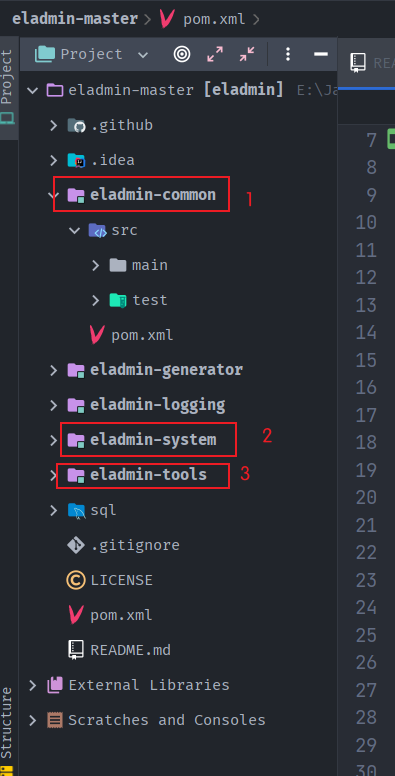

- 只要发现Swagger，就需要先进入Swagger-ui页面，因为前后端分离的接口全部都在这里；

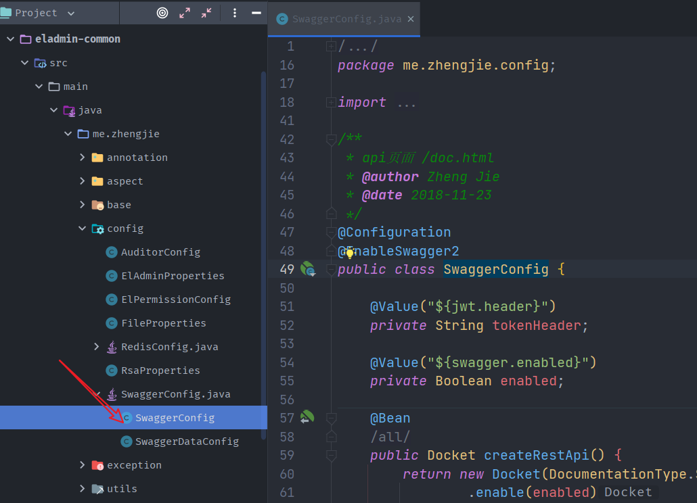

- 打开Redis

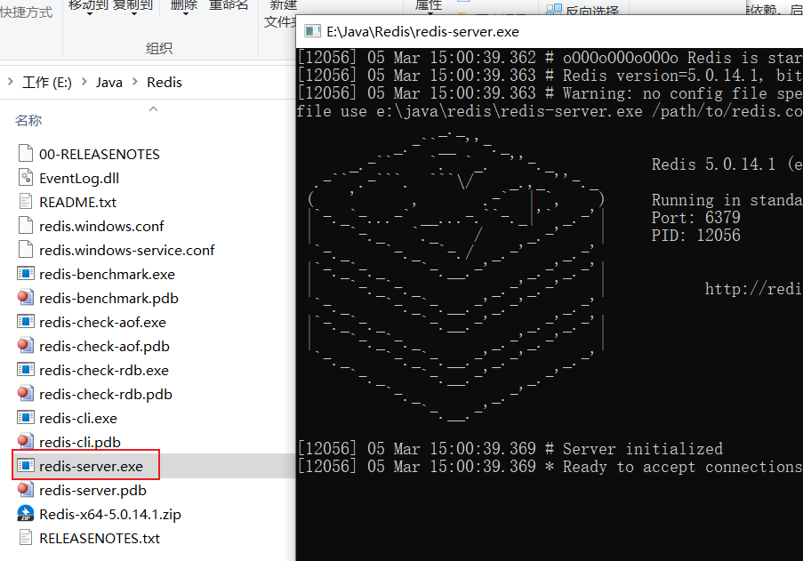

- 开发环境重点需要去看端口号：server：port：8000（在总文件application.yml里面）前端也是调这个端口。

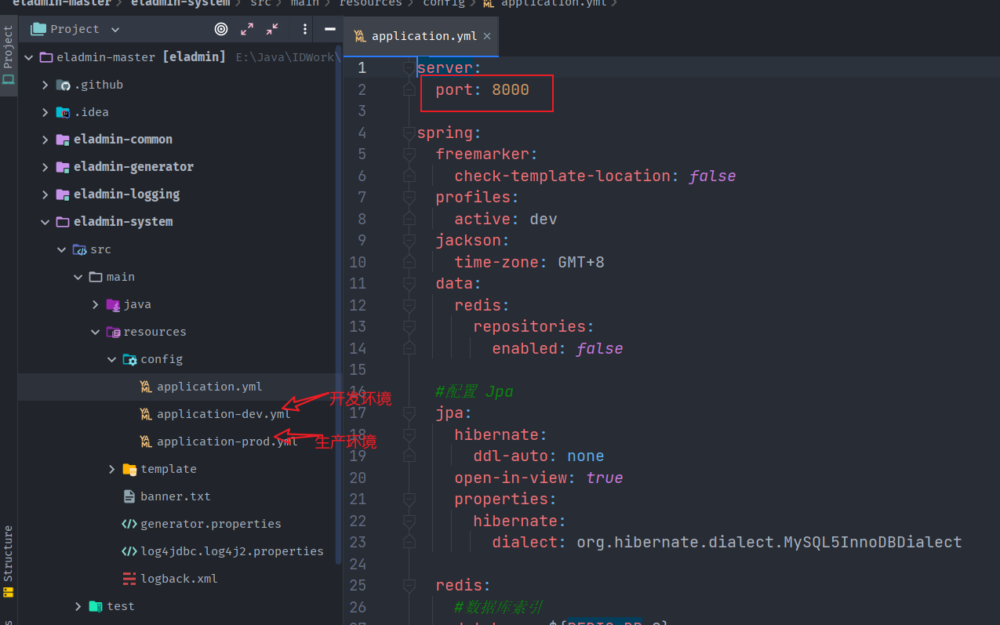

- 去看Redis的端口号。


- 看开发环境dev.yml的JDBC是否有问题。

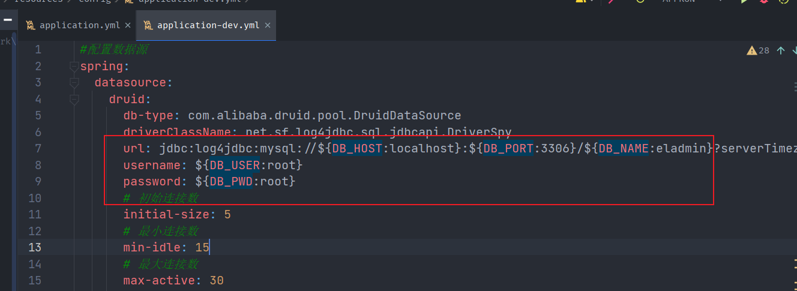

- 启动后端项目：

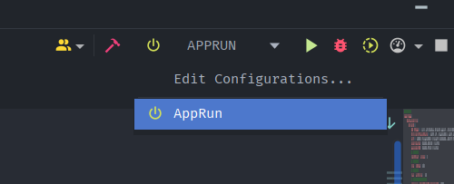

- 进入页面：localhost:8000/swagger-ui.html

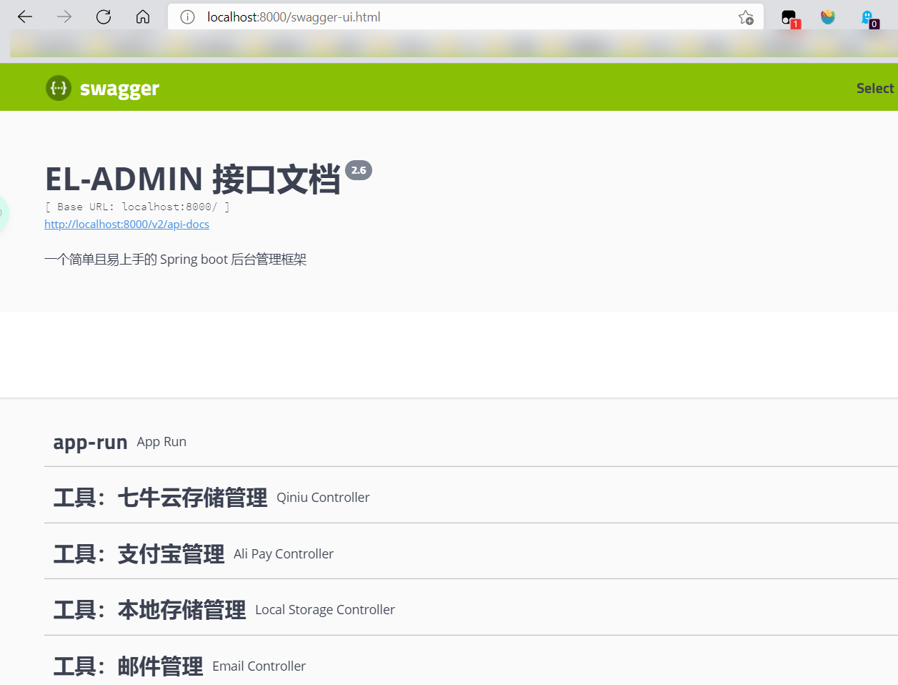

- 前端跑起来：

```nginx
# 启动服务 localhost:8013
npm run dev
```

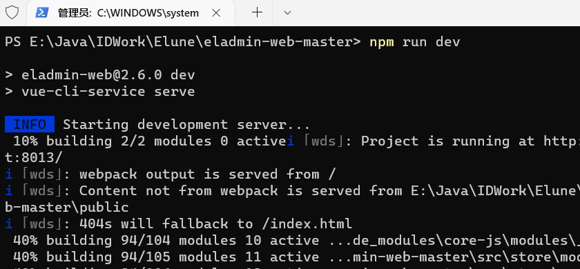

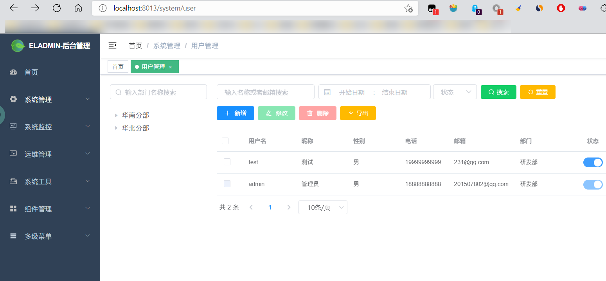

> 启动成功！
>
> - 用户名和密码：admin/123456

## 4.前后端分离项目的固定套路

1. 从前端开始分拆，打开控制台(`VS-Code`)，点一个接口，分析一波调用关系

2. 前后端端口调用不一致：前端：8013 后端：8000；研究怎么操作。
   1. 封装了接口请求 ajax(前后端分离) axios(Vue) request(前端封装)
   2. 找到配置（生产配置、开发环境配置）


3. 前后端分离项目的重点：==找到接口的调用关系==。
4. Springboot提供服务、前端调用接口数据、Vue负责渲染页面

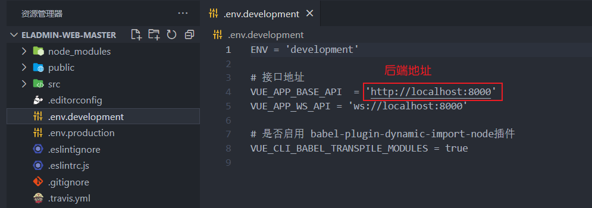

- 前端项目固定模板：

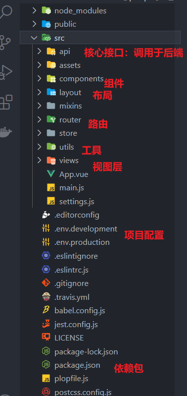

- 每一个接口的后面都在后端有一个一一对应的地址。
- 通过抓取前端的请求，找到后端对应的接口。


- 在前端文件中，找对应的接口文件：

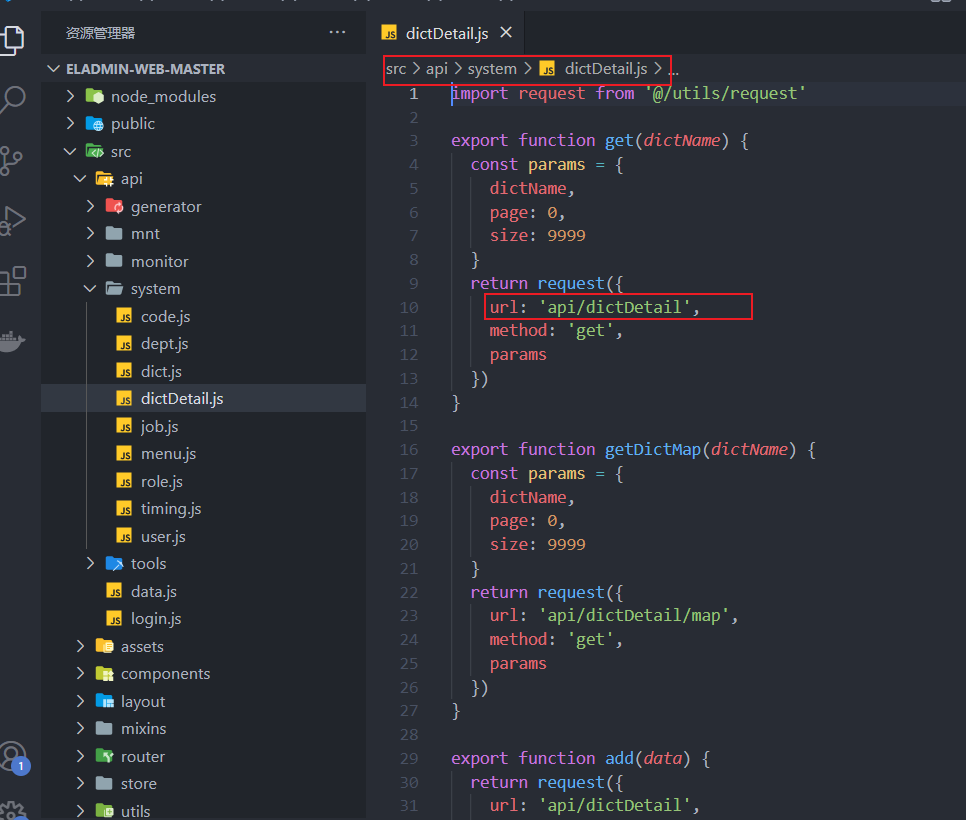

- 在后端文件中，找对应的接口文件：

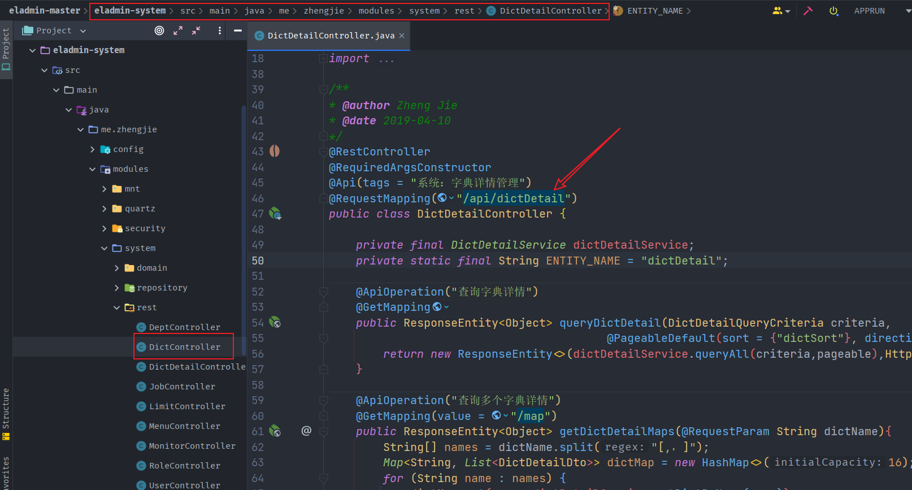

5. 怎么去跟后端对接？拿到接口的地址：

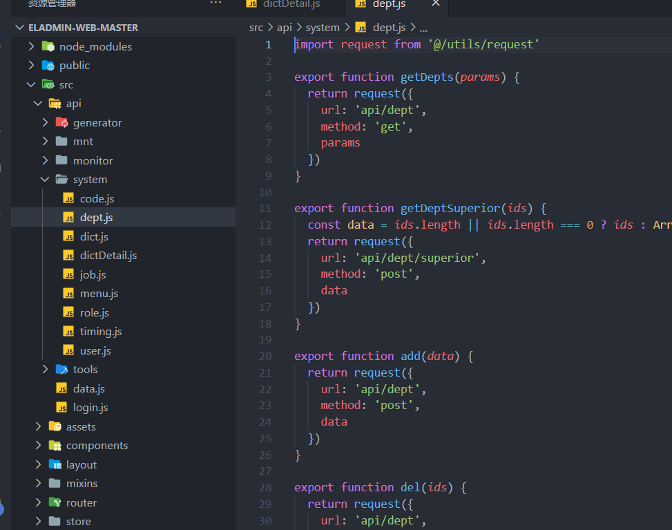

- 去后端找：


> 后端分析套路：==Controller ——> Service ——> Dao==

- 从前到后知道怎么分析了，但是如何渲染到视图上的呢？
- 看前端：==搜索一个接口，查看其地址在哪里调用了==。

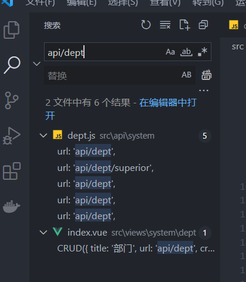

- Vue标准套路：
  - template：视图层
  - script：js操作，接口的调用
  - style：页面的样式

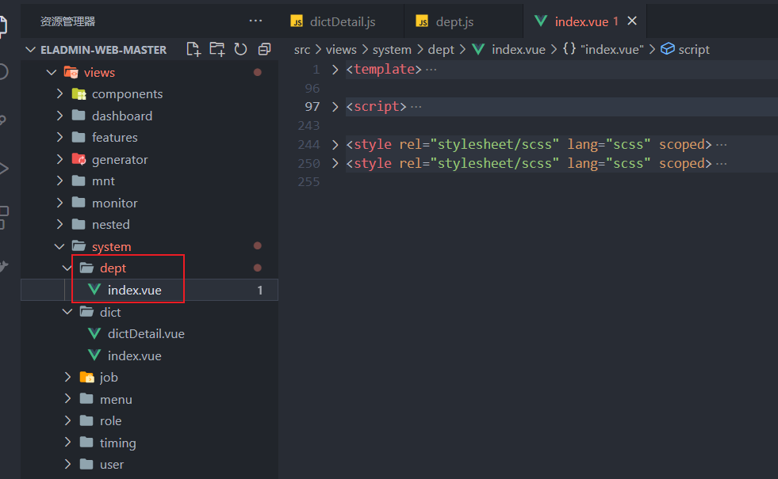

- 当我们要学习一个模块，将这个模块独立抽取出来即可，即删除对应的模块，自行修复删除部分。
- 例如：学习用户模块，除了了user模块，还需要删除对应的接口文件：

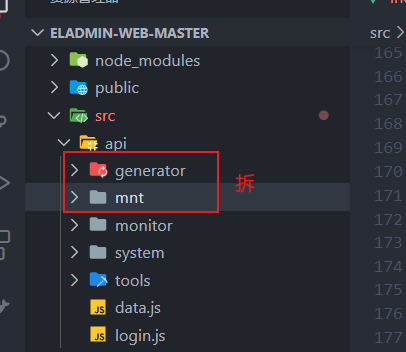

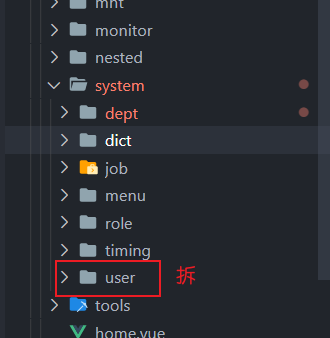

- 如果你想测试这个接口成不成功，在[Swagger UI](http://localhost:8000/swagger-ui.html)里测一下，是否可以将它查出来。

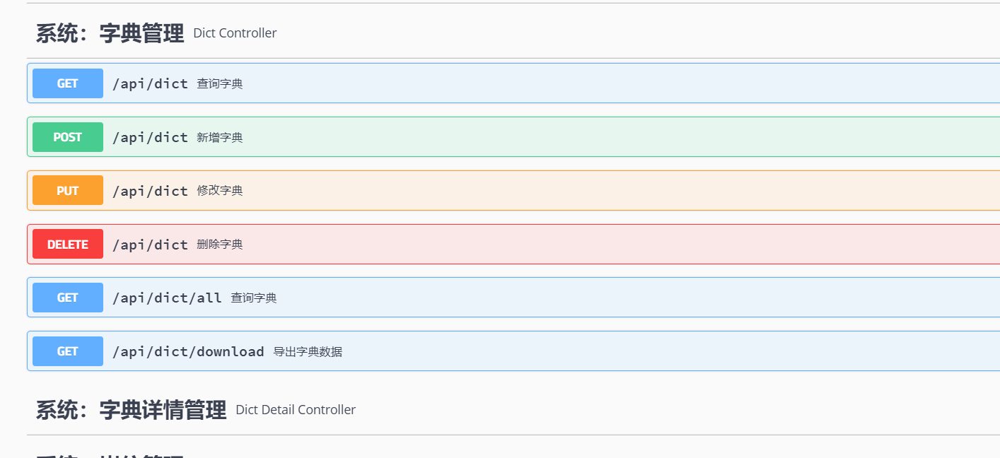

## 5.如何找到一个比较好的开源项目

> 比较有名的开源项目：

- layui
- Semantic UI
- Grabient
- Vue Element Admin

> 查找手段：

1. 找分类（Java、python）

2. 看收藏（star），大家都觉得不错的，就是比较好的，有学习的价值

3. 看具有价值

4. 根据自身的理解情况：Java、SSM、Springboot…阶段性成果、

5. 如何学习Java：Java进阶路线七个阶段

==后端开发去写前端非常难看，可以使用第三方的：Ant Design Pro 或 Element==。

> 查找步骤：


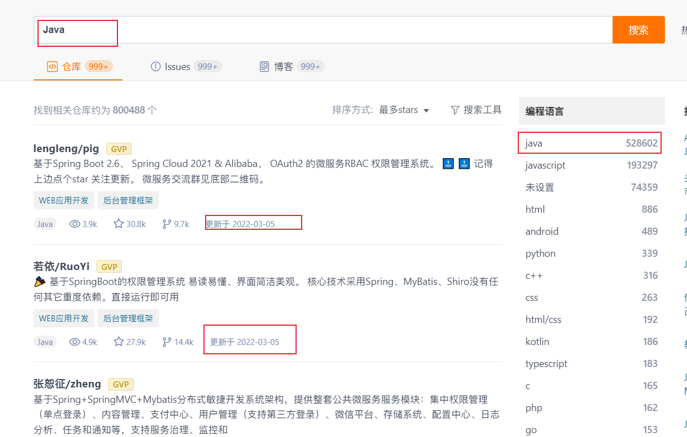

## 🎉结束🎉